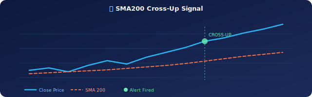
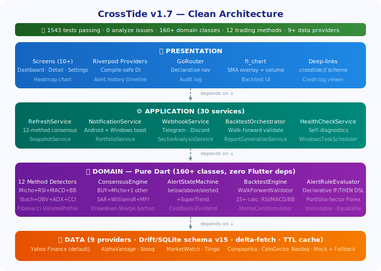

# 🌊 CrossTide — Stock SMA Crossover Monitor

> **Catch the cross. Ride the tide.**

<p align="center">
  
</p>

CrossTide is a cross-platform Flutter app that monitors stock tickers for **SMA crossover events** and fires multi-method consensus alerts from **12 independent trading signal methods**. Runs on **Android** and **Windows** from a single Dart codebase. Uses **Yahoo Finance** — no API key required.

> 🟢 **Consensus BUY** fires when Micho Method + ≥1 other method (RSI, MACD, Bollinger, Stochastic, OBV, ADX, CCI, SAR, Williams%R, MFI, SuperTrend) all agree.

<p align="center">
  <a href="https://flutter.dev"></a>
  <a href="https://dart.dev"></a>
  <a href="LICENSE"></a>
  <a href="https://github.com/RajwanYair/CrossTide/actions/workflows/ci.yml"></a>
  <a href="https://github.com/RajwanYair/CrossTide/releases/latest"></a>
  <a href="https://github.com/RajwanYair/CrossTide/releases/latest"></a>
  <a href="https://github.com/RajwanYair/CrossTide/releases/latest"></a>
</p>

> ⚠️ **Disclaimer**: CrossTide is for informational and educational purposes only. It is NOT financial advice. Always do your own research before making investment decisions.

## 🏗️ Architecture

<p align="center">
  
</p>

Dependencies flow **inward only** — Presentation → Application → Domain ← Data.

## 📊 Key Signal Logic

```
close[t]    = latest trading day close
sma200[t]   = SMA of last 200 trading closes (inclusive)
sma150[t]   = SMA of last 150 trading closes
sma50[t]    = SMA of last  50 trading closes

🟢 SMA200 Cross-Up:  close[t-1] ≤ sma200[t-1]  AND  close[t] > sma200[t]
✨ Golden Cross:     sma50[t-1]  ≤ sma200[t-1]  AND  sma50[t] > sma200[t]
📈 Rising filter:   close[t] > close[t-1]  (configurable 1–5 day strictness)
🔔 Alert:           idempotent — fires once per cross event, resets on cross-down
```

## Prerequisites

- **Flutter SDK** ≥ 3.16.0 (stable channel)
- **Android**: Android Studio or Android SDK with API 21+
- **Windows**: Visual Studio 2022 with "Desktop development with C++" workload
- **Git**
- **No API key needed** — Yahoo Finance data is free

## Setup

```bash
# 1. Clone the repo
git clone https://github.com/RajwanYair/CrossTide.git && cd CrossTide

# 2. Copy environment file
cp .env.example .env
# Edit .env with your Alpha Vantage API key (or leave blank for mock data)

# 3. Install dependencies
flutter pub get

# 4. Generate code (Drift database, Freezed models)
dart run build_runner build --delete-conflicting-outputs

# 5. Run on Windows
flutter run -d windows

# 6. Run on Android emulator
flutter run -d emulator

# 7. Run tests
flutter test
```

## Market Data Provider

**Yahoo Finance** (default — free, no API key):
- Uses the public `query1.finance.yahoo.com/v8/finance/chart/` endpoint
- Returns 2+ years of daily OHLCV data (~500 candles)
- No registration or rate-limit tokens required

**Alpha Vantage** (optional, select in Settings):
- Free tier: 25 requests/day, 5/minute
- Get API key: https://www.alphavantage.co/support/#api-key

**Mock Provider**: Generates deterministic synthetic data for offline dev and tests.

The provider interface (`IMarketDataProvider`) is fully abstracted — add any source by implementing the interface.

## Project Structure

```
lib/
├── main.dart                          # Entry point + bootstrap
└── src/
    ├── domain/                        # Pure business logic
    │   ├── entities.dart              # Value objects
    │   ├── sma_calculator.dart        # SMA computation
    │   ├── cross_up_detector.dart     # Cross-up detection
    │   └── alert_state_machine.dart   # Alert lifecycle FSM
    ├── data/                          # Data access layer
    │   ├── database/database.dart     # Drift schema + queries
    │   ├── providers/                 # Market data providers
    │   │   ├── market_data_provider.dart  # Interface
    │   │   ├── alpha_vantage_provider.dart
    │   │   └── mock_provider.dart
    │   └── repository.dart            # Cache + orchestration
    ├── application/                   # Services
    │   ├── refresh_service.dart       # Fetch → compute → alert
    │   ├── notification_service.dart  # Local notifications
    │   └── background_service.dart    # WorkManager + Timer
    └── presentation/                  # UI layer
        ├── providers.dart             # Riverpod providers
        ├── router.dart                # GoRouter config
        └── screens/
            ├── onboarding_screen.dart
            ├── ticker_list_screen.dart
            ├── ticker_detail_screen.dart
            └── settings_screen.dart

test/
└── domain/
    ├── sma_calculator_test.dart
    ├── cross_up_detector_test.dart
    └── alert_state_machine_test.dart
```

## ⚙️ Background Execution

| 📱 Platform | ⚡ Mechanism | ⚠️ Limitations |
|------------|------------|--------------|
| 🤖 Android | `workmanager` periodic task | Min 15-min interval; OS may defer; requires network + battery not low |
| 🖥️ Windows | `Timer.periodic` in-app | Only works while app is running (foreground or tray mode) |

**Windows tray mode**: When enabled, the app minimizes to the system tray instead of closing, continuing periodic refresh via `Timer.periodic`.

**Future enhancement** (not implemented): A separate Windows helper process or Windows Task Scheduler entry could enable true background execution when the app is closed.

## Notifications

Uses `flutter_local_notifications`:
- **Android**: Notification channel with high importance; requests POST_NOTIFICATIONS permission on Android 13+
- **Windows**: Toast notifications; `cancel()` and `getActiveNotifications()` require MSIX package identity (handled gracefully)
- **Deep-link**: Tapping a notification navigates to the ticker detail screen

## 🗺️ Roadmap

See [docs/ROADMAP.md](docs/ROADMAP.md) for the full enhancement plan. Highlights:

| 🏷️ Version | 🚀 Feature | Status |
|-----------|-----------|--------|
| v1.1 | 📉 Multi-SMA overlay, Golden/Death Cross, S&P 500 benchmark | ✅ Done |
| v1.2 | 📋 Watchlist groups, heatmap dashboard, bulk add, autocomplete | ✅ Done |
| v1.3 | 🔢 RSI, MACD, Bollinger Bands, EMA, 15 technical indicators | ✅ Done |
| v1.4 | 🔔 Price/volume/% alerts, Telegram/Discord webhooks, alert history | ✅ Done |
| v1.5 | ⚡ 9 providers, intraday, delta-fetch, backtesting, 12 methods | ✅ Done |
| v1.6 | 🏠 Android widget, MSIX package, iOS/macOS/Web targets | 🚧 In Progress |
| v1.7 | 📊 Prometheus metrics, snapshot/rollback, YAML config | 🚧 In Progress |
| v1.8 | 🤝 Watchlist share, community lists, in-app news feed | 🚧 In Progress |
| v1.9 | 🤖 Signal confidence, behavioral profiling, sentiment analysis | Planned |
| v2.0 | 🔌 Plugin system, real-time streaming, multi-device sync | Planned |

---

## 🧩 Design Decisions

| 🏷️ Decision | ✅ Choice | 💡 Rationale |
|-----------|--------|-----------|
| State management | Riverpod | Compile-safe, no BuildContext for providers, excellent testability, auto-dispose |
| Persistence | Drift (SQLite) | Type-safe queries, migration support, in-memory databases for testing |
| Notifications | flutter_local_notifications | Single plugin for Windows toasts + Android channels |
| Background (Android) | workmanager | Mature plugin for periodic tasks with OS constraints |

## 📄 License

MIT — see [LICENSE](LICENSE).
