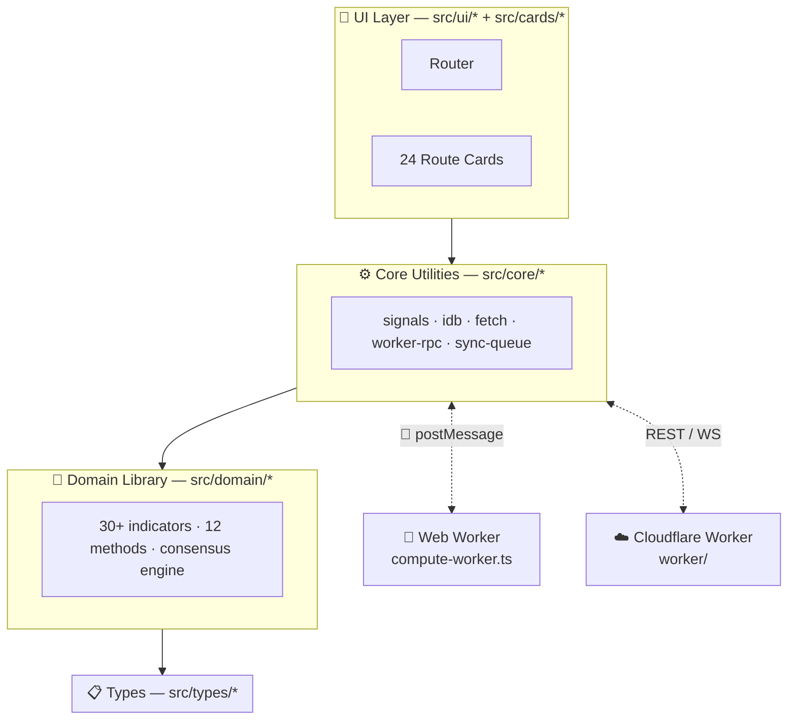
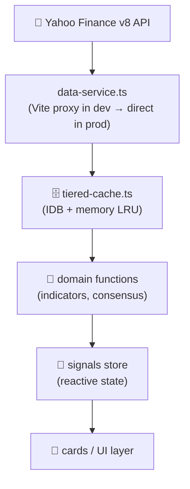

Supported, preview, package-only, dormant, and blocked surfaces are classified in the
[capability matrix](/CrossTide/docs/CAPABILITY_MATRIX.md).
The layered product boundary is defined in [ADR-0016](/CrossTide/docs/adr/0016-product-boundary.md).

## 🏗 Layer Diagram

## 🧩 Key Modules

### Domain (`src/domain/`)

Pure functions — no side effects, no DOM, fully testable in Node.

- **Indicators**: RSI, MACD, Bollinger, ADX, ATR, VWAP, CCI, SAR, Williams%R, MFI, SuperTrend, Aroon, AO, anchored VWAP
- **Consensus**: `aggregateConsensus()` combines all 12 method signals into one weighted score
- **Backtest**: `runBacktest()` — equity curve, Sharpe, Calmar, drawdown metrics
- **Alert state machine**: price/indicator alerts with cooldown and snooze

### Core (`src/core/`)

Infrastructure and utilities:

- `signals.ts` — reactive signals with `effect()`, `computed()`
- `idb.ts` — typed IndexedDB wrapper
- `tiered-cache.ts` — LRU memory + IDB persistence
- `worker-rpc.ts` — type-safe Worker ↔ main-thread RPC
- `retry-backoff.ts` — exponential backoff with jitter
- `circuit-breaker.ts` — per-provider open/close breaker
- `event-bus.ts` — typed pub/sub

### Cards (`src/cards/`)

Self-contained feature panels that mount into `<section>` elements:

| Card                 | Purpose                                      |
| -------------------- | -------------------------------------------- |
| `watchlist-card`     | Live ticker list with consensus badges       |
| `chart-card`         | Lightweight Charts OHLC + overlay indicators |
| `consensus-card`     | 12-method gauge + timeline                   |
| `heatmap`            | Sector heatmap with color-coded returns      |
| `screener`           | Multi-criteria filter across watchlist       |
| `alerts-card`        | Alert rule manager                           |
| `settings-card`      | Theme, layout, export/import                 |
| `multi-chart-layout` | 2×2 / 1+3 synchronized sparkline grid        |

## 🔀 Data Flow

