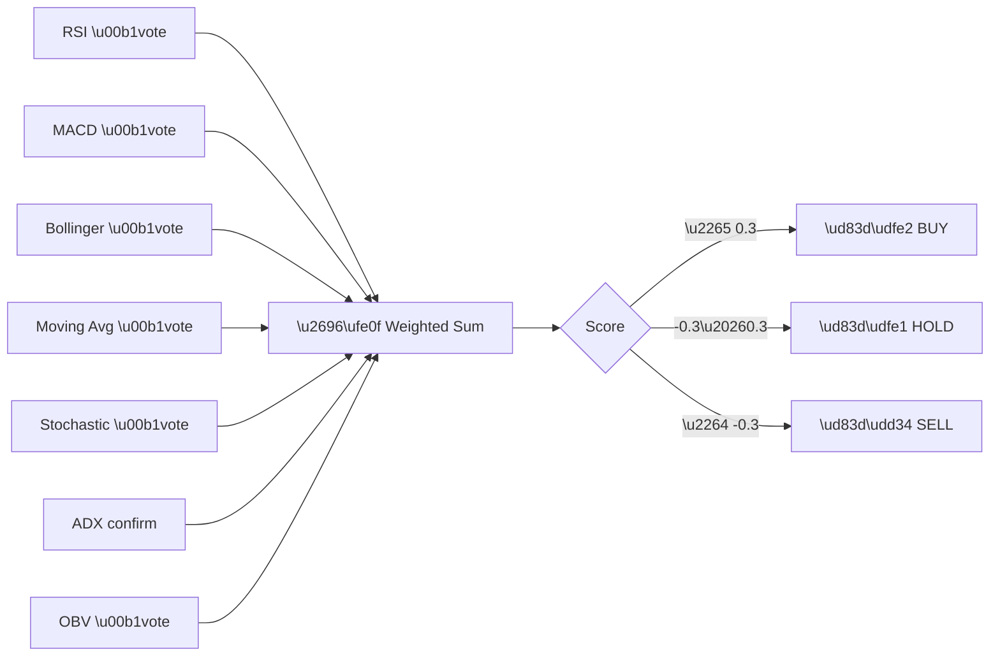

import { Aside } from "@astrojs/starlight/components";

The **Consensus** card aggregates multiple technical analysis methods into a single
actionable signal: **Buy**, **Sell**, or **Hold**.

## ⚙ How It Works

CrossTide evaluates each ticker against a configurable set of technical methods:

| Method | Signal Logic |
|--------|-------------|
| RSI | Buy when RSI < 30, Sell when RSI > 70 |
| MACD | Buy on bullish crossover, Sell on bearish crossover |
| Bollinger Bands | Buy at lower band touch, Sell at upper band touch |
| Moving Average | Buy when price > SMA, Sell when price < SMA |
| Stochastic | Buy when %K < 20, Sell when %K > 80 |
| ADX | Confirms trend strength (no directional signal) |
| OBV | Buy on rising OBV divergence, Sell on falling |

## 🧮 Consensus Calculation

Each method casts a vote:
- **+1** = Buy signal active
- **0** = Neutral / Hold
- **−1** = Sell signal active

The final consensus is the weighted average of all active methods. You can customize
weights in **Settings → Method Weights**.

## 🔍 Interpreting the Score

| Score Range | Label | Meaning |
|-------------|-------|---------|
| ≥ 0.3 | **Buy** | Majority of methods confirm bullish |
| −0.3 to 0.3 | **Hold** | Mixed signals, no clear direction |
| ≤ −0.3 | **Sell** | Majority of methods confirm bearish |

<Aside type="caution">
  Consensus signals are for informational purposes only. They are not financial advice.
  Always do your own research before making trading decisions.
</Aside>

## 📅 Timeline View

The **Consensus Timeline** card shows how the consensus signal for a ticker evolved
over time, plotted alongside price. This helps identify whether signals were timely
or lagging.

## 🎛 Customization

- Adjust method weights in Settings to emphasize methods you trust more.
- Enable/disable individual methods from the consensus calculation.
- Export consensus history via the CSV export button.
