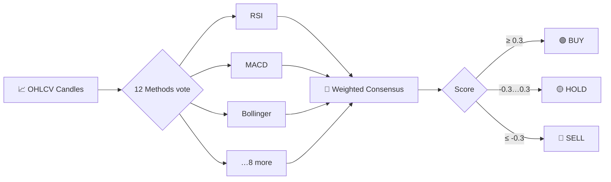

## 🤔 Why CrossTide?

CrossTide is a pure-TypeScript indicator and consensus library. Its supported,
preview, package-only, dormant, and blocked surfaces are classified in the
[capability matrix](https://github.com/rajwanyair/CrossTide/blob/main/docs/CAPABILITY_MATRIX.md).
It combines 12 trading methods (RSI, MACD, Bollinger Bands, ADX, Stochastic,
OBV, CCI, SAR, Williams%R, MFI, SuperTrend, and the proprietary Micho method)
into a single weighted consensus signal.

The broader CrossTide product includes a PWA, Worker API, widgets, and MCP server.
Their support status is maintained in the [capability matrix](/CrossTide/docs/CAPABILITY_MATRIX.md).
The product boundary is defined in [ADR-0016](/CrossTide/docs/adr/0016-product-boundary.md).

| Feature        | Details                                                          |
| -------------- | ---------------------------------------------------------------- |
| 📊 **Indicators** | 30+ — RSI, MACD, Bollinger, ADX, Stochastic, ATR, VWAP, and more |
| 🗳️ **Methods**    | 12 trading methods with configurable weights                     |
| 🧪 **Tests**      | Repository-wide unit, browser, and E2E gates with published thresholds |
| 🪶 **Size**       | < 250 KB gzipped application budget                                |
| ⚡ **Runtime**    | Browser + Web Worker (via `worker-rpc`)                          |
| 📄 **License**    | MIT                                                              |

## 🔀 How a Signal Is Born

