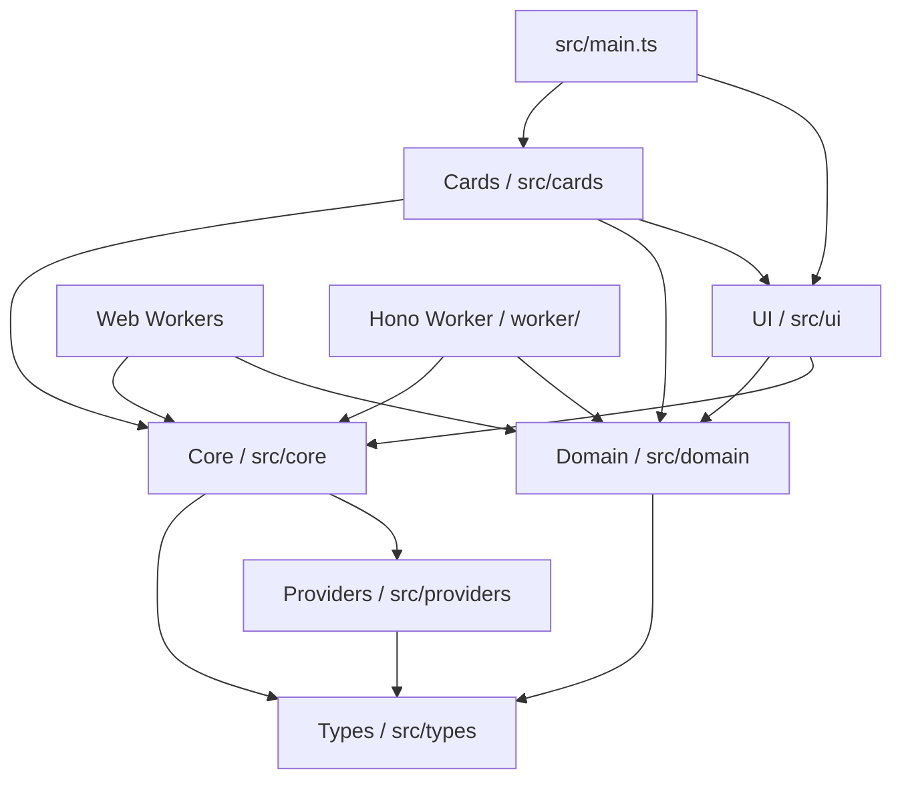
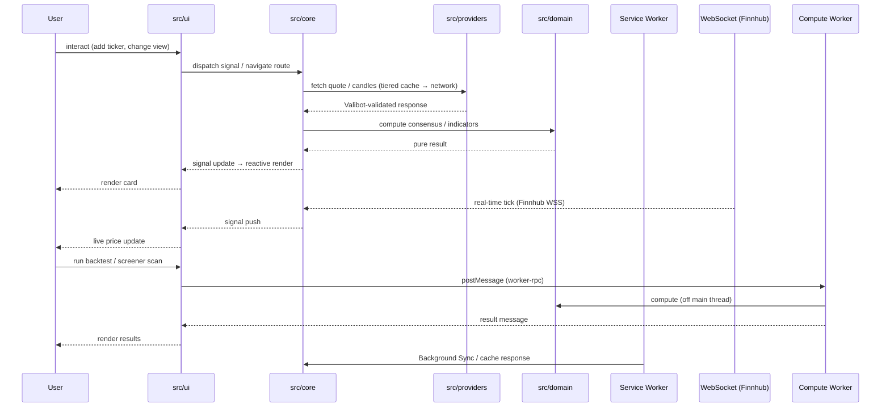
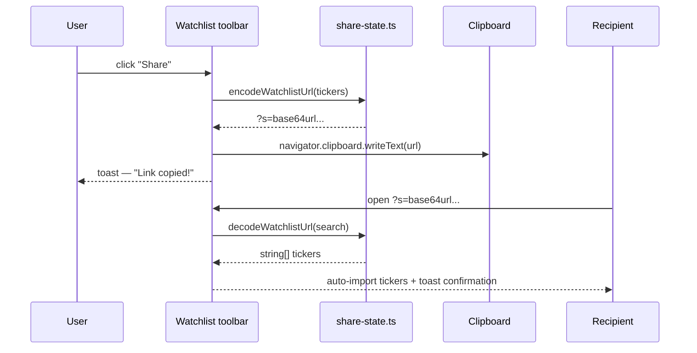

# Architecture

> **Last updated:** v7.24.0 (May 2026)

CrossTide Web is a browser-based stock monitoring dashboard built with vanilla TypeScript and Vite.
It follows a strict layered architecture, keeps the production bundle small, and ships as a
self-contained offline-first PWA with real-time streaming, multi-provider data, and Web Worker
compute offload.

## Layered architecture



**Dependency rule:** each layer may only import from layers below it. The domain layer is pure
(zero side effects, no DOM access). Web Workers share the domain and core layers.

## Runtime data flow



## URL sharing flow (D5)



## Key product features (v7.15)

| Feature                    | Implementation                                                                |
| -------------------------- | ----------------------------------------------------------------------------- |
| 112 domain modules         | `src/domain/*` — pure TS, exhaustive tests                                    |
| 12-method consensus engine | `src/domain/consensus-engine.ts`                                              |
| Signal DSL                 | `src/domain/signal-dsl.ts` + `cards/signal-dsl-card.ts`                       |
| Interactive charting       | `lightweight-charts@^5` via `src/cards/lw-chart.ts`                           |
| Multi-chart layout         | `src/cards/multi-chart-layout.ts` — 2×2 / 1+3 synced crosshair                |
| Drawing tools              | Trendline + Fibonacci retracement canvas overlay                              |
| Real-time streaming        | Finnhub WebSocket via `src/core/reconnecting-ws.ts`                           |
| Screener (preset + custom) | `src/cards/screener-card.ts` + off-thread compute                             |
| Sector heatmap             | Canvas treemap `src/cards/heatmap-card.ts`                                    |
| Portfolio + risk metrics   | Sharpe, Sortino, max DD, CAGR, equity curve, Calmar                           |
| Backtest engine            | `src/domain/backtest-engine.ts` + Web Worker + equity curve UI                |
| Alert state machine        | `src/domain/alert-state-machine.ts` + in-browser notifications                |
| Correlation matrix         | `src/domain/correlation-matrix.ts` + `cards/correlation-matrix-card.ts`       |
| Market breadth             | `src/domain/market-breadth.ts` + `cards/market-breadth-card.ts`               |
| Sector rotation            | `src/domain/sector-rotation.ts` + `cards/sector-rotation-card.ts`             |
| Earnings calendar          | `src/domain/earnings-calendar.ts` + `cards/earnings-calendar-card.ts`         |
| Macro dashboard            | `src/domain/macro-dashboard.ts` + `cards/macro-dashboard-card.ts`             |
| Relative strength          | `cards/relative-strength-card.ts`                                             |
| Offline-first PWA          | Workbox: precache + NetworkFirst/SWR + Background Sync                        |
| Command palette (`⌘K`)     | `src/ui/command-palette.ts` + fuzzy match                                     |
| Keyboard-first             | `src/core/keyboard.ts` — `j/k`, `/`, `g+h`, Vim-style nav                     |
| i18n (EN + HE RTL)         | `src/core/icu-formatter.ts` — `formatMessage()`, EN + HE catalogs             |
| Color-blind palettes       | deuteranopia/protanopia/tritanopia/high-contrast; runtime switch              |
| Onboarding tour            | `src/ui/onboarding-tour.ts` — guided walkthrough                              |
| View Transitions API       | Named containers + watchlist column container queries                         |
| Drag-reorder watchlist     | Mouse/touch drag-and-drop sort; `persistSort`/`loadSort` localStorage         |
| Cross-tab sync             | BroadcastChannel `src/core/broadcast-channel.ts`                              |
| Push notifications         | `src/core/push-notifications.ts` — VAPID-based Web Push                       |
| Passkey auth               | `src/core/passkey.ts` — WebAuthn passkey registration/authentication          |
| Telemetry                  | `src/core/telemetry.ts` — Plausible analytics + GlitchTip errors + Web Vitals |
| Security headers           | Hono Worker middleware `worker/security.ts` — CSP, HSTS, COOP, CORP           |
| Storage pressure guard     | `src/core/storage-pressure.ts` — polls quota, LRU-evicts at ≥80%              |
| Indicator docs             | 48 MDX reference pages in `docs-site/src/content/docs/indicators/`            |
| URL state sharing          | `src/core/share-state.ts` — base64-URL encoded watchlist snapshot             |
| Data export                | JSON, CSV, XLSX export via `src/core/data-export.ts`                          |
| 10 data providers          | Yahoo, Finnhub, Alpha Vantage, Polygon, Tiingo, Stooq, CoinGecko + chain      |

## Directory layout

```text
CrossTide/
├── src/
│   ├── domain/         pure calculators (112 modules — indicators, consensus, backtest, risk, …)
│   ├── core/           signals, cache, config, fetch, idb, telemetry, passkey, i18n, …
│   ├── providers/      market-data adapters (Yahoo, Finnhub, Alpha Vantage, Polygon, Tiingo,
│   │                   Stooq, CoinGecko) + provider-chain failover + circuit breaker
│   ├── cards/          composable UI cards — 39 card components, lazy-loaded via registry
│   ├── ui/             DOM helpers, router, toast, modal, command palette, a11y (46 modules)
│   ├── types/          shared interfaces + Valibot schemas for all provider boundaries
│   ├── styles/         design tokens, base, responsive, components, palettes
│   └── main.ts         bootstrap: router, signals, keyboard, palette, cards, telemetry
├── worker/             Hono-based Cloudflare Worker (API proxy + security headers)
│   ├── index.ts        Hono route dispatch with typed middleware
│   ├── security.ts     withSecurityHeaders() middleware — CSP, HSTS, COOP, CORP, COEP
│   ├── cors.ts         CORS handling
│   ├── rate-limit.ts   Rate limiting
│   └── routes/         chart, health, og, openapi, screener, search, signal-dsl
├── docs-site/          Astro Starlight documentation site (48 indicator MDX pages)
├── docs/               Roadmap, contributing guidelines, Copilot guide
├── tests/unit/         Vitest unit tests (316 files, ~3 884 tests)
└── public/             Static assets, PWA manifest, 404.html
```

## Runtime dependencies

| Package                      | Purpose                     | Size (gz) |
| ---------------------------- | --------------------------- | --------- |
| `lightweight-charts`         | Candlestick / line charting | ~45 KB    |
| `valibot`                    | Runtime schema validation   | ~3 KB     |
| `hono`                       | Worker HTTP framework       | ~14 KB    |
| `@js-temporal/polyfill`      | Temporal API polyfill       | ~20 KB    |
| `@fontsource-variable/inter` | Self-hosted Inter font      | ~100 KB   |

All other functionality is hand-written TypeScript — no framework runtime.

## Tooling — single source of truth

| Concern        | File                            | Notes                                                               |
| -------------- | ------------------------------- | ------------------------------------------------------------------- |
| TypeScript     | `tsconfig.json`                 | strict + `exactOptionalPropertyTypes` + `noUncheckedIndexedAccess`  |
| Bundler        | `vite.config.ts`                | Vite 8, oxc minifier, ES2022                                        |
| Tests (unit)   | `vitest.config.ts`              | happy-dom, v8 coverage, 90% thresholds                              |
| Tests (E2E)    | `playwright.config.ts`          | Chromium, 15+ critical flows + axe-core                             |
| Linting (TS)   | `eslint.config.mjs`             | ESLint 10 flat + typescript-eslint 8 + import-x, `--max-warnings 0` |
| Linting (CSS)  | `config/.stylelintrc.json`      | inline rule set                                                     |
| Linting (HTML) | `config/.htmlhintrc`            | inline rule set                                                     |
| Linting (MD)   | `config/.markdownlint.json`     | `default: true`, allow common HTML elements                         |
| Format         | `.prettierrc`                   | repo-local; `npm run format:check` is the gate                      |
| Bundle budget  | `scripts/check-bundle-size.mjs` | 200 KB gzipped JS                                                   |
| Lighthouse     | `config/lighthouserc.json`      | Perf ≥ 85, A11y ≥ 90, Best ≥ 90                                     |

The repo is fully self-contained: `git clone` → `npm ci` → `npm run ci` works on any machine.

Git hooks are configured via `simple-git-hooks`:

- **pre-commit**: `lint-staged` runs ESLint + Prettier on staged TS/CSS/MD files
- **commit-msg**: `commitlint` enforces [Conventional Commits](https://www.conventionalcommits.org/)

## CI / CD

| Workflow         | Trigger   | Purpose                                                     |
| ---------------- | --------- | ----------------------------------------------------------- |
| `ci.yml`         | push + PR | typecheck → lint:all → test:coverage → build → bundle check |
| `release.yml`    | tag `v*`  | gates + zip dist + SHA-256 + GitHub Release                 |
| `pages.yml`      | push main | deploy to GitHub Pages (mirror)                             |
| `cf-pages.yml`   | push + PR | Cloudflare Pages deploy (production + PR previews)          |
| `lighthouse.yml` | push + PR | `lhci autorun` performance/a11y budgets                     |
| `dependabot.yml` | weekly    | npm + github-actions grouped update PRs                     |

## Quality gates

Local and CI both enforce, with **zero waivers**:

- 0 TypeScript errors (`npm run typecheck`)
- 0 ESLint warnings (`npm run lint`)
- 0 Stylelint warnings (`npm run lint:css`)
- 0 HTMLHint findings (`npm run lint:html`)
- 0 markdownlint findings (`npm run lint:md`)
- Prettier clean (`npm run format:check`)
- 3884+ unit tests pass (`npm test`), v8 coverage thresholds met
- 15+ Playwright E2E flows + axe a11y audit pass
- Lighthouse CI budgets met
- Production build under 200 KB gzipped JS (`npm run check:bundle`)

## Security

- **CSP + security headers** via Cloudflare Worker middleware (`worker/security.ts`) on all API responses:
  `Content-Security-Policy`, `Strict-Transport-Security`, `X-Frame-Options: DENY`,
  `X-Content-Type-Options: nosniff`, `Permissions-Policy`, `Cross-Origin-Opener-Policy`,
  `Cross-Origin-Resource-Policy`, `Referrer-Policy`
- **CSP** also enforced via Vite dev headers + `_headers` file (Cloudflare Pages)
- **SRI** hashes for preloaded scripts (`src/core/sri.ts`)
- **Valibot** validation at every external data boundary (Yahoo, Finnhub, CoinGecko, Polygon)
- **Token-bucket** rate limiter prevents API abuse
- **Circuit-breaker** per provider with automatic failover chain
- **No `innerHTML`** with user data — all DOM via `textContent` or sanitized templates
- **Dependabot** + dependency-review-action for supply chain

## Routing & card registry

Routes use the History API (`src/ui/router.ts`). Every route maps to a card module loaded via
lazy `import()`. The card registry (`cards/registry.ts`) returns `{ mount(el, ctx) }` for each
entry. Cards are never destroyed on route change — hidden/shown via CSS.

| Route                 | Card module                                           |
| --------------------- | ----------------------------------------------------- |
| `/watchlist`          | built-in (watchlist table in `main.ts`)               |
| `/consensus`          | `cards/consensus-card.ts`                             |
| `/chart`              | `cards/chart-card.ts`                                 |
| `/alerts`             | `cards/alerts-card.ts`                                |
| `/heatmap`            | `cards/heatmap.ts`                                    |
| `/screener`           | `cards/screener.ts`                                   |
| `/portfolio`          | `cards/portfolio.ts`                                  |
| `/risk`               | `cards/risk-card.ts` (Sortino, max DD, CAGR, Calmar)  |
| `/backtest`           | `cards/backtest-card.ts` (MA crossover, equity curve) |
| `/consensus-timeline` | `cards/consensus-timeline.ts`                         |
| `/signal-dsl`         | `cards/signal-dsl-card.ts`                            |
| `/multi-chart`        | `cards/multi-chart-layout.ts`                         |
| `/correlation`        | `cards/correlation-matrix-card.ts`                    |
| `/market-breadth`     | `cards/market-breadth-card.ts`                        |
| `/sector-rotation`    | `cards/sector-rotation-card.ts`                       |
| `/earnings`           | `cards/earnings-calendar-card.ts`                     |
| `/macro`              | `cards/macro-dashboard-card.ts`                       |
| `/relative-strength`  | `cards/relative-strength-card.ts`                     |
| `/provider-health`    | `cards/provider-health.ts`                            |
| `/settings`           | `cards/settings-card.ts`                              |

## Storage

CrossTide uses a four-tier storage model:

| Tier | Store                | TTL              | Notes                                  |
| ---- | -------------------- | ---------------- | -------------------------------------- |
| L1   | In-memory Map        | Process          | `TieredCache` L1 — hot quotes          |
| L2   | `localStorage`       | Configurable TTL | `TieredCache` L2 — ~5 MB, config/theme |
| L3   | IndexedDB            | No expiry        | Quote candles, watchlists, alerts      |
| L4   | Service Worker Cache | Per-strategy     | App shell (precache) + API SWR         |

`src/core/storage-manager.ts` polls `navigator.storage.estimate()` every 60 s.
When quota usage reaches **80%** it evicts the 20 oldest L1/L2 cache entries.
At **95%** it evicts 50 entries and calls `navigator.storage.persist()` to request
persistent storage from the browser.

## Performance budget

| Asset                | Budget      | Gate           |
| -------------------- | ----------- | -------------- |
| JS initial           | ≤ 200 KB gz | `check:bundle` |
| Lazy card chunk      | ≤ 50 KB gz  | build          |
| CSS                  | ≤ 30 KB gz  | build          |
| LCP (4G mid Android) | ≤ 1.8 s     | Lighthouse CI  |
| INP p75              | ≤ 200 ms    | Lighthouse CI  |
| CLS                  | ≤ 0.05      | Lighthouse CI  |
