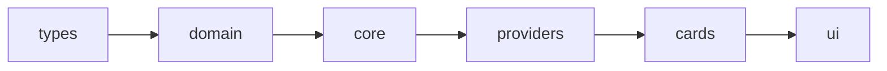
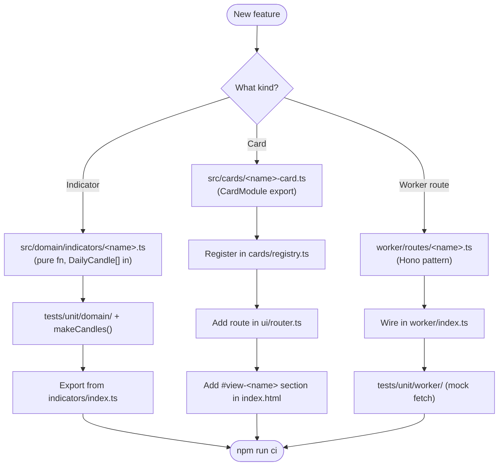
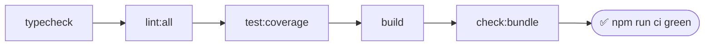

# Development Guide

Quick-start for contributors to get CrossTide running locally.

## Prerequisites

- **Node.js** 20+ (LTS)
- **npm** 10+
- **Git** 2.40+

## Setup

```bash
git clone https://github.com/RajwanYair/CrossTide.git
cd CrossTide
npm ci
```

## Development Server

```bash
npm run dev
```

Opens at `http://localhost:5173` with HMR.

## Available Scripts

| Script                  | Purpose                               |
| ----------------------- | ------------------------------------- |
| `npm run dev`           | Vite dev server with HMR              |
| `npm test`              | Run unit tests (Vitest)               |
| `npm run test:watch`    | Watch mode for tests                  |
| `npm run test:coverage` | Tests with coverage report            |
| `npm run test:browser`  | Browser tests (Vitest + real browser) |
| `npm run test:e2e`      | End-to-end tests (Playwright)         |
| `npm run lint`          | ESLint check                          |
| `npm run lint:css`      | Stylelint check                       |
| `npm run lint:html`     | HTMLHint check                        |
| `npm run lint:md`       | Markdownlint check                    |
| `npm run typecheck`     | TypeScript strict check               |
| `npm run format`        | Prettier format                       |
| `npm run format:check`  | Prettier verify                       |
| `npm run build`         | Production build                      |
| `npm run check:bundle`  | Verify bundle < 250 KB gzip           |
| `npm run ci`            | Full CI pipeline (all of the above)   |

## Project Structure

```text
src/
  types/      ← Shared interfaces (no imports from other layers)
  domain/     ← Pure functions (no DOM, no fetch, no side effects)
  core/       ← State, signals, config, fetch wrappers
  providers/  ← Data provider adapters (Yahoo, Finnhub, etc.)
  cards/      ← Route cards (CardModule pattern)
  ui/         ← Router, theme, toast, dialogs
  styles/     ← CSS layers: tokens, base, components, responsive
  locales/    ← i18n translation dictionaries
worker/       ← Hono on Cloudflare Workers (API backend)
tests/        ← Unit, browser, and E2E tests
```

## Import Rules

Imports flow **downward only** (enforced by ESLint):



Never import upward. Domain must never import from core, cards, or ui.

## Adding Features



## Worker Development

The Cloudflare Worker (API) lives in `worker/`:

```bash
npx wrangler dev          # Local worker dev server
npx wrangler deploy       # Deploy to production
```

Requires a `.dev.vars` file with API keys (see `.dev.vars.example`).

## Quality Gates

All must pass before merge:

- TypeScript: zero errors
- ESLint: zero warnings
- Stylelint: zero CSS warnings
- HTMLHint: zero issues
- Markdownlint: zero violations
- Prettier: formatted
- Tests: all pass, 90%+ coverage
- Build: successful
- Bundle: under 250 KB gzip



Run `npm run ci` to verify all gates locally.

## Commit Convention

```text
type(scope): lowercase subject, ≤72 chars
```

Types: `feat`, `fix`, `docs`, `refactor`, `test`, `chore`, `perf`, `ci`

Enforced by commitlint via husky pre-commit hook.
