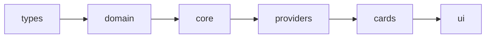
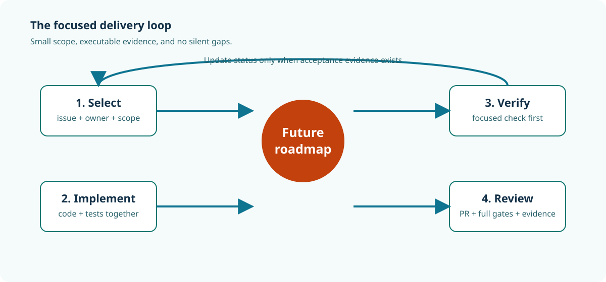
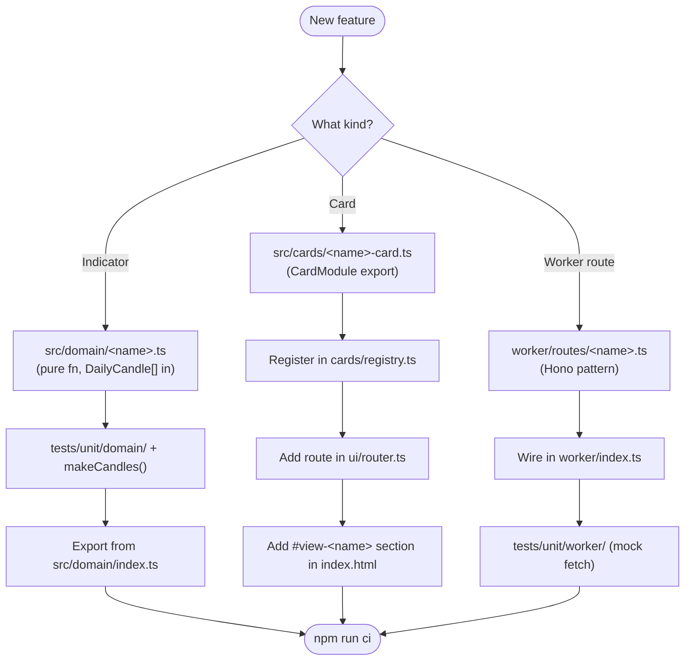
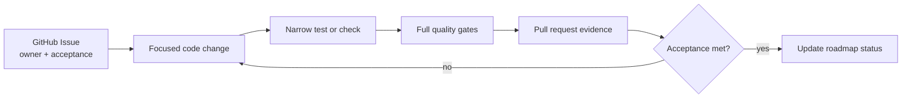
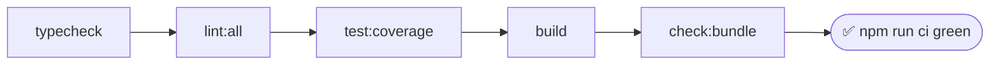

# Development Guide

Quick-start for contributors to get CrossTide running locally.

## Prerequisites

- **Node.js** 20.19.0+ (LTS)
- **npm** 10+
- **Git** 2.40+

## Setup

```bash
git clone https://github.com/RajwanYair/CrossTide.git
cd CrossTide
npm ci
```

## Development Server

```bash
npm run dev
```

Opens at `http://localhost:5173` with HMR.

## Available Scripts

| Script                  | Purpose                               |
| ----------------------- | ------------------------------------- |
| `npm run dev`           | Vite dev server with HMR              |
| `npm test`              | Run unit tests (Vitest)               |
| `npm run test:watch`    | Watch mode for tests                  |
| `npm run test:coverage` | Tests with coverage report            |
| `npm run test:browser`  | Browser tests (Vitest + real browser) |
| `npm run test:e2e`      | End-to-end tests (Playwright)         |
| `npm run lint`          | Oxlint TypeScript 7 check             |
| `npm run lint:css`      | Stylelint check                       |
| `npm run lint:html`     | HTMLHint check                        |
| `npm run lint:md`       | Markdownlint check                    |
| `npm run typecheck`     | TypeScript strict check               |
| `npm run format`        | Biome auto-format                     |
| `npm run format:check`  | Biome format check                    |
| `npm run build`         | Production build                      |
| `npm run check:bundle`  | Verify bundle < 250 KB gzip           |
| `npm run ci`            | Full CI pipeline (all of the above)   |

## Project Structure

```text
src/
  types/      ← Shared interfaces (no imports from other layers)
  domain/     ← Analytical functions; pure boundary enforced, browser helpers under A04 split
  core/       ← State, signals, config, fetch wrappers
  providers/  ← Data provider adapters (Yahoo, Finnhub, etc.)
  cards/      ← Route cards (CardModule pattern)
  ui/         ← Router, theme, toast, dialogs
  styles/     ← CSS layers: tokens, base, components, responsive
  locales/    ← i18n translation dictionaries
worker/       ← Hono on Cloudflare Workers (API backend)
tests/        ← Unit, browser, and E2E tests
```

Configuration placement is documented in [`config/README.md`](../config/README.md).

## Repeat-regression checklist

The project history shows a few failure patterns that reappear when they are not written down.
Do not reintroduce them in new work:

- A gate is only useful if it can fail for the right reason. Do not assert file text, a
  vacuous `?.textContent !== ""` guard, or a bare snapshot flag that rewrites nothing.
- Use `waitForAppReady` and real route-level checks instead of hand-rolled readiness logic.
- Parse CSS with `postcss`, not `happy-dom`'s CSSOM, when the test needs a truthful answer.
- Keep the router, card registry, and worker OpenAPI contract aligned; drift is treated as a
  regression in CI.
- Favor repo-installed binaries (`./node_modules/.bin/...`) over `npx` for dev dependencies.
- Keep Workbox injection in every Vite build that ships a PWA, or stale service-worker cache
  manifests become a user-visible bug.
- When a test depends on browser behavior, assert the DOM contract and the target environment,
  not a brittle assumption about screen geometry or focus order.
- A dormant code path that never executes accumulates defects silently. When a previously hidden
  path becomes reachable, expect a burst of failures and treat them as debt to resolve, not as a
  new regression created by the current patch.
- Never confuse visibility with clickability or route-focus state with page readiness. Check the
  box/viewport relationship and the actual interaction contract instead of trusting a generic
  `isVisible()` result.
- If a check is an allowlist or a hand-maintained mirror, assume it is hiding a real regression
  until proven otherwise. Read its exceptions first and ensure it can fail on the real artifact.

## Import Rules

Imports flow **downward only** (enforced by architecture checks and Oxlint):


```mermaid
flowchart LR
  types[types] --> domain[domain]
  domain --> core[core]
  core --> providers[providers]
  providers --> cards[cards]
  cards --> ui[ui]
```

Never import upward. Domain must never import from core, cards, or ui.

## Adding Features



_A good contribution starts with a bounded issue and ends with reproducible acceptance
evidence._

When changing a route, provider, package export, widget, MCP tool, or deployment mode,
review [docs/CAPABILITY_MATRIX.md](CAPABILITY_MATRIX.md) and update its classification,
evidence, and customer-facing limitation in the same change when needed.


```mermaid
flowchart TD
  Start([New feature]) --> Choice{What kind?}

  Choice -->|Indicator| I1["src/domain/&lt;name&gt;.ts\n(pure fn, DailyCandle[] in)"]
  I1 --> I2["tests/unit/domain/ + makeCandles()"]
  I2 --> I3["Export from src/domain/index.ts"]

  Choice -->|Card| C1["src/cards/&lt;name&gt;-card.ts\n(CardModule export)"]
  C1 --> C2["Register in cards/registry.ts"]
  C2 --> C3["Add route in ui/router.ts"]
  C3 --> C4["Add #view-&lt;name&gt; section in index.html"]

  Choice -->|Worker route| W1["worker/routes/&lt;name&gt;.ts\n(Hono pattern)"]
  W1 --> W2["Wire in worker/index.ts"]
  W2 --> W3["tests/unit/worker/ (mock fetch)"]

  I3 --> Gate([npm run ci])
  C4 --> Gate
  W3 --> Gate
```

### 🔁 Contribution inputs and evidence


```mermaid
flowchart LR
  Issue[GitHub Issue<br/>owner + acceptance] --> Change[Focused code change]
  Change --> Narrow[Narrow test or check]
  Narrow --> Full[Full quality gates]
  Full --> PR[Pull request evidence]
  PR --> Decision{Acceptance met?}
  Decision -->|yes| Roadmap[Update roadmap status]
  Decision -->|no| Change
```

## Worker Development

The Cloudflare Worker (API) lives in `worker/`:


_Local fixtures prove behavior; provisioned Cloudflare resources are required for production
evidence._

```bash
./node_modules/.bin/wrangler dev          # Local worker dev server
./node_modules/.bin/wrangler deploy       # Deploy to production
```

Requires a `.dev.vars` file with API keys (see `.dev.vars.example`).

## Quality Gates

All must pass before merge:

- TypeScript: zero errors
- Oxlint: zero errors
- Stylelint: zero CSS warnings
- HTMLHint: zero issues
- Markdownlint: zero violations
- Biome: formatted clean
- Tests: all pass, 90%+ coverage
- Build: successful
- Bundle: under 250 KB gzip


```mermaid
flowchart LR
  A[typecheck] --> B[lint:all]
  B --> C[test:coverage]
  C --> D[build]
  D --> E[check:bundle]
  E --> F(["✅ npm run ci green"])
```

Run `npm run ci` to verify all gates locally.

## Commit Convention

```text
type(scope): lowercase subject, ≤72 chars
```

Types: `feat`, `fix`, `docs`, `refactor`, `test`, `chore`, `perf`, `ci`

Enforced by commitlint via simple-git-hooks pre-commit hook.
