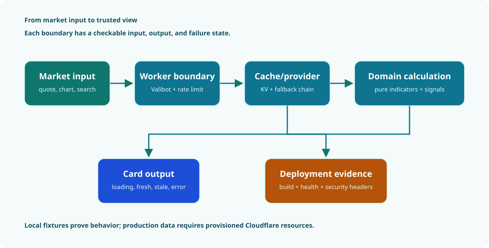
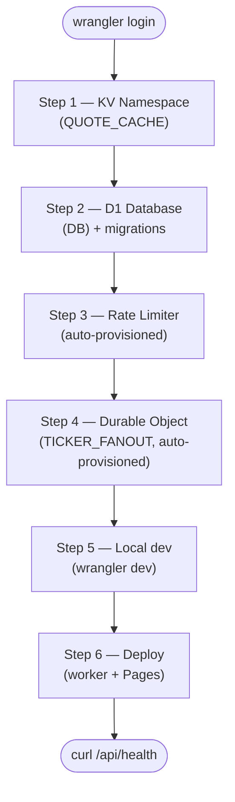
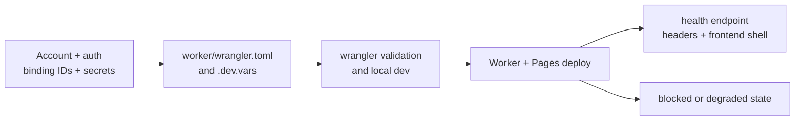

<!-- markdownlint-disable MD012 -->

# CrossTide Operations And Auth Matrix

This is the repository-level record of external tool access, deployment
credentials, optional provider secrets, and durable engineering learnings.
It intentionally records capability and scope, never secret values.

Use [the operations rehearsal record](#operations-rehearsal-record) below to
capture fresh-machine recovery evidence. The checklist is intentionally separate
from the runbook above it so incomplete rehearsals cannot be mistaken for
verified claims.

Run `npm run resolve-blockers` for an interactive, read-only-by-default check of
every row below plus the GitHub Actions secrets and optional provider keys —
it never reads or stores a secret itself; every credential-entering step hands
the terminal to the vendor's own CLI (`wrangler`/`npm`/`gh`/`flyctl`).

## Verification Snapshot

Last checked: 2026-08-12 on Windows, branch `main`.

| Surface | Authentication | Local status | Required for | Owner / next action |
| --- | --- | --- | --- | --- |
| GitHub CLI and GitHub MCP | VS Code/GitHub keyring or device login | Authenticated as `RajwanYair`; CLI has `repo`, `workflow`, `read:org`, and `gist` scopes | Repository operations and GitHub MCP actions | Keep the token in the keyring; rotate if scope or account changes |
| GitHub Actions | Built-in `GITHUB_TOKEN` plus repository secrets | Workflow definitions consume `CLOUDFLARE_API_TOKEN`, `CLOUDFLARE_ACCOUNT_ID`, `NPM_TOKEN`, and optional `GLITCHTIP_DSN` | Cloudflare Pages deploy, npm publish, release source maps | Configure secrets in repository/environment settings; never commit them |
| Cloudflare Wrangler | Local OAuth token in Wrangler config | Authenticated; account and Workers/Pages/KV/D1/secrets permissions available | Worker deployment, bindings, logs, migrations, secrets | Replace placeholder KV/D1 IDs in `worker/wrangler.toml` before production deploy |
| Cloudflare MCP and docs MCP | VS Code MCP provider session | Configured in `.vscode/mcp.json`; session availability depends on the editor login | Cloudflare discovery, observability, and current docs | Re-authenticate in VS Code if an MCP call returns 401 |
| npm registry | User npm config / `NPM_TOKEN` in CI | Local `npm whoami` succeeds as `rajwanyair` | Publishing `@crosstide/domain` | Keep publish token scoped to the package and use provenance |
| Fly.io / Uptime Kuma | `flyctl` login | Not available: `flyctl` is not installed | Deploying or administering `monitoring/fly.toml` | Install Fly CLI, authenticate, deploy, create monitors, and verify the public status page |
| Finnhub, Massive, Alpha Vantage, FRED | Worker secrets via Wrangler | Not configured locally; all are optional fallbacks | Provider failover, live WebSocket fan-out, and selected macro routes | Add only the keys needed, with `wrangler secret put`; verify provider health afterward |
| Yahoo, Stooq, CoinGecko, Frankfurter, FRED CSV | No key in the current provider path | Keyless paths are documented | Default development and fixture/production provider paths | Monitor upstream rate limits and schema changes; do not add browser keys |
| Plausible and GlitchTip | Site registration / DSN | Not configured locally; optional | Analytics and error reporting | Set `VITE_*` values for builds and `GLITCHTIP_DSN` for source-map upload |
| Context7 MCP | `CONTEXT7_API_KEY` when required by the service | Passed through `.vscode/mcp.json`; local environment value not present | Higher-rate/current library documentation retrieval | Add the key only through the user environment if the service requires it |
| Playwright MCP and browser tests | Local browser process, no account | Configured and local-only | Browser inspection and E2E tests | Install browsers with the lockfile-pinned Playwright binary |
| CrossTide MCP server | `CROSSTIDE_API_URL`, no credential by default | Built for local Worker at `http://localhost:8787` | AI-agent access to CrossTide tools | Start the Worker first; add authentication before exposing it beyond localhost |

## Repeat-issue guardrails

The repository keeps a short anti-regression record here so the same issues do not silently
return as "new" problems:

- Do not treat a gate as green just because it exits zero. If the script cannot observe the
  real artifact being named, it is decorative.
- Do not hand-roll readiness guards with optional chaining; `getElementById(...)?... !== ""`
  resolves immediately when the element is absent.
- Do not trust `isVisible()` alone when panels are off-canvas; measure the box against the
  viewport or navigate directly.
- Do not run `npx` for dev dependencies. Use the local binary or the machine-scoped tool path to
  avoid registry drift and mismatched versions.
- Do not let Workbox pre-cache injection be omitted from the build path; stale service-worker
  updates are an operational bug.
- Do not mix generated artifacts with hand-maintained copies; file-text assertions and a copied
  palette or manifest are not verification.
- Keep the repo's dirty-worktree discipline intact: review `git diff --unified=0` after multi-file
  edits and preserve user changes outside the task scope.
- Hidden execution paths are a recurring source of bugs. A path that is never reached by CI or the
  app still accumulates defects, and when it becomes reachable it often fails in clusters.
- A blanket allowlist is not a fix. If a rule is meant to forbid cross-layer access, do not embed a
  category-wide exception that silently reopens the drift you were trying to block.
- Browser focus and route state are not the same as "the app is ready"; do not let a route-change
  helper or a hidden drawer confuse the test's starting condition for a real boot signal.

## Production Readiness Gaps

These are the actual missing operational pieces found during the review:

1. `worker/wrangler.toml` still contains placeholder KV and D1 identifiers.
2. The Fly CLI is not installed, and `monitoring/README.md` says the Uptime Kuma deployment is not verified.
3. Production provider fallbacks, telemetry, and source-map upload are optional and currently unconfigured locally.
4. The MCP server is intentionally local-only; it must not be exposed publicly without an authentication and authorization design.

No end-user authentication is missing from the current web product: it is designed as a no-account PWA with local state. Adding accounts, shared portfolios, or protected server resources requires a new threat model and ADR before implementation.

## Recovery Runbooks

These procedures are intentionally provider- and environment-scoped. Record the
operator, timestamp, target environment, command output, and resulting health URL in
the change or incident record. Never paste secrets, tokens, or `.dev.vars` contents.

### Roll Back A Deployment

1. Stop promotion of the current release and record the failing health check, route,
   and deployment identifier.
2. Redeploy the last known-good commit through the same workflow and environment. Do
   not edit production bindings or secrets during a code rollback.
3. Verify `/api/health`, `/openapi.json`, one representative quote route, and the
   frontend shell. Check the response headers and Worker logs for the rollback window.
4. Keep the failed release available for diagnosis and open a follow-up issue before
   resuming promotion.

### Back Up And Restore D1

Before a destructive migration, export the target database using the authenticated
Cloudflare D1 workflow and retain the export with the change record. Confirm the
database name and environment before running any command.

```powershell
./node_modules/.bin/wrangler d1 backup create crosstide-db
./node_modules/.bin/wrangler d1 backup list crosstide-db
```

For a restore, pause writes, identify the backup from the change record, restore it
using the Cloudflare dashboard or the lockfile-pinned Wrangler command supported by
the installed version, then run the migration status and health checks. A restore is
not complete until the application can read existing watchlists, portfolios, and
alert history.

### Apply Or Recover A Migration

1. Run the migration against a disposable local or staging database first.
2. Confirm the migration is present and that the affected route tests pass.
3. Apply the production migration with the environment explicitly selected:

   ```powershell
   ./node_modules/.bin/wrangler d1 migrations apply crosstide-db --env staging
   ./node_modules/.bin/wrangler d1 migrations apply crosstide-db
   ```

4. Verify `/api/migrations/status` and the affected read/write workflows. Do not
   hand-edit production tables; use a forward migration or the documented restore
   procedure.

### Handle An Incident

1. Declare the incident in the repository or operations channel and assign an
   incident owner and communications owner.
2. Establish scope from health checks, Worker logs, recent deployments, provider
   status, and error rate. Preserve timestamps and request identifiers.
3. Mitigate first: roll back the deployment, disable the failing optional provider,
   or reduce traffic while preserving a truthful degraded state.
4. Verify recovery with the health, API contract, frontend, and affected workflow
   checks. Communicate user impact and current limitations.
5. Close with a timeline, root cause, evidence, corrective issue, and a review date.

### Respond To A Provider Outage

1. Confirm the failure is upstream by checking the provider response, route logs, and
   a second independent provider or fixture.
2. Leave the provider chain fallback enabled; do not expose provider keys to the
   browser or silently present stale data as current.
3. Confirm the UI exposes source, freshness, degraded status, and limitations. Use
   fixture or cached responses only when their age and provenance remain visible.
4. Monitor recovery, then re-run the representative quote, chart, search, and health
   checks before removing the incident notice.

### Rehearse Self-Hosted Recovery

Run this sequence from a clean checkout with Docker Desktop's Linux engine enabled.
The `.env` file is optional; copy `docker/.env.example` only when provider keys are
needed for the rehearsal.

```powershell
docker compose config
docker compose build
docker compose up -d
Invoke-WebRequest http://localhost:8787/api/health
docker compose restart
Invoke-WebRequest http://localhost:8787/api/migrations/status
docker compose down
docker volume ls --filter name=crosstide-data
```

Record the image digest, health response, migration status, restart result, volume
name, and shutdown result with the change record. Use `docker compose down -v` only
when intentionally testing data loss and volume recreation. A failed health check
must follow the incident and provider-outage procedures above rather than being
reported as a successful self-hosting rehearsal.

## Environment Ownership

| File / location | May contain secrets? | Purpose |
| --- | --- | --- |
| `.env.local` | Yes, ignored | Vite telemetry and local API overrides |
| `worker/.dev.vars` | Yes, ignored | Wrangler local Worker secrets |
| Wrangler secret store | Yes, encrypted remotely | Production Worker provider keys and DSNs |
| GitHub repository/environment secrets | Yes, encrypted remotely | Deploy, publish, release, and monitoring automation |
| `~/.config/gh` and Wrangler config | Yes, user-managed credentials | Local CLI authentication |
| `.vscode/mcp.json` | No secret values | MCP server definitions and environment forwarding |

## Durable Engineering Learnings

These points are deliberately short and actionable. The detailed history remains in `.github/copilot-instructions.md` and the scoped instruction files.

- Treat authentication as an operator capability, not an end-user feature, until the product adds protected resources.
- Verify identity with `gh auth status`, `npm whoami`, and `wrangler whoami`; do not print token values or add them to logs.
- Use repository-installed binaries (`npm exec -- tool` or `./node_modules/.bin/tool`), never unqualified `npx` for a dev dependency.
- Keep provider secrets server-side. Browser builds receive URLs and feature flags, never API keys.
- A green local build does not prove Cloudflare bindings, Pages deployment, D1 migrations, KV namespaces, or monitoring exist in production.
- Public or remote MCP access needs explicit authentication and authorization; local stdio access is not a production security boundary.
- The default Vitest pool is tuned for this workstation: threads with a bounded worker percentage; use `VITEST_POOL=forks` only for compatibility diagnosis.
- When a dependency report conflicts with the registry, verify with `npm view <package>@<version> version` before changing the lockfile.
- Preserve unrelated dirty-worktree changes. Review `git diff --unified=0` after multi-file edits because configuration context can include user changes.
- New auth, accounts, shared state, or native signing flows require a threat-model/ADR update and a credential lifecycle entry here.

## Verification Commands

Run these without exposing secrets:

```powershell
gh auth status
npm whoami --registry=https://registry.npmjs.org
./node_modules/.bin/wrangler whoami
./node_modules/.bin/wrangler deploy --dry-run --config worker/wrangler.toml
Get-ChildItem Env: | Where-Object { $_.Name -match 'KEY|TOKEN|SECRET|DSN' } | Select-Object Name
```

The final command reports names only. Never print values from environment variables, `.env` files, Wrangler config, or CI secrets.

## Cloudflare Resource Provisioning

This section walks through creating all Cloudflare resources required by CrossTide and
wiring their IDs into `worker/wrangler.toml`.

### Provisioning Workflow



_The visual separates local behavior checks from deployment evidence: a green local build does
not prove that production bindings exist._



#### Provisioning Inputs And Outputs



### Prerequisites

- [Cloudflare account](https://dash.cloudflare.com/sign-up) (free tier is sufficient)
- [Wrangler CLI](https://developers.cloudflare.com/workers/wrangler/install-and-update/)
  installed and authenticated. Wrangler is a devDependency, so invoke the
  lockfile-pinned binary rather than `npx`, which may fetch a different version:

  ```powershell
  ./node_modules/.bin/wrangler login
  ```

### Step 1 — KV Namespace (QUOTE_CACHE)

Caches quote, chart, and search responses with market-hours-aware TTLs.

```powershell
# Create production namespace
./node_modules/.bin/wrangler kv namespace create QUOTE_CACHE
# Output: { id: "abc123..." }

# Create preview namespace (used by PR preview deployments)
./node_modules/.bin/wrangler kv namespace create QUOTE_CACHE --preview
# Output: { preview_id: "def456..." }
```

Paste the IDs into `worker/wrangler.toml`:

```toml
[[kv_namespaces]]
binding = "QUOTE_CACHE"
id = "abc123..."          # replace PLACEHOLDER_KV_NAMESPACE_ID
preview_id = "def456..."  # replace PLACEHOLDER_KV_PREVIEW_ID
```

### Step 2 — D1 Database (DB)

Stores user watchlists, portfolios, alert rules, and CSP violation reports.

```powershell
# Create the database
./node_modules/.bin/wrangler d1 create crosstide-db
# Output: { database_id: "ghi789..." }
```

Paste into `worker/wrangler.toml`:

```toml
[[d1_databases]]
binding = "DB"
database_name = "crosstide-db"
database_id = "ghi789..."   # replace PLACEHOLDER_D1_DATABASE_ID
migrations_dir = "migrations"
```

#### Apply Migrations

```powershell
# Staging / preview
./node_modules/.bin/wrangler d1 migrations apply crosstide-db --env staging

# Production
./node_modules/.bin/wrangler d1 migrations apply crosstide-db
```

Migration files live in `worker/migrations/`:

| File                      | Contents                                       |
| ------------------------- | ---------------------------------------------- |
| `0001_initial_schema.sql` | watchlists, portfolios, alerts, settings, sync |
| `0002_alert_history.sql`  | alert_history table + indexes                  |

To check migration status:

```powershell
# Local (requires D1 binding)
curl http://localhost:8787/api/migrations/status

# Via wrangler
./node_modules/.bin/wrangler d1 migrations list crosstide-db
```

### Step 3 — Rate Limiter (RATE_LIMITER)

The `[[unsafe.bindings]]` block for the Rate Limiting API does **not** require a separate
create step — Cloudflare provisions it automatically on `wrangler deploy`. The `namespace_id`
(`1001`) is an arbitrary identifier you choose; it scopes the rate limit counters to this worker.

No action required — the binding in `worker/wrangler.toml` is ready as-is.

### Step 4 — Durable Object (TICKER_FANOUT)

The `TickerFanout` Durable Object class is declared in `worker/index.ts` and exported via
`[[durable_objects]]` + `[[migrations]]` in `worker/wrangler.toml`. Cloudflare creates the
namespace automatically on first `wrangler deploy`. No separate provisioning step needed.

### Step 5 — Local Development

```powershell
# Copy the example file
Copy-Item worker\.dev.vars.example worker\.dev.vars
# Edit worker/.dev.vars with any optional API keys

# Start the worker locally (hot-reload, KV/D1 in-memory stubs)
cd worker
./node_modules/.bin/wrangler dev
```

The worker runs at `http://localhost:8787`. Vite proxies `/api/*` to it when running
`npm run dev` (see `vite.config.ts`).

### Step 6 — Deploy

```powershell
# Deploy worker
cd worker
./node_modules/.bin/wrangler deploy

# Deploy Pages (static build)
cd ..
npm run build
./node_modules/.bin/wrangler pages deploy dist --project-name crosstide
```

### Environment Matrix

| Env          | KV Binding | D1 Binding | Data source  |
| ------------ | :--------: | :--------: | ------------ |
| `dev`        |    None    |    None    | Yahoo (real) |
| `preview`    |  Preview   |    None    | Fixture data |
| `staging`    |  Prod KV   |  Prod D1   | Yahoo (real) |
| `production` |  Prod KV   |  Prod D1   | Yahoo (real) |

When `ENVIRONMENT=preview` (set automatically on Cloudflare Pages PR deployments), the
worker serves deterministic fixture data so CI never hits Yahoo rate limits.

## Operations Rehearsal Record

Use one copy of this record for each fresh-machine rehearsal. Record commands,
outputs, timestamps, and target environments in the change or incident record.
Never include secrets, tokens, `.env` contents, or personal access data.

### Run Metadata

| Field | Value |
| --- | --- |
| Operator | |
| Date and time (UTC) | |
| Commit or image digest | |
| Host OS and version | |
| Target environment | |
| Change or incident reference | |

### Acceptance Checklist

| Operation | Command or evidence | Result | Evidence reference |
| --- | --- | --- | --- |
| Rollback | Last-known-good deployment restored through the normal workflow | Pending | |
| D1 backup | Authenticated backup created and listed for the intended database | Pending | |
| D1 restore | Writes paused, selected backup restored, reads verified | Pending | |
| Migration | Disposable or staging migration applied and status verified | Pending | |
| Incident | Scope, owner, mitigation, recovery, timeline, and follow-up recorded | Pending | |
| Provider outage | Upstream failure confirmed, fallback and freshness state verified | Pending | |

### Self-Hosted Smoke Evidence

| Check | Result | Evidence reference |
| --- | --- | --- |
| `docker compose config` | Pending | |
| `docker compose build` | Pending | |
| `docker compose up -d` | Pending | |
| `/api/health` | Pending | |
| `docker compose restart` | Pending | |
| `/api/migrations/status` | Pending | |
| `docker compose down` | Pending | |


