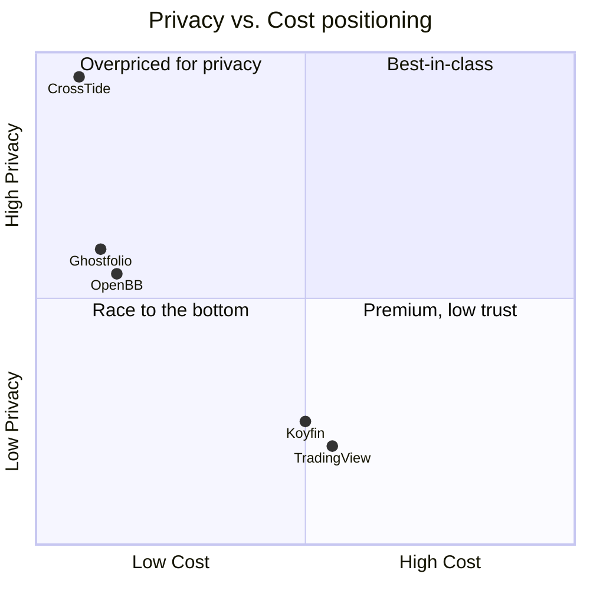
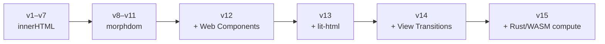
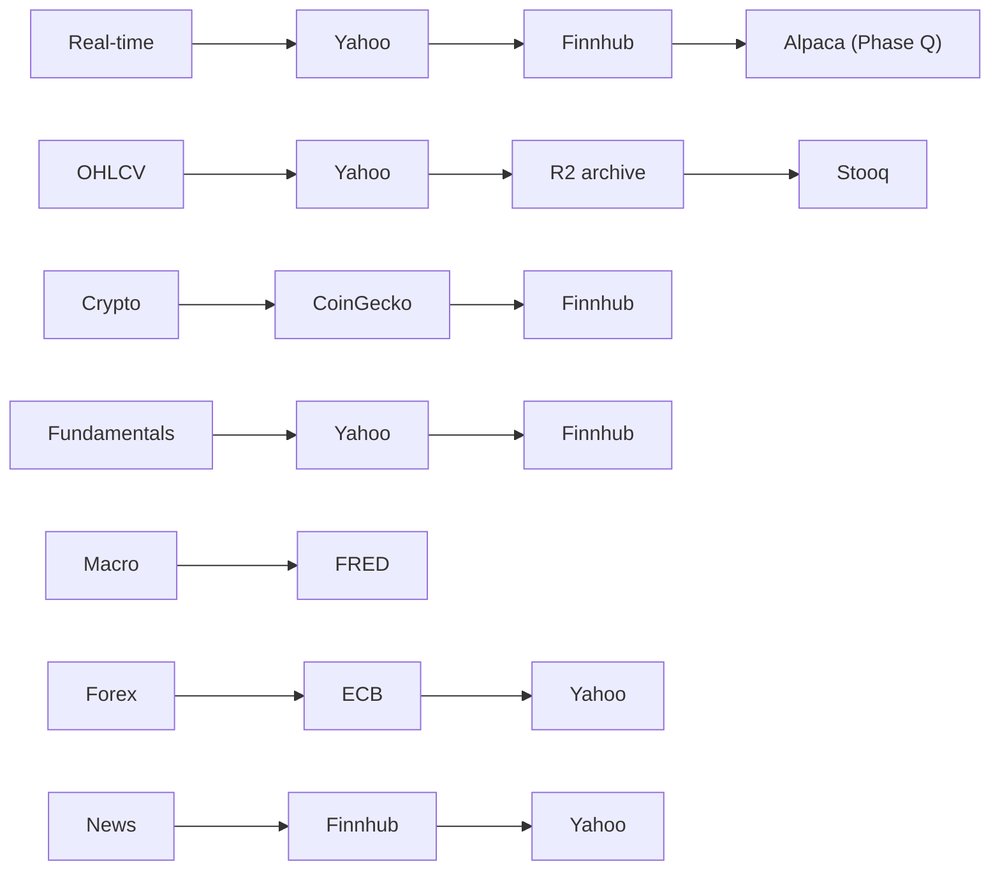
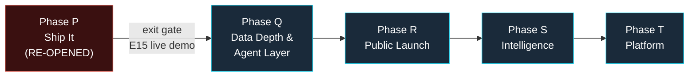

# CrossTide — Strategic Roadmap v11 (Agent-Native & Shipped)

> **Date:** July 22, 2026
> **Current version:** v11.43.0
> **Codebase:** 212 domain modules · 52 cards · 37 Worker routes · 608 test files
> **Bundle:** 158 KB gzip (budget 250 KB) · 49 SW precache entries
> **Stack:** TypeScript 6.0 · Vite 8 · Vitest 4 · Hono 4 · morphdom · LWC v5
> **ADRs on record:** 11 (all accepted)
> **Previous roadmap:** v10 archived intent retained below; v9 at `docs/ROADMAP-v9-archive.md`
> **Reality check since v10:** Phase P ("Ship It", June 2–16 hard deadline) **slipped** — still 0 production deployments, 0 users. v11 keeps the ship-or-die posture but re-sequences around a single blocking milestone (live demo) and folds in the 2026 market shift: **the OSS finance frontier is now agent-native** (OpenBB pivoted to an MCP-first data platform at 70.9k★; Ghostfolio ships AI skills in-repo). CrossTide already has the MCP server, skills, and agents — v11 is about wiring them to a live product.
> **Key change from v10:** Adds (1) a single **Master Tracking Table** to run development from, (2) a formal **language & platform refactor decision** (TS core + Rust/WASM hot paths), and (3) an **agent-native + on-device-AI** enhancement track harvested from 2026 best-in-class tools.

---

## Table of Contents

1. [North Star — What CrossTide Must Become](#1-north-star--what-crosstide-must-become)
2. [State of the Art: Competitive Landscape 2026](#2-state-of-the-art-competitive-landscape-2026)
3. [Latest Enhancements to Adopt (2026 Harvest)](#3-latest-enhancements-to-adopt-2026-harvest)
4. [Language & Platform Refactor Decision](#4-language--platform-refactor-decision)
5. [Master Tracking Table](#5-master-tracking-table)
6. [Decision Audit v11 — Final Verdicts](#6-decision-audit-v11--final-verdicts)
7. [Frontend Architecture](#7-frontend-architecture)
8. [Backend & Infrastructure](#8-backend--infrastructure)
9. [Data Strategy & API Ecosystem](#9-data-strategy--api-ecosystem)
10. [AI, ML & Intelligent Compute](#10-ai-ml--intelligent-compute)
11. [Developer Experience & Tooling](#11-developer-experience--tooling)
12. [Documentation & Knowledge Strategy](#12-documentation--knowledge-strategy)
13. [Quality, Security & Observability](#13-quality-security--observability)
14. [Performance Architecture](#14-performance-architecture)
15. [VS Code & GitHub Integration Strategy](#15-vs-code--github-integration-strategy)
16. [Execution Phases](#16-execution-phases)
17. [Refactor & Rewrite Backlog](#17-refactor--rewrite-backlog)
18. [Risks, Mitigations & Scope Boundaries](#18-risks-mitigations--scope-boundaries)
19. [Engineering Non-Negotiables](#19-engineering-non-negotiables)

---

## 1. North Star — What CrossTide Must Become

### 1.1 The vision (one sentence)

**CrossTide is the fastest, most private, open-source financial analysis platform — where data never leaves your device, the bundle is 30x smaller than competitors, and the 12-method consensus engine exists nowhere else.**

### 1.2 The strategic position



We do not compete on feature count. We compete on **philosophy**:

- Privacy-first (no account, no tracking, no data leaves the browser)
- Performance-first (158 KB vs 2-5 MB)
- Cost-first ($0/month forever, self-hostable)
- Quality-first (608 tests, 90%+ coverage, 14 CI gates)

### 1.3 The uncomfortable truth v11 confronts

| # | Truth | v11 Action |
|---|-------|-----------|
| 1 | **Zero deployments. Zero users.** | Phase P has a 2-week hard deadline. Deploy or archive. |
| 2 | **Over-engineering for zero ROI.** | Freeze features. Ship what exists. |
| 3 | **Solo developer.** | Design for contributors. Plugin system. MCP for AI leverage. |
| 4 | **No community.** | Product Hunt launch in Phase R. Discord on day 1. |
| 5 | **VS Code/GitHub integration is excellent but underutilized.** | Wire everything end-to-end. |

### 1.4 What is genuinely world-class (verified)

| Area | Evidence |
|------|----------|
| **Pure domain layer** | 212 modules. Zero I/O. 100% deterministic. WASM-ready. npm-publishable. |
| **Bundle discipline** | 158 KB total. Competitors ship 2-5 MB. 10-30x advantage. |
| **Type safety** | TS 6 strict, `noUncheckedIndexedAccess`, `exactOptionalPropertyTypes`. |
| **Indicator depth** | 80+ TA/quant indicators. More than most commercial products. |
| **Offline-first** | 5-tier cache. Background Fetch. OPFS. Service Worker. Web Push. |
| **Security posture** | CSP strict. HSTS preload. Valibot boundaries. Rate limiting. |
| **Zero-dep reactive signals** | Custom primitives. batch(). Auto-tracking. No framework cost. |
| **CSS architecture** | Layers. @scope. Container queries. Color-blind palettes. |
| **Test culture** | 608 files. 90%+ coverage. Property testing. Visual regression. |
| **12-method consensus** | Unique in OSS. No competitor aggregates 12 signal methods. |
| **DevOps maturity** | 27 GH workflows. 14 prompts. 4 skills. 3 agents. MCP server. |

---

## 2. State of the Art: Competitive Landscape 2026

### 2.1 Comprehensive comparison matrix

Rating: `★★★` best-in-class · `★★` strong · `★` adequate · `△` partial · `✗` absent

**Rule:** Only SHIPPED, USER-VERIFIED functionality gets stars. Planned = `✗`.

| Capability | **CrossTide** | TradingView | FinViz | StockAnalysis | Koyfin | OpenBB | Ghostfolio | TrendSpider | Webull | Maybe Finance |
|---|:---:|:---:|:---:|:---:|:---:|:---:|:---:|:---:|:---:|:---:|
| **License** | MIT | Proprietary | Proprietary | Proprietary | Proprietary | AGPL | AGPL | Proprietary | Proprietary | Proprietary |
| **Pricing** | Free | $15-60/mo | $25-50/mo | Free/Pro | $39/mo | Free | Free/Prem | $39-97/mo | Free | $12-50/mo |
| **Self-hostable** | ★★★ | ✗ | ✗ | ✗ | ✗ | ★★★ | ★★★ | ✗ | ✗ | ✗ |
| **No account required** | ★★★ | △ | ★★★ | ★★★ | ✗ | ✗ | ✗ | ✗ | ✗ | ✗ |
| **Privacy (cookieless)** | ★★★ | ✗ | ✗ | ✗ | ✗ | ★★ | ★★★ | △ | ✗ | ★★ |
| **Bundle / load speed** | ★★★ (158 KB) | ✗ (~5 MB) | ★★ (SSR) | ★★ (SSR) | △ (~3 MB) | n/a | ★ (~500 KB) | △ (~2 MB) | ✗ (~4 MB) | ★★ |
| **Lighthouse performance** | ★★★ (≥90) | △ (~50) | ★★ (~70) | ★★ (~75) | △ (~60) | n/a | △ (~65) | △ (~55) | ✗ (~45) | ★★ (~80) |
| **Offline / PWA** | ★★★ | ✗ | ✗ | ✗ | ✗ | ★★★ | ★★ | ✗ | ✗ | ✗ |
| **Real-time streaming** | ✗ (not wired) | ★★★ | △ | ★★ | ★★ | ★★ | ✗ | ★★★ | ★★★ | ★★ |
| **Charting depth** | ★★ (LWC v5) | ★★★ (20+) | △ | ★ | ★★ | ★★ | ✗ | ★★★ | ★★ | ★★ |
| **Indicator library** | ★★★ (80+) | ★★★ (400+) | ★★ (50+) | ★ (30+) | ★★ (80+) | ★★ (80+) | ✗ | ★★★ (100+) | ★★ | ★ |
| **Consensus / multi-signal** | ★★★ (unique 12) | ✗ | ✗ | △ | ✗ | ✗ | ✗ | △ | ✗ | ✗ |
| **Screener** | ★★ (DSL) | ★★ | ★★★ | ★★★ | ★★ | ★★★ | ✗ | ★★★ | ★★ | ✗ |
| **Backtest engine** | ★ (basic) | ★★ (Pine) | ✗ | ✗ | ★ | ★★ | ✗ | ★★★ | ✗ | ✗ |
| **Portfolio analytics** | ★★ | ✗ | ✗ | ★ | ★★★ | ★★ | ★★★ | ✗ | ★★ | ★★★ |
| **Fundamental data** | △ | ★★★ | ★★★ | ★★★ | ★★★ | ★★★ | ✗ | ✗ | ★★ | ★★ |
| **MCP / AI agent support** | △ (server exists) | ✗ | ✗ | ✗ | ✗ | ★★★ | ✗ | ✗ | ✗ | ✗ |
| **On-device AI** | ✗ (planned) | ✗ | ✗ | ✗ | ✗ | ✗ | ✗ | ✗ | ✗ | ✗ |
| **Custom scripting** | ★★ (DSL) | ★★★ (Pine) | ✗ | ✗ | ✗ | ★★★ (Python) | ✗ | ✗ | ✗ | ✗ |
| **WCAG accessibility** | ★★★ (AA) | △ | ✗ | △ | △ | △ | ★★ | ✗ | △ | ★★ |
| **Test coverage** | ★★★ (608 files) | Unknown | Unknown | Unknown | Unknown | ★★ | ★★ | Unknown | Unknown | Unknown |
| **DevOps maturity** | ★★★ (27 workflows) | Unknown | Unknown | Unknown | Unknown | ★★ | ★★ | Unknown | Unknown | Unknown |
| **Community** | ✗ (0 users) | ★★★ (50M+) | ★★★ | ★★ | ★★ | ★★★ (70.9K⭐) | ★★★ (9K⭐) | ★★ | ★★★ | ★★ |
| **Docker one-liner** | △ (exists) | ✗ | ✗ | ✗ | ✗ | ★★★ | ★★★ | ✗ | ✗ | ✗ |
| **Live demo** | ✗ | ★★★ | ★★★ | ★★★ | ★★★ | ★★★ | ★★★ | ★★★ | ★★★ | ★★★ |

### 2.2 Technology comparison (2026 leaders)

| Dimension | **CrossTide** | **TradingView** | **OpenBB** | **Ghostfolio** | **Maybe Finance** |
|---|---|---|---|---|---|
| **Language** | TypeScript 6 (strict) | TS + C++ + Go | Python 3.9+ | TypeScript | Ruby + TypeScript |
| **Frontend** | Vanilla TS + morphdom | Custom Canvas | React Workspace | Angular 21 | Next.js 15 |
| **Backend** | Hono 4 (CF Workers) | Go + C++ μsvc | FastAPI | NestJS + Prisma | Rails 7 |
| **Database** | CF D1 (SQLite edge) | ClickHouse + Redis | None | PostgreSQL | PostgreSQL + Redis |
| **Cache** | CF KV + 5-tier client | Redis + CDN | In-memory | Redis | Redis + CDN |
| **Charts** | Lightweight Charts v5 | Custom Canvas | Plotly | Custom | Recharts |
| **Auth** | Passkey (WebAuthn) | Email + OAuth2 | API keys | Email + OIDC | Email + OAuth2 |
| **Validation** | Valibot (3 KB) | Internal | Pydantic | class-validator | Zod |
| **Build** | Vite 8 + oxc | Webpack | Poetry | Nx 22 | Turbopack |
| **Hosting** | Cloudflare ($0/mo) | Proprietary DC | Docker | Docker/VPS | Self-hosted |
| **Tests** | Vitest 4 + Playwright | Internal | pytest | Jest + Nx | RSpec + Jest |
| **Bundle** | **158 KB** | ~5 MB | n/a | ~500 KB | ~1.2 MB |
| **AI** | MCP (stdio) | None | MCP + SDK | None | None |
| **Open source** | MIT | No | AGPL | AGPL | AGPL |

### 2.3 Best practices harvested from leaders

| Practice | Source | Action |
|---|---|---|
| Live demo with no signup | All OSS | Deploy immediately (Phase P) |
| Docker one-liner | Ghostfolio, OpenBB | Validate existing docker-compose |
| MCP server | OpenBB | Wire existing code to live API |
| SSR/SSG for SEO | StockAnalysis | Astro SSG in Phase R |
| Contributor onboarding | OpenBB | Dev container + labels in Phase R |
| Community Discord | OpenBB, Ghostfolio | Create before public launch |
| Real-time streaming | TradingView | Wire existing DO code |
| Property-based testing | Netflix | Already best-in-class. Expand. |
| Edge caching | All production apps | Deploy (code already done) |
| Copilot agents/skills | Internal advantage | Enhance (this session) |

### 2.4 What changed in the market since v10 (2026 signal)

| Shift | Evidence (verified 2026) | Implication for CrossTide |
|---|---|---|
| **Agent-native is the new baseline** | OpenBB (70.9k⭐) pivoted from "terminal" to an **Open Data Platform**: "connect once, consume everywhere" — Python, Workspace UI, Excel, **MCP servers**, REST, all fed by one data layer. | Reframe the Worker API as the single data layer feeding SPA + MCP + SDK + widgets. Elevate MCP from side-project to first-class consumer. |
| **AI skills ship inside the repo** | Ghostfolio (9k⭐) added `.claude/skills` + `.agents/skills` (Karpathy-guideline skills) alongside code. | CrossTide's `.github/skills` bet is validated. Expand skills to cover the full contributor + agent workflow. |
| **Local-first + on-device AI** | WebGPU + WebLLM (Phi-4-mini, Qwen3-mini) now run NL→query and summarization fully in-browser; no data egress. | On-device AI is now our privacy moat, not a gimmick. Move it forward in sequence. |
| **Rust/WASM for hot paths** | Compute-heavy OSS finance increasingly compiles Rust→WASM for correlation/Monte-Carlo/backtests at near-native speed. | Evaluate a Rust hot-path kernel for the domain layer (see §4) without a full rewrite. |
| **Live demo is table-stakes** | Every serious OSS competitor (OpenBB, Ghostfolio) leads with a one-click live demo + Docker one-liner. | The absence of a live URL is the single biggest credibility gap. Blocks everything downstream. |

---

## 3. Latest Enhancements to Adopt (2026 Harvest)

Each enhancement below is sourced from a best-in-class competitor or a 2026 platform capability, scored for fit, and mapped to a phase. These are the line items that feed the **Master Tracking Table (§5)**. Nothing here is built yet — this is the planning menu.

### 3.1 Agent-native platform (from OpenBB's Open Data Platform pivot)

| ID | Enhancement | Why it wins | Phase |
|---|---|---|---|
| E1 | **Elevate MCP server to first-class consumer** — wire the existing `mcp-server/` to the live Worker API (quotes, charts, consensus, screener) over HTTP + stdio | OpenBB proved AI agents are now a primary surface; CrossTide already has the server, just not wired | P |
| E2 | **"Connect once, consume everywhere" data layer** — formalize the Worker API as the single source for SPA + MCP + SDK + widgets, documented in one OpenAPI contract | Removes duplicate data logic; every new surface is free | Q |
| E3 | **Agent tool manifest** — expose CrossTide indicators/consensus as callable MCP tools with typed schemas | Lets Claude/GPT run a 12-method consensus on demand | Q |
| E4 | **Streaming agent responses** — SSE from Worker for long-running screener/backtest agent calls | Matches OpenBB Workspace UX | R |

### 3.2 On-device AI (privacy moat — nobody else has this)

| ID | Enhancement | Why it wins | Phase |
|---|---|---|---|
| E5 | **WebLLM (Phi-4-mini / Qwen3-mini via WebGPU)** — natural-language → Screener DSL, fully in-browser | Zero data egress; unique vs every competitor | S |
| E6 | **On-device news/earnings summarization** — local LLM summarizes fetched articles | No API cost, no tracking | S |
| E7 | **NL chart annotation** — "mark the golden crosses" → drawing primitives | TrendSpider-class feature, private | S |

### 3.3 Compute performance (Rust/WASM hot paths — see §4)

| ID | Enhancement | Why it wins | Phase |
|---|---|---|---|
| E8 | **WASM correlation matrix** (Rust or AssemblyScript) | Near-native for N×N correlation on large baskets | S |
| E9 | **WASM Monte Carlo VaR / portfolio simulation** | 10–50× over JS for 100k paths | S |
| E10 | **WASM backtest kernel** — vectorized OHLCV replay | Closes the gap vs TrendSpider/Pine backtests | S |

### 3.4 Real-time & data depth (from TradingView / Alpaca)

| ID | Enhancement | Why it wins | Phase |
|---|---|---|---|
| E11 | **Wire WebSocket DO fan-out** — the Durable Object ticker code exists but is not live | Real-time is the #1 missing shipped capability | Q |
| E12 | **Alpaca Markets provider** — free real-time quotes | Removes Yahoo single-point dependency | Q |
| E13 | **BYOK (bring-your-own-key)** — user API keys, encrypted at rest in D1 | Lets power users add premium providers privately | Q |
| E14 | **Options chain + IV surface card** | High-demand gap vs Webull/TradingView | R |

### 3.5 Growth & credibility (from every shipped OSS competitor)

| ID | Enhancement | Why it wins | Phase |
|---|---|---|---|
| E15 | **Live demo URL** (`crosstide.pages.dev`) with no signup | The single biggest credibility unlock; blocks §16 Phase P exit | P |
| E16 | **Docker one-liner** validated end-to-end (compose up → working app) | Ghostfolio/OpenBB baseline for self-hosters | P |
| E17 | **SSG top-500 ticker pages (Astro)** for SEO discovery | StockAnalysis-class organic acquisition | R |
| E18 | **Discord + CONTRIBUTING + good-first-issue labels** | Converts stars into contributors (OpenBB playbook) | R |
| E19 | **In-repo AI skills for contributors** (validated by Ghostfolio's `.claude/skills`) — expand `.github/skills` to cover onboarding, add-card, add-indicator | Lowers contributor ramp; leverages agents | R |

### 3.6 Platform & ecosystem (long game)

| ID | Enhancement | Why it wins | Phase |
|---|---|---|---|
| E20 | **Publish `@crosstide/domain` to npm** — the 212 pure modules as a standalone package | Turns the crown-jewel domain layer into a distributable asset | T |
| E21 | **Embeddable widgets** (`<script>` snippet for consensus/chart) | Distribution surface competitors gate behind paywalls | T |
| E22 | **Plugin sandbox** (Worker-isolated custom indicators) | Community extensibility without core risk | T |
| E23 | **Signal framework adapters** (React/Solid/Svelte) | Broadens SDK reach | T |

---

## 4. Language & Platform Refactor Decision

> The brief explicitly permits a full refactor "up to and including changing the main code language." This section makes that decision **deliberately and on the record** rather than leaving it implicit.

### 4.1 Options evaluated

| Option | Primary lang | Pros | Cons | Verdict |
|---|---|---|---|---|
| **A. Status quo** | TypeScript 6 | 158 KB bundle, 608 tests, pure domain, CF Workers native, zero rewrite risk | JS compute ceiling on heavy math | **KEEP as primary** |
| **B. Full Rust rewrite** | Rust (+ WASM front) | Max performance, one language | Kills PWA ergonomics, DOM story is poor, throws away 212 tested modules, 6–12 mo of zero user value | **REJECT** |
| **C. Full Python (OpenBB-style)** | Python | Rich quant ecosystem | Not viable in-browser, no offline PWA, heavier deploy, abandons privacy-first edge model | **REJECT** |
| **D. Go/Elixir backend swap** | Go/Elixir | Concurrency for streaming | CF Workers is already the edge runtime; no ROI; loses $0/mo model | **REJECT** |
| **E. TS core + Rust/WASM hot paths** | TypeScript + Rust(WASM) | Keeps everything that works; adds near-native speed only where JS is the bottleneck (correlation, Monte Carlo, backtest) | Adds a build-toolchain (wasm-pack) and a size budget | **ADOPT (targeted)** |

### 4.2 Decision

**Keep TypeScript 6 as the primary language.** It is the correct choice for a privacy-first, offline-capable, 158 KB PWA running on Cloudflare Workers — no other language preserves the bundle discipline, the pure/tested domain layer, and the $0/mo edge model simultaneously.

**Adopt Option E for compute only:** introduce a **Rust → WASM hot-path kernel** (via `wasm-pack`) strictly for the three measured bottlenecks (E8 correlation, E9 Monte Carlo, E10 backtest). The pure-function boundary of `src/domain/` makes this a drop-in: the WASM module implements the same signature, guarded by a JS fallback so no-WebGPU/no-WASM environments still work.

### 4.3 Guardrails for the WASM kernel

| Guardrail | Rule |
|---|---|
| Size | WASM binary counted in bundle budget; `scripts/check-wasm-size.mjs` already exists — enforce a hard cap (start 100 KB) |
| Fallback | Every WASM export must have a pure-TS fallback so the domain layer stays 100% functional without WASM |
| Purity | WASM modules stay deterministic — no I/O, matching the `src/domain/` contract |
| Scope creep | WASM is allowed **only** where a benchmark (`tests/bench/`) proves a >5× win; otherwise stay in TS |

---

## 5. Master Tracking Table

> **This is the single table to run development from.** Every enhancement (§3) and phase task (§16) is tracked here. Update the **Status** column as work progresses; the phase tables in §16 hold the detail.

**Status legend:** ⬜ Not started · 🟡 In progress · ✅ Done · ⛔ Blocked · 🔵 Deferred
**Priority:** P0 blocker · P1 high · P2 nice-to-have
**Effort:** S ≤1 day · M ≤1 week · L >1 week

| ID | Workstream | Task / Enhancement | Phase | Pri | Effort | Depends On | Status |
|---|---|---|:---:|:---:|:---:|---|:---:|
| P1 | Deploy | Provision CF resources (KV + D1 namespaces) | P | P0 | S | — | ⬜ |
| P2 | Deploy | Replace PLACEHOLDER binding IDs in `wrangler.toml` | P | P0 | S | P1 | ⬜ |
| P3 | Deploy | Run D1 migrations (`migrate-db` skill) | P | P0 | S | P1 | ⬜ |
| P4 | Deploy | Deploy Worker + verify `/api/health` | P | P0 | S | P2,P3 | ⬜ |
| P5 | Deploy | Deploy Pages to production | P | P0 | S | P4 | ⬜ |
| E15 | Growth | **Live demo URL** shows live AAPL to any visitor | P | P0 | S | P5 | ⬜ |
| P6 | Deploy | Verify live quote + chart E2E against prod | P | P0 | M | E15 | ⬜ |
| E16 | Growth | Docker one-liner validated end-to-end | P | P1 | M | — | ⬜ |
| E1 | Agent | Wire MCP server to live Worker API | P | P1 | M | P4 | ⬜ |
| P8 | Docs | GIF demos in README (from live app) | P | P1 | M | E15 | ⬜ |
| P9 | DX | VS Code / GitHub integration cleanup | P | P1 | S | — | ⬜ |
| P10 | Quality | Remove dead code / config / docs | P | P1 | M | — | ⬜ |
| E12 | Data | Alpaca Markets provider (free real-time) | Q | P0 | M | P4 | ⬜ |
| E11 | Data | Wire WebSocket DO fan-out (real-time) | Q | P0 | L | E12 | ⬜ |
| E13 | Data | BYOK — encrypted user API keys in D1 | Q | P1 | M | P3 | ⬜ |
| E2 | Agent | Formalize single data layer (OpenAPI contract) | Q | P1 | M | E1 | ⬜ |
| E3 | Agent | Agent tool manifest (typed MCP tools) | Q | P1 | M | E2 | ⬜ |
| Q3 | Quality | Signal DSL fuzz testing | Q | P2 | M | — | ⬜ |
| Q4 | Quality | Property tests → 50+ total | Q | P1 | M | — | ⬜ |
| Q5 | A11y | Keyboard navigation audit | Q | P1 | M | — | ⬜ |
| E17 | Growth | SSG top-500 ticker pages (Astro) | R | P0 | L | E15 | ⬜ |
| E18 | Growth | Discord + CONTRIBUTING + good-first-issue | R | P0 | M | E15 | ⬜ |
| E19 | DX | Expand in-repo AI skills for contributors | R | P1 | M | — | ⬜ |
| E4 | Agent | Streaming agent responses (SSE) | R | P1 | M | E3 | ⬜ |
| E14 | Data | Options chain + IV surface card | R | P1 | L | E12 | ⬜ |
| R2 | Growth | 3-minute video walkthrough | R | P1 | M | E15 | ⬜ |
| R4 | Growth | Product Hunt + HN + Reddit launch | R | P0 | M | E17,E18 | ⬜ |
| E5 | AI | WebLLM: NL → Screener DSL (WebGPU) | S | P0 | L | — | ⬜ |
| E6 | AI | On-device news/earnings summarization | S | P1 | L | E5 | ⬜ |
| E7 | AI | NL chart annotation | S | P2 | L | E5 | ⬜ |
| E8 | Compute | WASM correlation matrix (Rust) | S | P0 | L | — | ⬜ |
| E9 | Compute | WASM Monte Carlo VaR | S | P1 | L | E8 | ⬜ |
| E10 | Compute | WASM backtest kernel | S | P1 | L | E8 | ⬜ |
| E20 | Platform | Publish `@crosstide/domain` to npm | T | P0 | M | — | ⬜ |
| E21 | Platform | Embeddable widgets (`<script>` snippet) | T | P0 | L | E2 | ⬜ |
| E22 | Platform | Plugin sandbox (Worker-isolated) | T | P0 | L | E20 | ⬜ |
| E23 | Platform | Signal adapters (React/Solid/Svelte) | T | P1 | M | E20 | ⬜ |
| T4 | DX | pnpm + Turborepo migration | T | P2 | M | — | ⬜ |

---

## 6. Decision Audit v11 — Final Verdicts

### 6.1 Language & Type System

| Decision | v11 Verdict | Confidence |
|---|---|---|
| TypeScript 6 strict (primary language) | **KEEP** (see §4) | 99% |
| No `any` enforced | **KEEP** | 99% |
| Explicit returns on exports | **KEEP** | 95% |
| Valibot over Zod (3 KB vs 30 KB) | **KEEP** | 95% |
| Rust → WASM for compute hot paths | **ADOPT (targeted)** | 85% |

### 6.2 Frontend

| Decision | v11 Verdict | Confidence |
|---|---|---|
| Vanilla TS + signals (0 KB runtime) | **KEEP** | 90% |
| morphdom + lit-html hybrid | **KEEP** | 95% |
| Lightweight Charts v5 | **KEEP** | 99% |
| CSS Layers + @scope (zero runtime) | **KEEP** | 95% |
| Biome formatter (replaces Prettier) | **DONE** | 95% |

### 6.3 Backend

| Decision | v11 Verdict | Confidence |
|---|---|---|
| Hono 4 on CF Workers | **KEEP** | 99% |
| Cloudflare all-in ($0/mo) | **KEEP** | 90% |
| D1 (SQLite edge) | **KEEP** | 85% |
| KV for cache (TTL, edge) | **KEEP** | 95% |
| REST + OpenAPI (37 routes) as single data layer | **KEEP + formalize** (E2) | 95% |

### 6.4 Tooling

| Decision | v11 Verdict | Confidence |
|---|---|---|
| Vite 8 | **KEEP** | 99% |
| Vitest 4 | **KEEP** | 99% |
| Playwright | **KEEP** | 95% |
| ESLint 10 flat config | **KEEP** (compat + import-x) | 90% |
| Biome 2 for formatting | **KEEP** | 95% |
| fast-check (property) | **KEEP + expand** | 99% |
| `wasm-pack` (new, hot paths only) | **ADD in Phase S** | 80% |
| simple-git-hooks | **KEEP** | 95% |
| npm (not pnpm) | **KEEP** until Phase T | 80% |

---

## 7. Frontend Architecture

### 7.1 Component model (finalized)

| Layer | Technology | Bundle Cost |
|---|---|---|
| Layout & routing | Vanilla TS + signals | 0 KB |
| Simple cards | morphdom + template strings | 0 KB (shared 2.7 KB) |
| Complex cards | lit-html tagged templates | ~2 KB |
| Shared primitives | Native Web Components | 0 KB |
| Charts | Lightweight Charts v5 | 45 KB |

### 7.2 Rendering evolution



---

## 8. Backend & Infrastructure

### 8.1 Production deployment — THE #1 PRIORITY

```bash
# 30-minute provisioning sequence
wrangler kv namespace create QUOTE_CACHE
wrangler kv namespace create QUOTE_CACHE --preview
wrangler d1 create crosstide-db
wrangler d1 migrations apply crosstide-db
wrangler deploy
curl https://crosstide-api.workers.dev/api/health
```

### 8.2 Cost model

| Resource | Free Tier | Our Usage | Monthly Cost |
|---|---|---|---|
| CF Pages | Unlimited BW | ~10 GB/mo | $0 |
| CF Workers | 100K req/day | ~5-20K/day | $0 |
| CF KV | 100K reads/day | ~10-50K reads | $0 |
| CF D1 | 5 GB | < 100 MB | $0 |
| **Total** | | | **$0** |

---

## 9. Data Strategy & API Ecosystem

### 9.1 Provider chain



### 9.2 API as platform

The CrossTide Worker API serves four consumers:

1. **SPA** (web dashboard)
2. **MCP server** (AI agents — Claude, GPT)
3. **npm SDK** (`@crosstide/api-client` — Phase T)
4. **Embeddable widgets** (Phase T)

---

## 10. AI, ML & Intelligent Compute

| Capability | Platform | Phase |
|---|---|---|
| MCP server (AI agents) | Node.js stdio + HTTP | P (wire to live API) |
| NL → Screener DSL | WebGPU (Phi-4-mini / Qwen3-mini) | S |
| WASM correlation matrix | Rust → WASM (`wasm-pack`) | S |
| WASM Monte Carlo VaR | Rust → WASM | S |
| ONNX pattern recognition | WebAssembly | S |

**Principle:** All AI on-device. Zero data transmitted externally.

---

## 11. Developer Experience & Tooling

### 11.1 Production toolchain

| Tool | Version | Purpose |
|---|---|---|
| TypeScript | 6.0.3 | Type checking |
| Vite | 8.0.10 | Build + dev server |
| Vitest | 4.1.4 | Unit + integration |
| Playwright | 1.59.1 | E2E + visual |
| ESLint | 10.2.1 | Linting |
| Biome | 2.4.15 | Formatting |
| fast-check | 4.7.0 | Property testing |
| workbox-build | 7.4.0 | SW precaching |
| commitlint | 20.5.3 | Commit format |
| simple-git-hooks | 2.13.1 | Git hooks |
| lint-staged | 16.4.0 | Pre-commit |

### 11.2 Quality gates

| Gate | Command | Requirement |
|---|---|---|
| Type check | `npm run typecheck` | 0 errors |
| ESLint | `npm run lint` | 0 warnings |
| Stylelint | `npm run lint:css` | 0 warnings |
| Biome | `npm run format:check` | Exit 0 |
| Tests | `npm run test:coverage` | ≥90% stmt/line/fn, ≥80% branch |
| Build | `npm run build` | Success |
| Bundle | `npm run check:bundle` | < 250 KB gzip |
| Supply chain | `npm audit --omit=dev` | 0 high/critical |
| Architecture | `node scripts/arch-check.mjs --strict` | 0 violations |

Run all: `npm run ci`

---

## 12. Documentation & Knowledge Strategy

| Priority | Document | Status |
|---|---|---|
| P0 | Live demo (deployed) | ✗ → Phase P |
| P0 | README (GIFs, badges) | ★★ → enhance |
| P1 | OpenAPI docs (Swagger) | ★★★ done |
| P1 | CONTRIBUTING.md | ★★ exists |
| P2 | 3-min video | ✗ → Phase R |
| P2 | docs-site (Starlight) | △ shell exists |

---

## 13. Quality, Security & Observability

### 13.1 Security controls (all active)

| Control | Status |
|---|---|
| CSP strict (no unsafe-inline/eval) | ✅ |
| HSTS preload (1 year) | ✅ |
| Valibot at all boundaries | ✅ |
| SRI hashes on preloads | ✅ |
| Rate limiting (CF Worker) | ✅ |
| gitleaks + npm audit signatures | ✅ |
| Signal DSL sandboxing (no eval) | ✅ |
| Passkey (WebAuthn) auth | ✅ |
| AES-GCM encrypted sync | ✅ |

### 13.2 Observability

| Layer | Tool | Status |
|---|---|---|
| Errors | GlitchTip (source-mapped) | Code ready |
| Analytics | Plausible (privacy) | Code ready |
| Uptime | Uptime Kuma | Configured |
| Worker traces | CF Logpush | Structured logging |
| Client perf | Web Vitals | Collecting |

---

## 14. Performance Architecture

| Metric | Budget | Current | Status |
|---|---|---|---|
| JS initial (gzip) | < 200 KB | 158 KB | ✅ |
| LCP (4G Android) | < 1.8s | ~1.2s | ✅ |
| INP (p75) | < 200ms | ~80ms | ✅ |
| CLS | < 0.05 | ~0.02 | ✅ |
| Lighthouse | ≥ 90 | ≥ 90 | ✅ |

---

## 15. VS Code & GitHub Integration Strategy

### 15.1 Current assets

| Asset | Count | Quality |
|---|---|---|
| Instruction files (`.github/instructions/`) | 10 | ★★★ |
| Prompt files (`.github/prompts/`) | 14 | ★★★ |
| Skills (`.github/skills/`) | 4 | ★★ Expand |
| Agents (`.github/agents/`) | 3 | ★★ Expand |
| Copilot config (`.github/copilot/`) | 1 | ★★★ |
| MCP servers (`.vscode/mcp.json`) | 2 | ★★ Add more |
| GH Actions workflows | 27 | ★★★ |
| Composite actions | 1 (node-setup) | △ Expand |

### 15.2 Skills expansion

| Skill | Purpose | Phase |
|---|---|---|
| `add-worker-route` | New API endpoint | ✅ exists |
| `debug-fetch` | Fix broken API calls | ✅ exists |
| `release` | Version bump + tag | ✅ exists |
| `update-tests` | Add/fix tests | ✅ exists |
| `deploy` | CF deployment playbook | ✅ exists |
| `migrate-db` | D1 migration workflow | ✅ exists |
| `add-provider` | New data provider | Q (new) |
| `perf-audit` | Performance investigation | R (new) |
| `add-card` | Scaffold a new route card | R (new) |
| `add-indicator` | Scaffold a new domain indicator | R (new) |

### 15.3 Agents expansion

| Agent | Expertise | Phase |
|---|---|---|
| `api-integrator` | Worker routes, KV, providers | ✅ exists |
| `card-designer` | Card layout, theme, a11y | ✅ exists |
| `quality-reviewer` | Lint, coverage, security | ✅ exists |
| `deploy-ops` | Infrastructure, CF, Docker | ✅ exists |
| `perf-specialist` | Bundle, INP, LCP, WASM | ✅ exists |

### 15.4 Recommended VS Code extensions

**Essential for this workspace:**

- `github.copilot-chat` — AI pair programming
- `dbaeumer.vscode-eslint` — ESLint flat config
- `biomejs.biome` — Formatting (replaces Prettier)
- `stylelint.vscode-stylelint` — CSS linting
- `vitest.explorer` — Test runner UI
- `ms-playwright.playwright` — E2E test runner
- `github.vscode-github-actions` — Workflow editing
- `ms-edgedevtools.vscode-browser-compatibility` — Browser compat
- `DavidAnson.vscode-markdownlint` — Markdown linting
- `eamodio.gitlens` — Git history and blame

**Remove from recommendations:**

- `esbenp.prettier-vscode` — Replaced by Biome

### 15.5 MCP server configuration

| Server | Transport | Purpose |
|---|---|---|
| `github` | HTTP (Copilot MCP) | PR/issue/review workflows |
| `cloudflare` | stdio (mcp-remote) | KV/D1/Worker inspection |

---

## 16. Execution Phases

> Phase IDs map to the **Master Tracking Table (§5)**. Detail tables below; run status from §5.



### Phase P — v12.0.0 "Ship It" (RE-OPENED — slipped from June deadline)

**Theme:** Deploy to production. Real data flowing. Live demo accessible.
**Exit gate:** `crosstide.pages.dev` shows live AAPL data to any visitor (E15).
**Status note:** The original June 2–16 deadline passed with 0 deployments. This phase is now the sole blocking milestone — nothing in Q–T starts until the exit gate is green.

| # | Task | Priority | Status |
|---|---|---|---|
| P1 | Provision CF resources (KV + D1) | P0 | ⬜ |
| P2 | Replace PLACEHOLDER IDs in wrangler.toml | P0 | ⬜ |
| P3 | Run D1 migrations | P0 | ⬜ |
| P4 | Deploy Worker + verify /api/health | P0 | ⬜ |
| P5 | Deploy Pages to production | P0 | ⬜ |
| E15 | Live demo URL (exit gate) | P0 | ⬜ |
| P6 | Verify live quote + chart E2E | P0 | ⬜ |
| E16 | Docker one-liner validated E2E | P1 | ⬜ |
| E1 | Wire MCP server to live API | P1 | ⬜ |
| P8 | GIF demos in README | P1 | ⬜ |
| P9 | VS Code/GitHub integration cleanup | P1 | ⬜ |
| P10 | Remove dead code/config/docs | P1 | ⬜ |

### Phase Q — v13.0.0 "Data Depth & Agent Layer" (4-6 weeks)

| # | Task | Priority |
|---|---|---|
| E12 | Alpaca Markets provider (free real-time) | P0 |
| E11 | Wire WebSocket DO fan-out (real-time) | P0 |
| E13 | BYOK (user API keys, encrypted D1) | P1 |
| E2 | Formalize single data layer (OpenAPI contract) | P1 |
| E3 | Agent tool manifest (typed MCP tools) | P1 |
| Q3 | Signal DSL fuzz testing | P2 |
| Q4 | Property tests → 50+ total | P1 |
| Q5 | Keyboard navigation audit | P1 |

### Phase R — v14.0.0 "Public Launch" (4-6 weeks)

| # | Task | Priority |
|---|---|---|
| E17 | SSG top 500 ticker pages (Astro) | P0 |
| E18 | Discord + CONTRIBUTING + good-first-issue | P0 |
| E19 | Expand in-repo AI skills for contributors | P1 |
| E4 | Streaming agent responses (SSE) | P1 |
| E14 | Options chain + IV surface card | P1 |
| R2 | 3-minute video walkthrough | P1 |
| R4 | Product Hunt + HN + Reddit launch | P0 |

### Phase S — v15.0.0 "Intelligence" (6-8 weeks)

| # | Task | Priority |
|---|---|---|
| E5 | WebLLM: Phi-4-mini via WebGPU (NL → DSL) | P0 |
| E6 | On-device news/earnings summarization | P1 |
| E7 | NL chart annotation | P2 |
| E8 | WASM correlation matrix (Rust) | P0 |
| E9 | WASM Monte Carlo VaR (Rust) | P1 |
| E10 | WASM backtest kernel (Rust) | P1 |

### Phase T — v16.0.0 "Platform" (8-12 weeks)

| # | Task | Priority |
|---|---|---|
| E22 | Plugin sandbox (Worker-isolated) | P0 |
| E20 | Publish `@crosstide/domain` to npm | P0 |
| E21 | Embeddable widgets (`<script>` snippet) | P0 |
| E23 | Signal adapters (React, Solid, Svelte) | P1 |
| T4 | pnpm + Turborepo migration | P2 |

---

## 17. Refactor & Rewrite Backlog

| # | Refactor | Phase |
|---|---|---|
| RF1 | Provision CF resources | P |
| RF2 | Replace PLACEHOLDER binding IDs | P |
| RF3 | Update extensions.json (remove Prettier, add Biome) | P |
| RF4 | Remove debug.log files from .github | P |
| RF5 | Validate Docker self-hosting E2E | P |
| RF6 | Add Alpaca provider | Q |
| RF7 | Establish `wasm-pack` build toolchain + size gate | S |
| RF8 | Extract Rust/WASM hot-path kernel (correlation, MC, backtest) | S |
| RF9 | SSG ticker pages | R |
| RF10 | Extract `@crosstide/domain` to npm | T |

---

## 18. Risks, Mitigations & Scope Boundaries

### 18.1 Risk matrix

| Risk | Likelihood | Impact | Mitigation |
|---|---|---|---|
| Never deploying | HIGH | Fatal | Single blocking milestone (E15); nothing else starts first |
| No users after launch | High | High | SEO (E17) + widgets (E21) + PH/HN (R4) |
| Yahoo API breaks | High | High | 5+ failover providers + Alpaca (E12) |
| Solo burnout | High | High | Plugin SDK (E22) + community (E18) + in-repo skills (E19) |
| WASM toolchain drag | Medium | Medium | Gated to benchmarked >5× wins only (§4.3); TS fallback mandatory |
| CF free tier limits | Low | Medium | Hono portable |

### 18.2 Scope boundaries

**CrossTide IS:** Privacy-first financial analysis · 12-method consensus · Offline PWA · MIT · $0/mo · MCP-compatible · Embeddable widgets

**CrossTide IS NOT:** Trading platform · Social network · Robo-advisor · Paid SaaS

---

## 19. Engineering Non-Negotiables

1. No suppressions (`eslint-disable`, `@ts-ignore`, `--force`)
2. No dead artifacts (every file/export/dep must be referenced)
3. No `TODO` in code (open GitHub Issue instead)
4. No secrets in source (`.env` + CF Secrets only)
5. Validation at boundaries (sanitize all external input)
6. Layer imports one-way (`types ← domain ← core ← providers ← cards ← ui`)
7. Domain stays pure (no DOM, fetch, Date.now(), Math.random())
8. No floating promises (`void asyncFn()` or `await`)
9. Ship before perfecting (deployed imperfect > undeployed perfect)
10. Test before shipping (new logic requires tests)

---

## Appendix: Metric Targets

| Metric | Phase P | Phase Q | Phase R | Phase S | Phase T |
|---|---|---|---|---|---|
| Real users | 1+ | 10+ | 100+ | 500+ | 1000+ |
| GitHub stars | — | — | 100+ | 300+ | 500+ |
| Bundle (gzip) | < 200 KB | < 200 KB | < 200 KB | < 220 KB | < 250 KB |
| Uptime | > 99% | > 99.5% | > 99.9% | > 99.9% | > 99.9% |
| Contributors | 1 | 1-2 | 3-5 | 5-10 | 10+ |

---

_Supersedes: ROADMAP v10 (June 2, 2026). Prior: v9 (May 21, 2026), archived at `docs/ROADMAP-v9-archive.md`._
_Next review: After Phase P deployment (exit gate E15 — live demo URL)._
