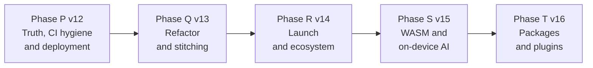
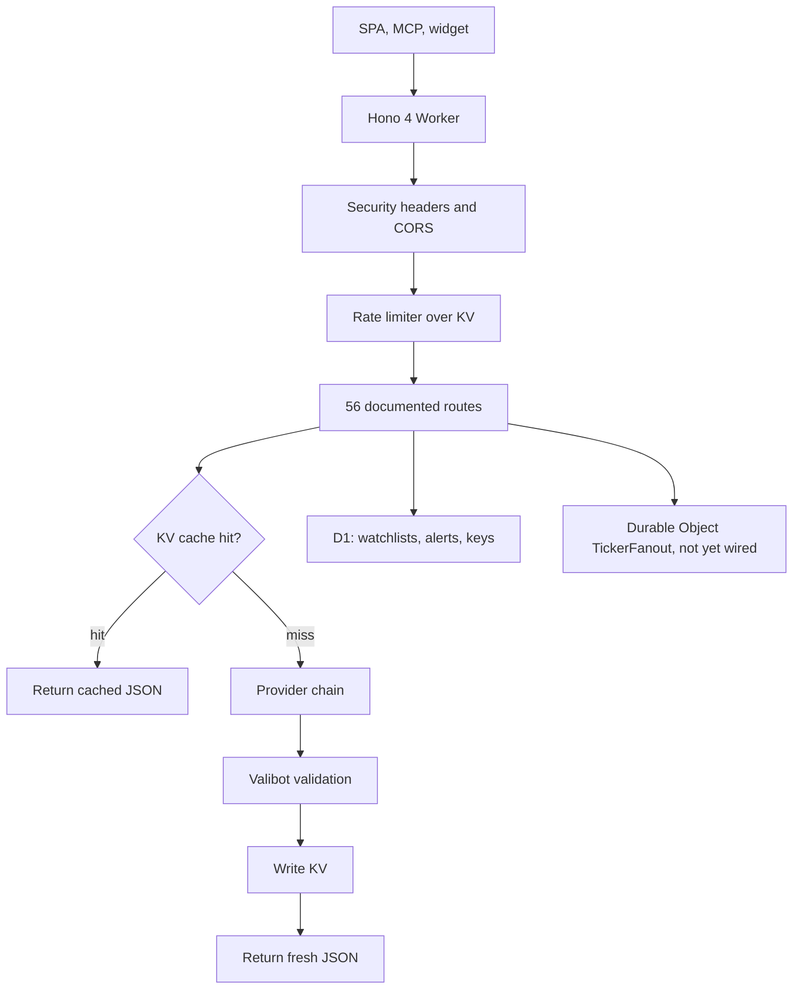
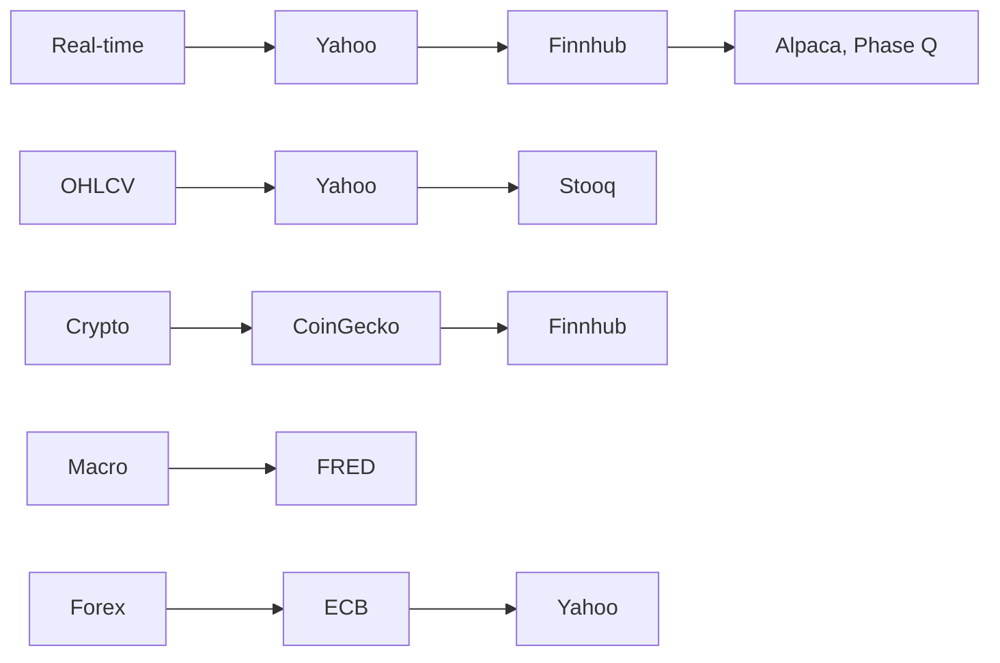

# CrossTide — Consolidated Master Roadmap v12

> **Date:** 10 August 2026 · **Current release:** v11.44.3
> **Supersedes:** Strategic Roadmap v11 (2 Aug 2026), v10, v9, v8, v6.
> Archived predecessors remain readable at `docs/ROADMAP-v9-archive.md`,
> `docs/ROADMAP-v8-archive.md`, `docs/ROADMAP-v6-archive.md`.

This is the **single planning document** for CrossTide. Everything previously
scattered across five roadmap generations, the issue tracker, and the
`.github/instructions/` learning notes is consolidated here.

**This document plans work. It does not perform it.** No code changes are
implied by merging this file.

---

## Reading order

1. [North Star and Market Position](#1--north-star-and-market-position)
2. [Verified Baseline](#2--verified-baseline)
3. [The Stitching Gap](#3--the-stitching-gap)
4. [Documentation Health Audit](#4--documentation-health-audit)
5. [Refactor Mandate](#5--refactor-mandate)
6. [Master Tracking Table](#6--master-tracking-table)
7. [Phase Execution Plan](#7--phase-execution-plan)
8. [Frontend and Card Architecture](#8--frontend-and-card-architecture)
9. [Backend and Edge Infrastructure](#9--backend-and-edge-infrastructure)
10. [Data Providers and Ecosystem](#10--data-providers-and-ecosystem)
11. [Developer Experience](#11--developer-experience)
12. [Quality, Security, Observability](#12--quality-security-observability)
13. [Non-Negotiables](#13--non-negotiables)

---

## 1. 🎯 North Star and Market Position

### 1.1 Vision

_CrossTide is the fastest, most private open-source financial analysis platform:
a sub-250 KB installable PWA with a 12-method consensus engine, a pure and
publishable domain layer, and an agent-native data layer that serves the web app,
AI agents, embeddable widgets, and third-party SDKs from one contract._

### 1.2 What best-in-class requires

| Pillar | Commitment | Status today |
|---|---|---|
| Privacy | No account, no cookies, no third-party analytics; sync is client-encrypted | Held |
| Performance | < 250 KB gzip initial JS, LCP < 1.8s, INP < 200ms | Held at 212.6 KB |
| Quant depth | 12-method consensus, 221 domain modules, property-tested | Built, mostly unreachable — see §3 |
| Agent-native | One OpenAPI contract feeding SPA, MCP, widgets, SDK | Contract done, consumers partial |
| Zero-cost edge | $0/month on Cloudflare, self-host via Docker | Not yet deployed |
| Credibility | Live demo, GIFs, video, community | **Missing — biggest gap** |

### 1.3 Competitive frame

| Capability | CrossTide | TradingView | OpenBB | Ghostfolio | StockAnalysis |
|---|:---:|:---:|:---:|:---:|:---:|
| Open source | MIT | No | AGPLv3 | AGPLv3 | No |
| Self-hostable | Yes | No | Yes | Yes | No |
| No signup | Yes | No | Partial | Yes | Partial |
| Initial bundle | < 250 KB | ~5 MB | n/a | ~500 KB | ~800 KB |
| 12-method consensus | Unique | No | No | No | No |
| MCP server for agents | Yes | No | Yes | No | No |
| On-device LLM | Planned, Phase S | No | No | No | No |
| WASM hot paths | Planned, Phase S | Partial | No | No | No |
| **Live public demo** | **Blocked** | Yes | Yes | Yes | Yes |

The absence of a live URL is the single biggest credibility gap and blocks every
growth item downstream.

---

## 2. 📐 Verified Baseline

All figures below were measured against the working tree on 10 August 2026, not
copied from a previous roadmap. Any number in any document that disagrees with
this table is stale and is corrected under §4.

| Metric | Verified value | Source of truth |
|---|---|---|
| Release | v11.44.3 | `package.json` |
| Source modules under `src/` | 517 TypeScript files | file walk |
| Domain modules | 220, plus `_experimental/` | `src/domain/*.ts` |
| Core modules | 139 | `src/core/*.ts` |
| UI modules | 75 | `src/ui/*.ts` |
| Card files | 52 | `src/cards/*.ts` |
| Registered card routes | 25 | `src/cards/registry.ts` |
| Worker route files | 45 | `worker/routes/*.ts` |
| Registered Worker routes | 56 | `worker/index.ts` |
| OpenAPI documented routes | 56 of 56, `KNOWN_GAP` empty | `tests/unit/worker/openapi-drift.test.ts` |
| Test files | 654 | `tests/**/*.{test,spec}.ts` |
| Coverage | 93.05% stmt · 83.86% branch · 94.95% func · 94.85% line | `npm run test:coverage` |
| Bundle | 212.6 KB gzip, cap 250 KB | `npm run check:bundle` |
| Service worker precache | 50 entries, 941.3 KB | `scripts/workbox-inject.mjs` |
| ADRs | 11, all accepted | `docs/adr/` |
| GitHub workflows | 26 | `.github/workflows/` |
| **Modules reachable from `src/main.ts` and `src/sw.ts`** | **200 of 517, or 39%** | transitive import walk |

### 2.1 Stack of record

TypeScript 6.0 · Vite 8 · Vitest 4 with split `node` and `happy-dom` projects ·
Playwright 1.62 · Hono 4 on Cloudflare Workers · Lightweight Charts v5 ·
morphdom with lit-html · Valibot · Biome 2.5 · ESLint 10 flat config ·
Cloudflare D1, KV, and Durable Objects.

---

## 3. 🧵 The Stitching Gap

> **This is the defining finding of the v12 audit and the reason this roadmap exists.**

**Only 200 of 517 source modules, 39%, are reachable** by following imports from
the application entry points. The remaining **319 modules are compiled, tested,
coverage-counted, and documented — but never execute in the running app.**

| Layer | Total | Unreachable from entry points | Share |
|---|---:|---:|---:|
| `src/domain` | 220 | 176 | 80% |
| `src/core` | 139 | 90 | 65% |
| `src/ui` | 75 | 37 | 49% |
| `src/cards` | 52 | 8 | 15% |
| `src/providers` | 13 | 6 | 46% |
| `src/types` | — | 1 | — |
| **Total** | **517** | **319** | **62%** |

### 3.1 Two distinct failure modes

The 319 unreachable modules are not one problem. They split cleanly, and the
correct response differs:

| Mode | Count | Meaning | Correct response |
|---|---:|---|---|
| **Hard orphan** — imported by nothing | 57 | Never referenced by any source file, only by its own test | Wire into a real surface |
| **Barrel-only** — imported solely by an `index.ts` | 245 | Reachable through a layer barrel the app never imports | Decide: public API, or app feature |

Hard orphans by layer: `src/core` 38 · `src/ui` 12 · `src/cards` 7.

### 3.2 Why barrels do not count as wired

No file in `src/` imports `src/core/index.ts` or `src/ui/index.ts`. Those barrels
exist only to satisfy the `exports` map in `package.json`. A module re-exported by
an unconsumed barrel is exactly as unreachable as one imported by nothing, so
adding a barrel entry is **not** an honest fix for application infrastructure.

For `src/domain` the barrel **is** the product: `@crosstide/domain` publishes it,
so barrel-only is the intended state there. The 177 unreachable domain modules are
therefore a **packaging** concern rather than a defect — but they must not be
counted as delivered app features, and their coverage must not be read as app
coverage.

### 3.3 Consequence for the quality gates

Coverage is currently measured across code that never runs in the app. A 93%
statement figure over a tree where 62% of modules are unreachable is not a
statement about the shipped product. The response is not to lower the threshold;
it is to **add a second, honest metric** — item Q10 — reporting coverage over the
reachable graph separately.

This is the failure shape already recorded in `.github/copilot-instructions.md`
learning 23: _a gate that passes without checking the thing it names._

### 3.4 Stitching principle — no deletion

Per the standing directive, **no module is deleted to close this gap.** Each of the
319 receives an explicit disposition recorded in a tracking file:

| Disposition | Definition | Typical target |
|---|---|---|
| **WIRE** | Import from a card, store, router, or Worker route so it executes | App infrastructure in `core`, `ui`, `cards` |
| **PUBLISH** | Keep barrel-only as public API of `@crosstide/domain` | Most of `src/domain` |
| **PROMOTE** | Turn into a registered card or Worker route of its own | `news-feed-card`, `portfolio`, `trade-journal`, `net-worth` |
| **MERGE** | Fold into a canonical sibling, preserving behaviour and tests | The 12 duplicate-named domain modules, issue #104 |
| **DEFER** | Genuinely future work, annotated with the phase that consumes it | `plugin-contracts`, `plugin-integrity`, `speculation-rules` |

There is no sixth option. Delete is not on the list.

### 3.5 Hard-orphan inventory

The inventory is now reproducible with `npm run check:reachability`. It follows
relative TypeScript imports from `src/main.ts` and `src/sw.ts`, normalizes runtime
`.js` specifiers, and emits JSON with each module's importers, category, and
non-destructive default disposition. Layer barrels with no importers remain
visible in the output and are not treated as application features.

The verified list, to be transcribed into the tracking file under P10a, grouped by
the surface each module should attach to.

**`src/core` — 38 hard orphans**

| Cluster | Modules | Target surface |
|---|---|---|
| Watchlist data | `watchlist-store`, `watchlist-export`, `watchlist-import`, `watchlist-history`, `ticker-tags`, `ticker-notes`, `ticker-pinning`, `ticker-selection` | Watchlist card and Settings export |
| Portfolio depth | `net-worth`, `trade-journal`, `price-targets` | Portfolio card, or promote to new cards |
| Session and routing | `session-state`, `url-state`, `route-guards`, `recent-tickers`, `search-history` | Router and command palette |
| Diagnostics | `cache-stats`, `perf-metrics`, `provider-usage`, `rate-limit-tracker`, `quote-staleness`, `failover-log` | Provider Health card |
| Platform APIs | `navigation-api`, `speculation-rules`, `cross-tab-share`, `webauthn`, `notification-prefs` | App shell and Settings |
| Presentation | `layout-presets`, `multi-timeframe-panel`, `css-scope`, `font-loader`, `export-image` | Dashboard shell |
| Backup and compute | `full-backup`, `screener-worker`, `shortcut-customization`, `ai-disclaimer`, `plugin-contracts`, `plugin-integrity` | Settings, screener, Phase T |

**`src/ui` — 12 hard orphans**

`a11y-aaa`, `card-width`, `chart-frame`, `empty-state`, `filter-bar`, `mobile-ux`,
`popover`, `route-loader`, `scroll-driven`, `stat-grid`, `ticker-context-menu`,
`uplot-helpers`.

Several of these are the Web Components that `.github/instructions/cards.instructions.md`
instructs contributors to use — `<ct-stat-grid>`, `<ct-filter-bar>`,
`<ct-empty-state>`, `<ct-chart-frame>`. **The documented component library is not
actually mounted.** That contradiction is itself a P0 decision, item Q11.

**`src/cards` — 7 hard orphans**

`drawing-history`, `error-boundary`, `heatmap-layout`, `indicator-config`,
`news-feed-card`, `performance-metrics`, `portfolio`.

`news-feed-card` is a complete card never added to `src/cards/registry.ts` — one
registration away from being a 25th route.

### 3.6 Domain duplication, issue #104

Twelve modules redeclare a name another module already exports. Canonical targets:

| Area | Duplicates | Canonical target |
|---|---|---|
| Black-Scholes | `black-scholes`, `option-pricing` | `black-scholes` |
| Implied volatility | `implied-volatility`, `iv-solver` | `implied-volatility` |
| Kelly fraction | `kelly-criterion`, `position-sizing` | `kelly-criterion` |
| Risk ratios | `sharpe-ratio`, `risk-metrics` | `risk-metrics` |
| Volatility estimation | `historical-volatility`, `realized-volatility` | `volatility` |
| Moving averages | `sma`, `ema`, `wma` | keep separate, unify only barrel grouping |

Merges must be behaviour-preserving, with both test suites retained.

---

## 4. 📚 Documentation Health Audit

Every Markdown file in the repository was reviewed. All 71 linted files pass
`npm run lint:md`; the defects below are **factual drift**, which linting cannot
detect.

### 4.1 Confirmed drift, corrected under D1

| File | Claim | Reality |
|---|---|---|
| `docs/ROADMAP.md` | Held a v12 draft concatenated with orphaned v11 fragments: duplicate sections 4, 5 and 13, a sentence beginning mid-clause, two conflicting master tables, two broken anchors | Replaced by this document |
| `.github/CONTRIBUTING.md` | "#105 — document one of the 29 Worker routes still missing" | None missing; all 56 documented, `KNOWN_GAP` empty |
| `.github/CONTRIBUTING.md` | "#103 — one of the 52 orphaned _domain_ modules, unreachable from any barrel" | Wrong layer and count: 57 hard orphans in `core`, `ui`, `cards`; the domain barrel is complete |
| `.github/copilot-instructions.md` | "Do NOT speculatively load `src/domain/indicators/` (218 files)" | That directory does not exist; domain is flat with 221 files |
| `.github/copilot-instructions.md` | "`src/cards/` (54 files)" | 52 |
| `.github/AGENTS.md` | "Tests: 629 files / 7198 tests" | 654 test files |
| `docs/ARCHITECTURE.md` | "Vitest unit tests (629 files / 7,198 tests)" | 654 test files |
| `README.md` | Embeds six demo GIFs from `docs/demos/` | **All six are missing.** `docs/demos/` holds only a README, so the landing page renders six broken images |
| Prior roadmap | "158 KB bundle", "608 tests" | 212.6 KB, 652 test files |

### 4.2 Structural gaps

| ID | Gap | Detail |
|---|---|---|
| D2 | No doc-fact gate | Nothing prevents a number in Markdown from drifting from code. Recurrence is certain without automation. |
| D3 | Dead links unresolved | The repository now checks local Markdown targets and anchors deterministically; issue [#106](https://github.com/RajwanYair/CrossTide/issues/106) still needs owner-side closure for any external URL findings. |
| D4 | Issue tracker drift | [#105](https://github.com/RajwanYair/CrossTide/issues/105) is complete but open; [#103](https://github.com/RajwanYair/CrossTide/issues/103) says 52 where the audit finds 57. |
| D5 | Missing ADRs | The 11 ADRs stop before the split-Vitest-projects, Biome-over-Prettier, domain-packaging, and WASM decisions. |
| D6 | `INDICATORS.md` quality | Generated, excluded from `lint:md`, and some rows dump whole source bodies into a table cell. |
| D7 | Misleading subsystem READMEs | `docs/demos/`, `monitoring/`, `mcp-server/` describe capabilities that are code-ready but undeployed, with no status banner. |
| P8 | README lacks proof | No live demo link or video, and its six embedded demo GIFs do not exist on disk. `scripts/record-demos.ts` exists to produce them but needs a running app. |

### 4.3 Documents verified current

`docs/ARCHITECTURE.md` apart from its test counts, all 11 ADRs, all 9
`.github/instructions/*.md`, all 9 `.github/skills/*/SKILL.md`, all 7
`.github/agents/*.agent.md`, `.github/SECURITY.md`,
`.github/CODE_OF_CONDUCT.md`, `docs/DEVELOPMENT.md`, `docs/CLOUDFLARE_SETUP.md`,
and `CHANGELOG.md`.

---

## 5. 🧩 Refactor Mandate

> **Directive: everything is open to refactor.** No structure, config, dependency,
> naming scheme, or architectural choice is retained merely because it already
> exists. The only protected asset is _behaviour that has tests_, and even that may
> move, provided the tests move with it.

### 5.1 Directory taxonomy — the largest structural debt

Three layers are flat directories well past the point of navigability:

| Layer | Files | Problem | Proposed structure |
|---|---:|---|---|
| `src/domain` | 221 | Flat. The instructions already reference a non-existent `src/domain/indicators/`, proving the mental model diverged from disk | `indicators/`, `analytics/`, `risk/`, `portfolio/`, `backtest/`, `statistics/`, `market/` |
| `src/core` | 139 | Flat. Mixes state, storage, network, platform APIs, and formatting | `state/`, `storage/`, `net/`, `platform/`, `format/` |
| `src/ui` | 75 | Flat. Mixes Web Components, DOM helpers, accessibility, and layout | `components/`, `a11y/`, `layout/`, `dom/` |

This is a mechanical, high-value, low-risk refactor: imports are explicit, and
`arch-check.mjs` plus the barrel-completeness tests catch every mistake. It should
precede the stitching work so wiring happens against the final layout — sequenced
as R1 before P10b.

### 5.2 Architecture decisions re-examined

Each was reconsidered from zero rather than defended:

| Decision | Verdict | Reasoning |
|---|---|---|
| TypeScript 6 as primary language | **KEEP** | The only choice preserving a 250 KB PWA, a pure domain, and a $0 edge simultaneously. A Rust or Python rewrite discards 652 test files for no user-visible gain. |
| Vanilla TS with signals, no framework | **KEEP** | A 0 KB runtime is the bundle budget's entire headroom. |
| morphdom with lit-html | **REVIEW in Phase R** | Two rendering strategies is one too many. Measure, then converge. |
| Hono 4 on Cloudflare Workers | **KEEP** | Free tier covers projected load; D1, KV, and Durable Objects are native. |
| Valibot over Zod | **KEEP** | 3 KB against 30 KB at the boundary. |
| Biome for format, ESLint for lint | **KEEP** | Fast, with cleanly split roles. |
| npm workspaces | **REPLACE in Phase T** | pnpm with Turborepo once four or more packages exist. |
| Rust to WASM for hot paths | **ADOPT, targeted** | Only where `tests/bench/` proves more than 5x, always with a pure-TypeScript fallback. |
| Web Components `<ct-*>` | **DECIDE in Phase Q** | Documented but unmounted, §3.5. Either mount them or stop documenting them. |
| Flat layer directories | **REFACTOR** | See §5.1. |

### 5.3 Configuration and CI refactor

Concrete defects found while auditing the 26 workflows in `.github/workflows/`:

| ID | Defect | Action |
|---|---|---|
| C1 | `ci.yml` runs oxlint suffixed with `\|\| true`, which cannot fail and therefore checks nothing, and fetches a tool that is not a dependency | Remove it, or add oxlint as a real devDependency and let it fail |
| C2 | `ci.yml` calls `npx @lhci/cli@0.15.x` and `npx @cyclonedx/cyclonedx-npm` although `@lhci/cli` is a declared devDependency | Use `./node_modules/.bin/lhci`; declare or digest-pin the SBOM tool |
| C3 | A step named "Prettier check" actually runs Biome | Rename the step |
| C4 | `zap-baseline.yml`, `perf-regression.yml`, and `trufflehog.yml` carry `continue-on-error: true` on the scanning step | Decide per workflow: enforce it, or move it off the gate path and stop calling it a gate |
| C5 | `cicd.instructions.md` claims a single quality gate and lists `deploy.yml` and `deploy-worker.yml`, which do not exist | Reconcile the documented workflow map with disk |
| C6 | Ten or more tool configs are split between the repository root and `config/` with no stated rule | Adopt one rule and document it |

Every item above is an instance of the project's own recorded anti-pattern: a gate
that cannot observe what it claims to observe.

### 5.4 Refactor guardrails

1. One refactor per pull request. Never combine a move with a behaviour change.
2. Review `git diff -U0` hunk by hunk after any multi-site edit.
3. `npm run ci` green before and after, with the bundle delta reported in the PR body.
4. Tests move with their subject in the same commit.
5. A refactor that no existing gate can validate must ship that gate first.

---

## 6. 📊 Master Tracking Table

**Status:** ⬜ not started · 🟡 in progress · ✅ done · ⛔ blocked
**Priority:** P0 blocker · P1 high · P2 opportunistic
**Effort:** S up to 1 day · M up to 1 week · L over 1 week

| ID | Stream | Task | Phase | Pri | Eff | Depends | Status |
|---|---|---|:---:|:---:|:---:|---|:---:|
| D1 | Docs | Correct every drifted fact listed in §4.1 | P | P0 | S | — | ✅ |
| D2 | Docs | Doc-fact gate asserting Markdown counts against code | P | P1 | M | D1 | ⬜ |
| D3 | Docs | Triage and close the dead-link issue #106 | P | P1 | S | — | 🟡 |
| D4 | Docs | Reconcile issues #103, #104, #105 with audit reality | P | P1 | S | P10a | ⬜ |
| D5 | Docs | ADRs 0012 to 0015: split test projects, Biome, packaging, WASM | P | P2 | M | — | ⬜ |
| D6 | Docs | Fix the `INDICATORS.md` generator emitting source bodies | Q | P2 | S | — | ⬜ |
| D7 | Docs | Status banners on undeployed subsystem READMEs | P | P2 | S | — | ⬜ |
| P1 | Deploy | Provision Cloudflare KV and D1 namespaces | P | P0 | S | — | ⛔ |
| P2 | Deploy | Replace placeholder IDs in `worker/wrangler.toml` | P | P0 | S | P1 | ⛔ |
| P3 | Deploy | Apply D1 migrations | P | P0 | S | P1 | ⛔ |
| P4 | Deploy | Deploy the Worker and verify `/api/health` | P | P0 | S | P2, P3 | ⛔ |
| P5 | Deploy | Deploy the Pages frontend | P | P0 | S | P4 | ⛔ |
| E15 | Growth | Live demo URL serving live data with no signup | P | P0 | S | P5 | ⛔ |
| E16 | Growth | Docker one-liner validated end to end | P | P1 | M | — | ⬜ |
| P8 | Docs | README GIFs recorded from the live app | P | P0 | M | E15 | ⬜ |
| C1 | CI | Remove or enforce the non-failing oxlint step | P | P0 | S | — | ✅ |
| C2 | CI | Eliminate `npx` for declared devDependencies | P | P0 | S | — | 🟡 |
| C3 | CI | Rename the mislabelled Prettier step | P | P2 | S | — | ✅ |
| C4 | CI | Resolve the `continue-on-error` scanners | P | P1 | S | — | ⬜ |
| C5 | CI | Reconcile the workflow map with disk | P | P1 | S | — | ⬜ |
| C6 | CI | Single documented rule for config file placement | Q | P2 | S | — | ⬜ |
| R1 | Refactor | Sub-directory taxonomy for domain, core, and ui | Q | P0 | L | — | ⬜ |
| P10a | Stitch | Disposition record for all 319 unreachable modules | Q | P0 | M | R1 | 🟡 |
| P10b | Stitch | Wire core hard orphans: watchlist, session, diagnostics | Q | P0 | L | P10a | ⬜ |
| P10c | Stitch | Wire ui hard orphans and decide the `<ct-*>` component fate | Q | P0 | M | P10a | ⬜ |
| P10d | Stitch | Register `news-feed-card`, promote portfolio orphans | Q | P1 | M | P10a | 🟡 |
| P10e | Stitch | Merge the 12 duplicate-named domain modules | Q | P1 | M | R1 | ⬜ |
| Q10 | Quality | Reachability metric and coverage over the reachable graph | Q | P0 | M | P10a | ⬜ |
| Q11 | Quality | Gate: a new module must be reachable or declared PUBLISH | Q | P1 | M | Q10 | ⬜ |
| E12 | Data | Alpaca Markets provider for free real-time quotes | Q | P0 | M | P4 | ⬜ |
| E11 | Data | Wire the `TickerFanout` Durable Object fan-out | Q | P0 | L | E12 | ⬜ |
| E13 | Data | Bring-your-own-key encrypted API keys in D1 | Q | P1 | M | P3 | ⬜ |
| E1 | Agent | Point the MCP server at the live Worker API | Q | P1 | M | P4 | ⬜ |
| E17 | Growth | Static top-500 ticker pages via Astro | R | P0 | L | E15 | ⬜ |
| E18 | Growth | Community: Discord and good-first-issue labels | R | P0 | M | E15 | 🟡 |
| R2 | Growth | Three-minute video walkthrough | R | P1 | M | E15 | ⬜ |
| R4 | Growth | Public launch on Product Hunt, Hacker News, Reddit | R | P0 | M | E17, E18 | ⬜ |
| E4 | Agent | Server-sent-event streaming for screener and backtest | R | P1 | M | E1 | ⬜ |
| E14 | Data | Options chain and implied-volatility surface card | R | P1 | L | E12 | ⬜ |
| R5 | Refactor | Converge morphdom and lit-html on one strategy | R | P1 | M | R1 | ⬜ |
| E8 | Compute | WASM correlation matrix kernel | S | P0 | L | D5 | ⬜ |
| E9 | Compute | WASM Monte Carlo value-at-risk kernel | S | P1 | L | E8 | ⬜ |
| E10 | Compute | WASM vectorized backtest kernel | S | P1 | L | E8 | ⬜ |
| E5 | AI | WebLLM natural language to Signal DSL | S | P0 | L | D5 | ⬜ |
| E6 | AI | On-device news and earnings summarization | S | P1 | L | E5 | ⬜ |
| E7 | AI | Natural-language chart annotation | S | P2 | L | E5 | ⬜ |
| E20 | Platform | Publish `@crosstide/domain` to npm | T | P0 | M | — | ⛔ |
| E23 | Platform | React, Solid, and Svelte signal adapters | T | P1 | M | E20 | ⬜ |
| E22 | Platform | Worker-isolated plugin sandbox | T | P0 | L | E20 | ⬜ |
| T4 | DX | pnpm and Turborepo migration | T | P2 | M | E23 | ⬜ |

### 6.1 Blocked items and their owners

| Blocker | Blocks | Needs |
|---|---|---|
| `wrangler login` not authenticated | P1 to P5, E15, E1, E11 | Repository owner runs the interactive OAuth flow |
| `NPM_TOKEN` secret absent | E20, and through it E22, E23, T4 | Owner adds a repository secret with `@crosstide` publish rights |
| Discord server not created | E18 | Owner action |

Nothing in Phase Q depends on these except E1, E11, and E12. **The entire stitching
and refactor programme — R1, P10a to P10e, Q10, Q11, D1 to D7, C1 to C6 — is
unblocked and can proceed immediately.**

---

## 7. 🚦 Phase Execution Plan


```mermaid
flowchart LR
  P["Phase P v12<br/>Truth, CI hygiene<br/>and deployment"]
  Q["Phase Q v13<br/>Refactor<br/>and stitching"]
  R["Phase R v14<br/>Launch<br/>and ecosystem"]
  S["Phase S v15<br/>WASM and<br/>on-device AI"]
  T["Phase T v16<br/>Packages<br/>and plugins"]
  P --> Q --> R --> S --> T
```

### Phase P — v12.0.0, Truth and Deployment

_Goal: every published statement about CrossTide is verifiable, every CI gate
actually gates, and the app is reachable at a public URL._

- **D1 to D7** — correct drifted documentation, add the doc-fact gate, triage issues.
- **C1 to C5** — remove decorative CI steps, eliminate `npx` for declared tools.
- **P1 to P5, E15** — Cloudflare provisioning through live demo, owner-blocked.
- **E16, P8** — Docker validation and README GIFs.

**Exit criteria:** no factual contradiction between docs and code; no CI step that
cannot fail; a live demo answering a real quote.

### Phase Q — v13.0.0, Refactor and Stitching

_Goal: the codebase the tests describe is the codebase that runs._

- **R1** — sub-directory taxonomy for domain, core, and ui. Do this first.
- **P10a** — disposition record for all 319 unreachable modules.
- **P10b to P10e** — wire, promote, and merge per disposition. No deletions.
- **Q10, Q11** — reachability metric, then a gate preventing regression.
- **E12, E11, E13, E1** — Alpaca, real-time fan-out, BYOK, live MCP.

**Exit criteria:** reachable-module share above 85%; every remaining unreachable
module carries an explicit PUBLISH or DEFER disposition; issues #103 and #104 closed.

### Phase R — v14.0.0, Launch and Ecosystem

E17 SEO ticker pages · E18 community · R2 video · R4 launch · E4 streaming ·
E14 options chain · R5 rendering convergence.

### Phase S — v15.0.0, WASM and On-Device AI

E8 to E10 Rust-to-WASM kernels, each behind a benchmark proving more than 5x, each
with a pure-TypeScript fallback, each counted against the bundle budget.
E5 to E7 WebLLM over WebGPU, lazily loaded and fully on-device.

### Phase T — v16.0.0, Packages and Plugins

E20 publish `@crosstide/domain` · E23 framework adapters · E22 plugin sandbox ·
T4 pnpm with Turborepo.

---

## 8. 🎨 Frontend and Card Architecture

### 8.1 Composition model

| Layer | Technology | Bundle cost |
|---|---|---|
| Shell and routing | Vanilla TypeScript with signals | 0 KB |
| Simple cards | morphdom with template strings | shared ~2.7 KB |
| Complex cards | lit-html tagged templates | ~2 KB |
| Shared primitives | Native Web Components `<ct-*>` | 0 KB — **currently unmounted, §3.5** |
| Charts | Lightweight Charts v5 | ~45 KB |
| Embeddable widgets | Standalone custom elements | 12.1 KB, separate bundle |

### 8.2 Registered routes, 24

`watchlist` · `consensus` · `chart` · `alerts` · `heatmap` · `screener` ·
`settings` · `provider-health` · `portfolio` · `risk` · `backtest` ·
`strategy-comparison` · `consensus-timeline` · `signal-dsl` · `multi-chart` ·
`correlation` · `market-breadth` · `earnings-calendar` · `macro-dashboard` ·
`sector-rotation` · `relative-strength` · `seasonality` · `comparison` ·
`rebalance`

A twenty-fifth, `news-feed`, is registered and covered by the card route matrix.

### 8.3 Planned frontend refactors

1. Every card standardises on `createStore()` and `batch()`, with no ad-hoc globals.
2. `CardHandle.dispose()` guarantees signal-subscription cleanup.
3. Cross-tab state through `BroadcastChannel` once `cross-tab-share` is wired.
4. Converge on a single rendering strategy, R5.
5. Apply the `src/ui` sub-directory taxonomy, R1.

---

## 9. 🧱 Backend and Edge Infrastructure


```mermaid
flowchart TD
  Client["SPA, MCP, widget"] --> Hono["Hono 4 Worker"]
  Hono --> Sec["Security headers and CORS"]
  Sec --> RL["Rate limiter over KV"]
  RL --> Routes["56 documented routes"]
  Routes --> Cache{"KV cache hit?"}
  Cache -->|hit| Cached["Return cached JSON"]
  Cache -->|miss| Chain["Provider chain"]
  Chain --> Valid["Valibot validation"]
  Valid --> Store["Write KV"]
  Store --> Fresh["Return fresh JSON"]
  Routes --> D1["D1: watchlists, alerts, keys"]
  Routes --> DO["Durable Object TickerFanout, not yet wired"]
```

### 9.1 Contract parity

All 56 registered routes are documented in `worker/routes/openapi.ts`.
`tests/unit/worker/openapi-drift.test.ts` fails on an undocumented route, on a
documented route that is not registered, and on a stale `KNOWN_GAP` — which is now
empty and may only shrink. `src/core/api-types.ts` is generated from the spec and
diff-checked by `npm run check:api-types`.

### 9.2 Cost model

| Resource | Free tier | Projected use | Cost |
|---|---|---|---|
| Pages | Unlimited bandwidth | ~10 GB per month | $0 |
| Workers | 100K requests per day | 5K to 20K per day | $0 |
| KV | 100K reads per day | 10K to 50K per day | $0 |
| D1 | 5 GB | under 100 MB | $0 |
| **Total** | | | **$0** |

---

## 10. 🔌 Data Providers and Ecosystem


```mermaid
flowchart LR
  RT["Real-time"] --> Y1["Yahoo"] --> F1["Finnhub"] --> A1["Alpaca, Phase Q"]
  OH["OHLCV"] --> Y2["Yahoo"] --> S1["Stooq"]
  CR["Crypto"] --> CG["CoinGecko"] --> F2["Finnhub"]
  MA["Macro"] --> FR["FRED"]
  FX["Forex"] --> EC["ECB"] --> Y3["Yahoo"]
```

Planned resiliency work: circuit breakers with adaptive backoff across every
adapter, bring-your-own-key credentials encrypted in D1 under E13, and
market-hours-aware IndexedDB caching so repeat candle requests never reach the
Worker.

### 10.1 Four consumers of one contract

1. The SPA dashboard
2. The MCP server for AI agents
3. `@crosstide/domain` and the framework adapters
4. Embeddable `<crosstide-*>` widgets

---

## 11. 🧰 Developer Experience

| Concern | Tool | Version |
|---|---|---|
| Types | TypeScript | 6.0.3 |
| Build | Vite | 8.0.10 |
| Unit tests | Vitest, split `node` and `happy-dom` | 4.1.10 |
| End-to-end | Playwright | 1.62.0 |
| Lint | ESLint flat config | 10.8.0 |
| Format | Biome | 2.5.6 |
| CSS lint | Stylelint | 17.14.1 |
| Markdown lint | markdownlint-cli2 | 0.23.2 |
| Property tests | fast-check | 4.9.0 |
| Hooks | simple-git-hooks with lint-staged | 2.13.1 and 17.2.0 |

### 11.1 Inner-loop budgets

| Loop | Budget | Current |
|---|---|---|
| Typecheck | under 10s | ~6.5s |
| ESLint, cached | under 10s | ~3.4s |
| Unit suite | under 180s | ~160s |
| Production build | under 15s | ~9.3s |
| Full `npm run ci` | under 300s | ~237s |

Rules that keep this fast: DOM-free suites belong to the `node` project; both
projects block unstubbed `fetch`; wall-clock assertions live in `tests/bench/` or
carry `{ retry: 2 }`; never `npx` a declared devDependency.

---

## 12. 🔒 Quality, Security, Observability

### 12.1 Gates, all passing with zero warnings

```bash
npm run typecheck       # tsc plus the service-worker project
npm run lint:all        # ESLint, Stylelint, HTMLHint, markdownlint, Biome, headers, contrast
npm run check:api-types # OpenAPI contract drift
npm run test:coverage   # >=90% stmt/line/fn, >=80% branch
npm run build:only      # Vite, widget, Workbox injection
npm run check:bundle    # under 250 KB gzip
node scripts/arch-check.mjs --strict
npm audit --omit=dev --audit-level=high
npm audit signatures
```

Run everything with `npm run ci`.

Planned additions: Q10 reachable-graph coverage, Q11 reachability gate, D2
doc-fact gate.

### 12.2 Gate design discipline

Before adding or accepting any gate, answer: **what edit would make this fail?** If
there is no crisp answer, the gate is decorative. Read a gate's exception list
before its logic — an allowlist entry naming a _category_ rather than a named file
is a rule repeal. This project has recorded seven gates that passed without
checking anything; §5.3 lists three more that are still live.

### 12.3 Security posture

Content Security Policy without `unsafe-inline` or `unsafe-eval` · HSTS preload ·
Valibot at every boundary · subresource integrity on preloads · KV-backed rate
limiting · gitleaks and TruffleHog · `npm audit signatures` · Signal DSL evaluated
without `eval` · WebAuthn passkeys, code-ready but unwired per §3.5 · AES-GCM
client-side sync encryption.

Observability is code-ready but inert until Phase P: GlitchTip source-mapped
errors, Plausible privacy analytics, Uptime Kuma, and Worker structured logging.

---

## 13. 🚫 Non-Negotiables

1. **No suppressions.** No `eslint-disable`, `@ts-ignore`, `@ts-expect-error`, or `--force`.
2. **No deletion to close the stitching gap.** Every module receives WIRE, PUBLISH, PROMOTE, MERGE, or DEFER.
3. **No `TODO` in code.** Open an issue instead.
4. **No secrets in source.** Use `.env` or Cloudflare secrets.
5. **Validate at boundaries.** Every external input passes through Valibot.
6. **One-way layer imports.** `types` to `domain` to `core` to `providers` to `cards` to `ui`.
7. **Pure domain.** No DOM, `fetch`, `Date.now()`, or `Math.random()` in `src/domain/`.
8. **No floating promises.** Use `void asyncFn()` or `await`.
9. **Bundle discipline.** CI rejects anything over 250 KB gzip; WASM and model assets load lazily and off-thread.
10. **Tests move with their subject.** A refactor that strands a test is incomplete.
11. **Documents state verified numbers.** A figure that cannot be reproduced by a command does not belong in a document.

---

_Consolidated Roadmap v12 · 10 August 2026 · Next review at Phase P exit._
