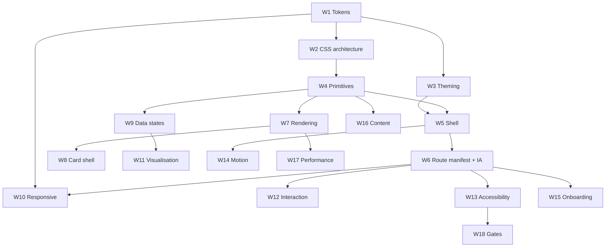

# CrossTide UI/UX Refactor Plan

Status: proposed, not started. No code in this plan has been applied.

This document is the implementation specification for rebuilding CrossTide's presentation layer into a
best-in-class financial dashboard experience. It is written so a developer who has never touched the
repository can execute any single workstream end to end without further design input.

Scope: `index.html`, `src/styles/**`, `src/ui/**`, `src/cards/**`, the presentation-facing parts of
`src/main.ts` and `src/core/**`, plus the test and gate changes required to hold the result in place.

Out of scope: `src/domain/**` numerical logic, `worker/**` route behaviour, provider chains, and the
D01-D08 data-integrity roadmap items. Those are consumed by this plan, not changed by it.

---

## 1. Current-state assessment

Every claim below was verified against the working tree before this plan was written. The verification
command is given so a reviewer can reproduce each finding.

### 1.1 Size and shape

| Artifact | Measure | Verification |
|---|---|---|
| `index.html` | 388 lines, 25 `section.view` shells | `(Get-Content index.html).Count` |
| `src/styles/components.css` | 2594 lines | `(Get-Content src/styles/components.css).Count` |
| `src/styles/responsive.css` | 563 lines | same |
| `src/styles/a11y.css` | 252 lines | same |
| `src/styles/layout.css` | 236 lines | same |
| `src/styles/tokens.css` | 125 lines | same |
| `src/styles/base.css` | 98 lines | same |
| `src/styles/print.css` | 92 lines | same |
| `src/main.ts` | 1265 lines | `(Get-Content src/main.ts).Count` |
| Registered cards | 25 | `grep 'route: "' src/cards/registry.ts` |
| Card modules using `patchDOM` | 35 files | `grep patchDOM src/**/*.ts` |
| Custom elements defined | 8 (`ct-*` x5, `crosstide-*` x3) | `grep customElements.define src/**/*.ts` |

### 1.2 Confirmed defects

These are concrete bugs, not opinions. Each one is fixed by a numbered workstream.

| ID | Defect | Evidence | Fixed by |
|---|---|---|---|
| DEF-1 | `--shadow-lg` is consumed but never defined anywhere in the codebase, so the ticker context menu renders with no elevation | `src/styles/components.css:1905` uses `box-shadow: var(--shadow-lg)`; no `--shadow-lg` declaration exists in `src/styles/**` | W1 |
| DEF-2 | `--green` is consumed with a hardcoded fallback, bypassing the token system and the colour-blind palettes | `src/styles/components.css:2258` uses `var(--green, #22c55e)` | W1 |
| DEF-3 | The static theme selector in the HTML shell offers only `dark` and `light`, but the `Theme` type and `settings.ts` both support `high-contrast` | `index.html` `#theme-select` has 2 options; `src/ui/theme.ts:5` declares 3; `src/cards/settings.ts:111-115` renders 3 | W3, W5 |
| DEF-4 | `high-contrast` exists simultaneously as a `theme` value and a `palette` value, and `data-contrast="aaa"` is a third, overlapping contrast axis | `src/ui/theme.ts:5`, `src/styles/tokens.css:115`, `src/core/contrast-preference.ts:35` | W3 |
| DEF-5 | The WCAG audit covers 23 routes, but 25 routes are registered. `rebalance` and `news-feed` are never audited | `tests/e2e/wcag-audit.spec.ts` `ALL_ROUTES` has 23 entries; `src/cards/registry.ts` has 25 | W6, W13 |
| DEF-6 | The WCAG audit docblock claims "all 19 routes" while the array holds 23 | `tests/e2e/wcag-audit.spec.ts:2` | W6 |
| DEF-7 | `lit-html` is a production dependency with zero imports in `src/`, violating the repository's no-dead-dependency rule | `package.json` dependencies; `grep 'from "lit-html"' src/**` returns nothing | W7 |
| DEF-8 | Every card container is force-assigned `aria-live="polite"`, so any data refresh in any mounted card is announced, producing screen-reader spam | `src/main.ts:160-165` | W9, W13 |
| DEF-9 | z-index is allocated by magic number across at least six distinct stacking values (`1`, `10`, `100`, `200`, `1000`, `9999`, `10000`) with no scale | `src/styles/layout.css`, `src/styles/components.css` | W1 |
| DEF-10 | Container-query breakpoints are ad hoc and mutually inconsistent (`360`, `400`, `401`, `480`, `500`, `600`, `601`, `700`, `701`) | `src/styles/responsive.css` | W1, W10 |

### 1.3 Structural problems

**S-1. Route definitions are duplicated across five files.** Adding one card requires synchronised edits to
`index.html` (section shell), `src/cards/registry.ts` (entry), `src/ui/router.ts` (`RouteName`, `VALID_ROUTES`,
`PATTERNS`), `src/main.ts` (`cardContainers` map), and `tests/e2e/cards.spec.ts` (matrix). DEF-5 is the direct
consequence: one of the five lists drifted and nothing caught it.

**S-2. The HTML shell owns card markup.** `index.html` hardcodes the entire watchlist table, including column
headers and sort attributes, and the entire settings form. Those belong to `watchlist-card.ts` and
`settings-card.ts`. This is why DEF-3 exists.

**S-3. All 25 views are permanently in the DOM.** `activateView` in `src/ui/router.ts:397` toggles a `.active`
class across every `.view` node. The document therefore always carries 25 view subtrees.

**S-4. `src/main.ts` is a 1265-line composition root** that wires watchlist rendering, drag-reorder, hover zoom,
PWA install, WebSocket streaming, telemetry, the command palette, and session restore in one scope.

**S-5. CSS is organised by feature, not by component.** `components.css` contains sections literally named
"Portfolio card", "Risk metrics card", "Backtest card". Styling is coupled to routes, so no visual primitive
can be reused or reasoned about independently.

**S-6. The component library is real but unadopted.** Five `ct-*` custom elements exist with sound APIs, yet 35
card files still assemble raw HTML strings and hand-call `escapeHtml`.

**S-7. Navigation is 25 flat links** with no grouping, no search entry point, and no hierarchy.

**S-8. There is no overview surface.** The default route is `watchlist`; there is no place that answers
"what changed since I last looked".

---

## 2. Target architecture

```text
index.html            shell only: <head>, skip link, header/nav/main/footer landmarks, no card markup
  |
  v
src/app/route-manifest.ts    SINGLE source of truth: route, path patterns, title, nav group, icon, loader
  |
  +--> src/ui/router.ts      derives RouteName, VALID_ROUTES, PATTERNS from the manifest
  +--> src/ui/nav.ts         renders grouped sidebar + mobile nav from the manifest
  +--> src/cards/registry.ts derives lazy loaders from the manifest
  +--> tests/**              assert coverage against the manifest, not a copy of it
  |
  v
src/ui/primitives/**   ct-* web components (the design system)
  |
  v
src/cards/**           card modules compose primitives; own their own markup end to end
```

Styling layers, declared once in `src/styles/tokens.css` and unchanged in order:

```css
@layer tokens, themes, base, layout, primitives, components, utilities, a11y;
```

---

## 3. Design principles

These are binding constraints for every workstream. A change that violates one is rejected in review.

1. **One source of truth per fact.** If a route, token, or string exists in two files, one of them is generated
   or derived.
2. **Tokens only.** No raw hex, no raw px in component CSS, no magic z-index. Enforced by Stylelint.
3. **Primitives before markup.** If two cards need the same visual, it becomes a `ct-*` primitive first.
4. **Every state is designed.** Loading, empty, partial, stale, error, and offline are first-class, not
   afterthoughts.
5. **Accessibility is a gate, not a phase.** The U05 axe matrix must stay green at every commit.
6. **Progressive enhancement.** Feature-detect; never break when an API is missing.
7. **No suppressions.** No `eslint-disable`, no `@ts-ignore`, no `--force`.

---

## 4. Workstreams

Each workstream is independently shippable and independently revertible. Sizing is relative (S/M/L),
matching the convention already used in `docs/ROADMAP.md`.

---

### W1 — Design token foundation

**Size: M. Depends on: nothing. Blocks: W2, W3, W4, W10, W11, W14.**

#### W1 problem

`tokens.css` defines colour, 5 spacing steps, 5 font sizes, 3 radii, and 2 transitions. It defines no
elevation, no z-index scale, no easing curves, no breakpoints, and no density. Components therefore invent
their own values, producing DEF-1, DEF-2, DEF-9, and DEF-10.

#### W1 spec

Rewrite `src/styles/tokens.css` into these token families. Names are normative.

**Elevation (fixes DEF-1).** Shadows must be theme-aware; a dark-theme shadow is invisible on light surfaces.

```css
:root {
  --elevation-0: none;
  --elevation-1: 0 1px 2px rgb(0 0 0 / 0.24);
  --elevation-2: 0 2px 8px rgb(0 0 0 / 0.28);
  --elevation-3: 0 4px 12px rgb(0 0 0 / 0.32);
  --elevation-4: 0 8px 24px rgb(0 0 0 / 0.40);
  --elevation-5: 0 16px 48px rgb(0 0 0 / 0.48);
}

[data-theme="light"] {
  --elevation-1: 0 1px 2px rgb(31 35 40 / 0.08);
  --elevation-2: 0 2px 8px rgb(31 35 40 / 0.10);
  --elevation-3: 0 4px 12px rgb(31 35 40 / 0.12);
  --elevation-4: 0 8px 24px rgb(31 35 40 / 0.16);
  --elevation-5: 0 16px 48px rgb(31 35 40 / 0.20);
}
```

Then replace, in `src/styles/components.css`:

| Line | Current | Replacement |
|---|---|---|
| 433 | `0 16px 48px rgb(0, 0, 0, 0.4)` | `var(--elevation-5)` |
| 1504 | `0 8px 32px rgb(0, 0, 0, 0.5)` | `var(--elevation-4)` |
| 1584 | `0 4px 12px rgb(0, 0, 0, 0.3)` | `var(--elevation-3)` |
| 1710 | `0 4px 12px rgb(0, 0, 0, 0.3)` | `var(--elevation-3)` |
| 1797 | `0 2px 8px rgb(0, 0, 0, 0.25)` | `var(--elevation-2)` |
| 1905 | `var(--shadow-lg)` (undefined) | `var(--elevation-4)` |
| 2316 | `0 4px 12px rgb(0, 0, 0, 0.15)` | `var(--elevation-3)` |
| 2404 | `0 8px 24px rgb(0, 0, 0, 0.25)` | `var(--elevation-4)` |

**Z-index scale (fixes DEF-9).** One ordered ladder; nothing may use a literal.

```css
:root {
  --z-base: 0;
  --z-raised: 10;      /* sticky table headers, chart overlays */
  --z-sidebar: 100;
  --z-header: 200;
  --z-dropdown: 300;   /* autocomplete, context menu, popover */
  --z-backdrop: 400;
  --z-modal: 500;
  --z-toast: 600;
  --z-tour: 700;       /* onboarding coach marks sit above everything */
}
```

Map existing values: `1` and `10` to `--z-raised`; `100` to `--z-sidebar`; `200` to `--z-header`; `1000` to
`--z-dropdown`; `9999` to `--z-modal` or `--z-toast` by call site; `10000` to `--z-toast`. Elements using the
Popover API top layer keep `z-index: unset` (`components.css:1566`) and are exempt.

**Motion.**

```css
:root {
  --ease-standard: cubic-bezier(0.2, 0, 0, 1);
  --ease-decelerate: cubic-bezier(0, 0, 0, 1);
  --ease-accelerate: cubic-bezier(0.3, 0, 1, 1);
  --duration-instant: 80ms;
  --duration-fast: 150ms;
  --duration-normal: 250ms;
  --duration-slow: 400ms;
  --transition-fast: var(--duration-fast) var(--ease-standard);
  --transition-normal: var(--duration-normal) var(--ease-standard);
}
```

`--transition-fast` and `--transition-normal` keep their existing names so no consumer breaks.

**Typography.** Extend to a full scale and add a numeric/tabular face for price columns.

```css
:root {
  --font-size-2xs: 0.6875rem;  /* 11px - dense table metadata */
  --font-size-xs:  0.75rem;    /* 12px */
  --font-size-sm:  0.8125rem;  /* 13px */
  --font-size-base:0.875rem;   /* 14px */
  --font-size-lg:  1rem;
  --font-size-xl:  1.25rem;
  --font-size-2xl: 1.5rem;
  --font-size-3xl: 2rem;       /* overview hero metrics */
  --line-height-tight: 1.25;
  --line-height: 1.5;
  --line-height-relaxed: 1.7;
  --font-weight-normal: 400;
  --font-weight-medium: 500;
  --font-weight-semibold: 600;
  --font-numeric: var(--font-mono);
  --font-feature-numeric: "tnum" 1, "zero" 1;  /* tabular figures, slashed zero */
}
```

Any element rendering a price, percentage, or quantity must set
`font-variant-numeric: tabular-nums; font-feature-settings: var(--font-feature-numeric);` so digits do not
jitter on live update. This is a correctness requirement for a streaming dashboard, not a stylistic one.

**Spacing and density.** Keep `--sp-*`, add density multipliers consumed by W10.

```css
:root {
  --sp-2xs: 2px;
  --sp-xs: 4px;
  --sp-sm: 8px;
  --sp-md: 16px;
  --sp-lg: 24px;
  --sp-xl: 32px;
  --sp-2xl: 48px;
  --density-scale: 1;
  --row-height: calc(2.25rem * var(--density-scale));
  --control-height: calc(2rem * var(--density-scale));
  --control-height-sm: calc(1.75rem * var(--density-scale));
}

[data-density="compact"]     { --density-scale: 0.85; }
[data-density="comfortable"] { --density-scale: 1.15; }
```

**Breakpoints (fixes DEF-10).** CSS custom properties cannot be used inside media query conditions, so
breakpoints are defined as a documented constant set and enforced by Stylelint rather than by `var()`.
Canonical set, and the only permitted values:

| Name | Value | Use |
|---|---|---|
| `xs` | 360px | smallest supported phone |
| `sm` | 480px | large phone |
| `md` | 768px | tablet portrait, sidebar becomes off-canvas below this |
| `lg` | 1024px | tablet landscape / small laptop |
| `xl` | 1280px | desktop |
| `2xl` | 1600px | wide desktop, multi-column overview |

Container queries use a separate, smaller ladder because they measure a card, not a viewport:
`320px`, `480px`, `640px`, `900px`. Every existing container query in `responsive.css` must be re-pointed to
the nearest value in this ladder.

**Focus ring.** Replace the repeated `outline: 2px solid var(--border-focus); outline-offset: 2px` literal.

```css
:root {
  --focus-ring-width: 2px;
  --focus-ring-offset: 2px;
  --focus-ring-color: var(--border-focus);
  --focus-ring: var(--focus-ring-width) solid var(--focus-ring-color);
}
```

**Surfaces.** Add the missing semantic layer so elevation and background stay consistent.

```css
:root {
  --surface-app: var(--bg-app);
  --surface-raised: var(--bg-card);
  --surface-overlay: var(--bg-card);   /* modals, popovers, menus */
  --surface-sunken: var(--bg-input);
  --surface-hover: var(--bg-card-hover);
  --surface-selected: color-mix(in oklab, var(--accent) 12%, transparent);
}
```

`--surface-selected` uses `color-mix`, which is supported across all `.browserslistrc` targets. Verify with
`CSS.supports("color", "color-mix(in oklab, red 10%, blue)")` before relying on it in a primitive; provide a
static fallback declaration immediately above each use.

#### W1 files

- Rewrite: `src/styles/tokens.css`
- Edit: `src/styles/components.css`, `src/styles/layout.css`, `src/styles/a11y.css`, `src/styles/responsive.css`
- Add: `tests/unit/styles/tokens.test.ts`

#### W1 acceptance

1. `node scripts/check-contrast.mjs` passes with zero violations.
2. Every `var(--token)` referenced anywhere in `src/styles/**` resolves to a declaration in `tokens.css`.
   This is the test that would have caught DEF-1.
3. No literal `z-index` numeric value outside `tokens.css`.
4. No raw hex colour outside `tokens.css`.
5. The U05 audit stays green: `playwright test tests/e2e/wcag-audit.spec.ts --project=chromium`.

#### W1 test specification

Create `tests/unit/styles/tokens.test.ts`. It must parse CSS with `postcss`, never with happy-dom's CSSOM,
which silently drops rules nested inside `@layer` and returns `undefined` from `getPropertyValue`.

```ts
/** Token contract: every consumed custom property must be declared. */
import { describe, it, expect } from "vitest";
import { readFileSync, readdirSync } from "node:fs";
import { resolve } from "node:path";
import postcss from "postcss";

const STYLE_DIR = resolve(process.cwd(), "src/styles");

function allDeclarations(): { declared: Set<string>; consumed: Map<string, string> } {
  const declared = new Set<string>();
  const consumed = new Map<string, string>();
  for (const file of readdirSync(STYLE_DIR).filter((f) => f.endsWith(".css"))) {
    const root = postcss.parse(readFileSync(resolve(STYLE_DIR, file), "utf8"));
    root.walkDecls((decl) => {
      if (decl.prop.startsWith("--")) declared.add(decl.prop);
      for (const [, name] of decl.value.matchAll(/var\(\s*(--[\w-]+)/gu)) {
        if (!consumed.has(name)) consumed.set(name, `${file}: ${decl.prop}`);
      }
    });
  }
  return { declared, consumed };
}

describe("design tokens", () => {
  it("declares every custom property that is consumed", () => {
    const { declared, consumed } = allDeclarations();
    const undeclared = [...consumed].filter(([name]) => !declared.has(name));
    expect(undeclared).toEqual([]);
  });

  it("uses no literal z-index outside tokens.css", () => {
    const offenders: string[] = [];
    for (const file of readdirSync(STYLE_DIR).filter((f) => f.endsWith(".css") && f !== "tokens.css")) {
      postcss.parse(readFileSync(resolve(STYLE_DIR, file), "utf8")).walkDecls("z-index", (decl) => {
        if (!decl.value.startsWith("var(") && decl.value !== "unset" && decl.value !== "auto") {
          offenders.push(`${file}: z-index: ${decl.value}`);
        }
      });
    }
    expect(offenders).toEqual([]);
  });
});
```

This test lives under `tests/unit/styles/`, which is not in the `node` project path list, so it runs in the
`dom` project. It touches no DOM globals, so that is harmless; do not add a `@vitest-environment` docblock.

#### W1 Stylelint additions

Add to `config/.stylelintrc.json`:

```json
{
  "rules": {
    "color-no-hex": true,
    "declaration-property-value-disallowed-list": {
      "z-index": ["/^\\d+$/"]
    },
    "media-feature-name-value-allowed-list": {
      "min-width": ["360px", "480px", "768px", "1024px", "1280px", "1600px"],
      "max-width": ["359px", "479px", "767px", "1023px", "1279px", "1599px"]
    }
  }
}
```

`color-no-hex` must be disabled for `tokens.css` only, via a targeted `overrides` entry keyed on
`src/styles/tokens.css`. Use `overrides`, not an inline `stylelint-disable` comment; inline suppressions are
forbidden by the repository rules.

#### W1 rollback

Single-file revert of `tokens.css` plus the mechanical replacements. No behavioural coupling.

---

### W2 — CSS architecture

**Size: L. Depends on: W1. Blocks: W4.**

#### W2 problem

`components.css` is 2594 lines organised by route (S-5). There is no way to locate, review, or delete the CSS
belonging to one visual primitive.

#### W2 spec

Split into one file per primitive plus one file per card family, and introduce the `primitives` and
`utilities` cascade layers.

Target structure:

```text
src/styles/
  tokens.css            (unchanged role: all custom properties)
  base.css              (element defaults, reset, reduced motion)
  layout.css            (app shell: header, nav, main, footer, view)
  primitives/
    button.css
    card.css
    badge.css
    table.css
    form.css
    dialog.css
    popover.css
    toast.css
    skeleton.css
    chart-frame.css
    stat-grid.css
    empty-state.css
    filter-bar.css
  views/
    watchlist.css
    portfolio.css
    heatmap.css
    correlation.css
    market-breadth.css
    backtest.css
    consensus.css
    screener.css
    ...one per card family that genuinely needs bespoke CSS
  utilities.css         (single-purpose helpers: .sr-only lives in a11y.css, not here)
  responsive.css        (container-query ladder only; viewport media queries live with their owner)
  print.css
  a11y.css              (must remain last in layer order)
```

Migration method, applied one section at a time so review stays reviewable:

1. Pick one commented section in `components.css` (they are already delimited, for example
   `/* -- Portfolio card -- */` at line 745).
2. Move it verbatim into the new file. Do not restyle in the same commit.
3. Wrap it in the correct `@layer`.
4. Add the `<link>` to `index.html` (see W5 note: the shell will import a single entry stylesheet instead).
5. Run `npm run lint:css` and the visual regression suite.
6. Commit. One section per commit.

Once all sections are moved, replace the eight `<link>` tags in `index.html` with a single
`src/styles/index.css` that `@import`s the parts in layer order. Vite inlines and bundles `@import` at build
time, so this costs no extra request in production.

Critical constraint: `tests/unit/a11y-audit.test.ts` fails if any file in `src/styles/` is not referenced by
`index.html`. Moving to a single entry stylesheet breaks that test's assumption. It must be updated in the
same commit to follow the `@import` graph from `src/styles/index.css` rather than reading `<link>` tags.
This is a deliberate, reviewed change to a gate, not a weakening: the new assertion is strictly stronger
because it proves reachability through the real import graph.

#### W2 acceptance

1. No CSS file in `src/styles/` exceeds 400 lines.
2. `npm run lint:css` passes with zero warnings.
3. `tests/unit/a11y-audit.test.ts` passes with its updated reachability logic.
4. Visual regression baselines show zero unintended diffs (see W18).

---

### W3 — Theming model unification

**Size: M. Depends on: W1. Blocks: W5.**

#### W3 problem

Three overlapping axes encode "how visually intense is this UI" (DEF-4):

- `data-theme` accepts `dark | light | high-contrast`
- `data-palette` accepts `default | deuteranopia | protanopia | tritanopia | high-contrast`
- `data-contrast` accepts `aaa`

`high-contrast` appears in two of them with different meanings, and `data-contrast="aaa"` partially duplicates
both. A user can select mutually contradictory combinations.

#### W3 spec

Collapse to three genuinely orthogonal axes:

| Attribute | Values | Meaning |
|---|---|---|
| `data-theme` | `dark`, `light` | base colour scheme only |
| `data-contrast` | `standard`, `aaa` | contrast enhancement level (WCAG AA vs AAA) |
| `data-palette` | `default`, `deuteranopia`, `protanopia`, `tritanopia`, `monochrome` | semantic signal colour mapping for colour-vision differences |

Changes:

1. `src/ui/theme.ts`: `export type Theme = "dark" | "light";`
2. The former `theme: "high-contrast"` becomes `theme: "dark" | "light"` plus `contrast: "aaa"`.
3. The former `palette: "high-contrast"` becomes `contrast: "aaa"`; the palette slot gains `monochrome`
   for users who want no colour signalling at all.
4. `detectPreferredTheme()` keeps reading `prefers-color-scheme` but no longer returns `high-contrast`.
   `prefers-contrast: more` now sets `data-contrast="aaa"` instead, which is the semantically correct mapping.
5. `src/styles/tokens.css`: delete the `[data-palette="high-contrast"]` block; its intent is served by
   `[data-contrast="aaa"]` in `a11y.css`.

**Migration of persisted user config.** `AppConfig.theme` is persisted in localStorage and validated by
`ThemeSchema` in `src/types/valibot-schemas.ts:428`. A stored `"high-contrast"` must not fail validation and
must not silently reset the user's preferences.

Add a versioned migration in `src/core/config.ts`:

```ts
/** v11 -> v12: split the fused high-contrast theme into theme + contrast axes. */
function migrateThemeAxis(raw: Record<string, unknown>): Record<string, unknown> {
  if (raw["theme"] !== "high-contrast") return raw;
  return { ...raw, theme: "dark", contrast: "aaa" };
}
```

`ThemeSchema` becomes `picklist(["dark", "light"])`. A new `ContrastSchema = picklist(["standard", "aaa"])`
is added and exported through `src/types/index.ts`. The migration runs before validation, so a stored
`high-contrast` is rewritten rather than rejected.

Also fix DEF-3 as part of this workstream: the static `#theme-select` in `index.html` is deleted outright,
because W5 removes the settings markup from the shell and `settings.ts` becomes its sole owner.

#### W3 acceptance

1. A localStorage config containing `"theme":"high-contrast"` loads without validation error and results in
   `data-theme="dark"` plus `data-contrast="aaa"` on `<html>`.
2. `prefers-contrast: more` with no stored override yields `data-contrast="aaa"`.
3. The theme, contrast, and palette selectors in Settings can be set in any combination without producing an
   invalid state.
4. The U05 axe matrix is extended to `2 themes x 2 contrast levels = 4 combinations` per route (see W13).

#### W3 test specification

`tests/unit/core/config-migration.test.ts`:

```ts
it.each([
  { stored: { theme: "high-contrast" }, theme: "dark", contrast: "aaa" },
  { stored: { theme: "light" }, theme: "light", contrast: "standard" },
  { stored: { theme: "dark" }, theme: "dark", contrast: "standard" },
])("migrates $stored.theme to theme=$theme contrast=$contrast", ({ stored, theme, contrast }) => {
  const migrated = migrateConfig(stored);
  expect(migrated.theme).toBe(theme);
  expect(migrated.contrast).toBe(contrast);
});
```

---

### W4 — Component library

**Size: L. Depends on: W1, W2. Blocks: W8, W9.**

#### W4 problem

Five `ct-*` primitives exist and are barely adopted (S-6). Thirty-five card files build HTML strings by hand.

#### W4 spec

Formalise a versioned primitive library under `src/ui/primitives/`, move the existing five into it, and add
the missing ones. Every primitive obeys this contract:

- A custom element named `ct-<name>`, registered exactly once, guarded against double registration.
- Attributes are the public API. Properties mirror attributes. No required JS setup for the default case.
- Light DOM, not Shadow DOM, so the global token system and `a11y.css` continue to apply, and so axe can
  inspect the tree. This matches the existing `ct-*` implementations.
- All user-supplied text passes through `escapeHtml` at the boundary.
- Documented ARIA contract, verified by a unit test.
- An entry in the component gallery (W18).

##### W4 existing primitives to relocate and harden

| Element | Current file | Change |
|---|---|---|
| `ct-chart-frame` | `src/ui/chart-frame.ts` | move; extract inline SVG spinner to `ct-skeleton` |
| `ct-data-table` | `src/ui/data-table.ts` | move; add sort, selection, sticky header, virtualisation hook |
| `ct-empty-state` | `src/ui/empty-state.ts` | move; add `variant="offline"` and a primary action slot |
| `ct-filter-bar` | `src/ui/filter-bar.ts` | move unchanged |
| `ct-stat-grid` | `src/ui/stat-grid.ts` | move; add delta colouring bound to signal tokens |

##### W4 new primitives

| Element | Purpose | Key attributes | ARIA contract |
|---|---|---|---|
| `ct-card` | standard card shell: header, toolbar slot, body, footer, collapse, width control | `heading`, `collapsible`, `collapsed`, `width` | `role="region"`, `aria-labelledby` pointing at the heading |
| `ct-skeleton` | loading placeholder | `variant="text\|row\|chart\|metric"`, `lines`, `width` | `aria-hidden="true"`; the container owns `aria-busy` |
| `ct-metric` | one labelled number with delta and trend | `label`, `value`, `delta`, `trend`, `precision` | value in tabular numerals; delta has a text prefix, not colour alone |
| `ct-badge` | signal / status pill | `tone="buy\|sell\|neutral\|info\|warn\|danger"` | never colour-only: always carries text |
| `ct-toolbar` | card action row with overflow collapse | `label` | `role="toolbar"`, roving tabindex |
| `ct-segmented` | timeframe / mode switch | `options`, `value` | `role="radiogroup"` with `role="radio"` children |
| `ct-symbol-picker` | ticker search and select, wraps `ticker-autocomplete` | `value`, `multiple` | combobox pattern, `aria-expanded`, `aria-activedescendant` |
| `ct-sheet` | mobile bottom sheet | `open`, `dismissible` | focus trap, `aria-modal`, Escape to close |
| `ct-tooltip` | anchored explanation, wraps `anchor-tooltip` | `for`, `placement` | `role="tooltip"`, referenced by `aria-describedby` |
| `ct-inline-error` | recoverable failure with retry | `message`, `retry-label` | `role="alert"`, retry is a real button |
| `ct-freshness` | data age and source attribution (consumes D03) | `timestamp`, `source`, `stale` | text, not colour alone |
| `ct-explain` | disclosure of inputs, weights, limitations (consumes D08) | `for` | `<details>`-backed disclosure |

`ct-explain` and `ct-freshness` are the UI surface for roadmap items D03 and D08. D08's consensus explanation
metadata is already implemented in `src/domain/consensus-engine.ts` and typed as `ConsensusExplanation`;
`ct-explain` renders it. Building this primitive is what makes that domain work user-visible.

**Registration guard.** Every primitive file ends with:

```ts
if (!customElements.get("ct-card")) customElements.define("ct-card", CtCard);
```

The unguarded `customElements.define` calls in the existing five files throw on double import under test
re-registration. Fixing this is part of the move.

#### W4 acceptance

1. Twelve primitives registered, each with a unit test asserting its rendered ARIA contract.
2. `docs/components-preview.html` renders every primitive in every variant, in all four theme/contrast
   combinations.
3. Zero primitive uses Shadow DOM.
4. axe reports no violations on the preview page (this is already covered by
   `tests/e2e/components.spec.ts`, which must be extended to the new primitives).

---

### W5 — Application shell

**Size: M. Depends on: W3, W4. Blocks: W6.**

#### W5 problem

`index.html` owns card markup (S-2), producing DEF-3 and guaranteeing drift.

#### W5 spec

Reduce `index.html` to landmarks only. Target shell, in full:

```html
<body>
  <a href="#app-main" class="skip-link">Skip to main content</a>
  <header id="app-header" role="banner"><!-- populated by src/ui/shell.ts --></header>
  <div id="app-body">
    <nav id="app-nav" role="navigation" aria-label="Main navigation"><!-- from route manifest --></nav>
    <main id="app-main" role="main" aria-label="Dashboard content"><!-- active view only --></main>
  </div>
  <div id="sidebar-backdrop" aria-hidden="true"></div>
  <footer id="app-footer"><!-- populated by src/ui/shell.ts --></footer>
  <script type="module" src="/src/main.ts"></script>
</body>
```

All 25 `section.view` blocks, the watchlist table, and the settings form are deleted from the shell.

**View host.** Replace the always-present 25 sections (S-3) with a single view host that creates the active
view's section on demand and retains a bounded LRU cache of recently visited views so back-navigation stays
instant.

```ts
/** Mounts and caches route view containers, keeping at most MAX_RETAINED in the DOM. */
const MAX_RETAINED = 4;
```

Rationale for retaining more than one: cards hold chart instances and scroll positions that are expensive to
rebuild. Retaining four covers realistic back-and-forth navigation without carrying 25 subtrees.

The retained-but-inactive sections must be `hidden` (the HTML attribute), not merely visually hidden, so they
leave the accessibility tree and the tab order.

**Header.** Composed by `src/ui/shell.ts` into three zones:

- Left: sidebar toggle, brand.
- Centre: global symbol context (`ct-symbol-picker`) plus a visible command palette trigger showing its
  shortcut in a `<kbd>` element. This fixes the palette's discoverability problem (S-7).
- Right: market status, connection/offline indicator, theme and density quick toggles, help.

The symbol picker is bound to `selectedTickerStore`, which already exists in `src/core/app-store.ts` and is
already injected into card params by `activateCard` in `src/main.ts:167-171`. Promoting it to a visible,
persistent control is a pure UX win with no new state.

**Decomposing `src/main.ts` (S-4).** Extract into:

```text
src/app/bootstrap.ts        composition root: ordered init calls only
src/app/shell.ts            header/nav/footer composition
src/app/session.ts          session + URL share-state restore
src/app/live-data.ts        WebSocket streaming + BroadcastChannel cross-tab sync
src/app/shortcuts.ts        keyboard map + palette command registration
src/app/telemetry.ts        analytics, error tracking, web vitals
```

`src/main.ts` becomes a file that imports `bootstrap` and calls it. Each extracted module is independently
testable. Move in the listed order; each move is one commit with no behavioural change.

#### W5 acceptance

1. `index.html` is under 80 lines.
2. No card markup exists in `index.html`.
3. At most `MAX_RETAINED + 1` `section.view` elements exist in the DOM at any time.
4. Inactive retained sections carry the `hidden` attribute and are absent from the tab order.
5. `src/main.ts` is under 60 lines.
6. All existing E2E specs pass unchanged, because landmark IDs and route paths are preserved.

---

### W6 — Route manifest and information architecture

**Size: M. Depends on: W5. Blocks: W10, W13.**

#### W6 problem

Five duplicated route lists (S-1), which already caused DEF-5 and DEF-6. Twenty-five flat nav links (S-7).

#### W6 spec

Create `src/app/route-manifest.ts` as the single source of truth:

```ts
export type NavGroup = "monitor" | "analyze" | "portfolio" | "research" | "system";

export interface RouteDefinition {
  readonly route: RouteName;
  readonly title: string;
  readonly shortTitle: string;      // sidebar label
  readonly group: NavGroup;
  readonly paths: readonly string[]; // e.g. ["chart", "chart/:symbol"]
  readonly acceptsSymbol: boolean;
  readonly icon: string;             // inline SVG sprite id
  readonly load: () => Promise<CardModule>;
}

export const ROUTES: readonly RouteDefinition[] = [ /* 25 entries */ ];
```

Derive everything else:

- `src/ui/router.ts`: `RouteName` becomes `(typeof ROUTES)[number]["route"]`; `VALID_ROUTES` and `PATTERNS`
  are computed from `ROUTES`.
- `src/cards/registry.ts`: reduces to a lookup over `ROUTES`.
- `src/ui/nav.ts`: renders grouped navigation from `ROUTES`.
- `src/main.ts`'s `cardContainers` map: deleted; the view host derives container ids as `view-${route}`.

**Information architecture.** Group the 25 routes:

| Group | Label | Routes |
|---|---|---|
| `monitor` | Monitor | watchlist, chart, multi-chart, alerts, news-feed |
| `analyze` | Analyze | consensus, consensus-timeline, signal-dsl, screener, comparison, seasonality |
| `portfolio` | Portfolio | portfolio, rebalance, risk, backtest, strategy-comparison |
| `research` | Research | heatmap, correlation, market-breadth, sector-rotation, relative-strength, macro-dashboard, earnings-calendar |
| `system` | System | provider-health, settings |

Navigation rendering rules:

- Groups render as `<h2 class="sr-only">` plus a `<ul>`, so screen-reader users get structure.
- Groups are collapsible and their state persists.
- A "Pinned" pseudo-group sits at the top; users pin any route. Persisted in config.
- A "Recent" pseudo-group shows the last three visited routes, excluding pinned ones.
- The active link keeps `aria-current="page"` (already correct in `router.ts:391`).

**Overview route (S-8).** Add a 26th route, `overview`, as the new default landing surface. It composes
existing primitives only, so it introduces no new data dependency:

- Watchlist movers: top three gainers and losers, from `tickerDataStore`.
- Consensus changes since last visit, from the consensus timeline data.
- Alerts fired since last visit, from `/api/alerts/history`.
- Portfolio value delta, from `portfolio-store`.
- Market status and breadth summary.
- Provider health banner if degraded.

Each block links to its full route. `/` maps to `overview`; `watchlist` keeps its own path. This is the single
highest-leverage UX change in the plan: it converts a tool that requires the user to know where to look into
one that reports what changed.

**Fixing DEF-5 and DEF-6.** `tests/e2e/wcag-audit.spec.ts` must stop hand-maintaining `ALL_ROUTES`. Because
importing the manifest pulls the card graph into the Node runner, follow the pattern already used by
`tests/unit/cards/registry.test.ts`: parse the manifest as text and derive the route list. Add a unit guard
that fails if the audit's route list is not exactly the manifest's route list.

#### W6 acceptance

1. Adding a route requires editing exactly one file.
2. A unit test asserts `router` patterns, `registry` entries, nav links, and the WCAG audit route list are all
   derived from `ROUTES` and agree.
3. `rebalance` and `news-feed` are covered by the axe matrix (DEF-5 closed).
4. The audit docblock states the true route count (DEF-6 closed).
5. `overview` is the default route and is axe-clean in all four theme/contrast combinations.

---

### W7 — Rendering model

**Size: L. Depends on: W4. Blocks: W8.**

#### W7 problem

Thirty-five card files call `patchDOM(container, htmlString)` with manually escaped interpolation. Escaping
correctness is enforced only by developer discipline. Meanwhile `lit-html` is a shipped dependency with zero
imports (DEF-7), which violates the no-dead-dependency rule and inflates the bundle.

#### W7 spec

Two options were considered. The decision is Option A.

**Option A (chosen): adopt `lit-html` properly.** It is already a dependency, it is already paid for in
`package.json`, it auto-escapes interpolation by construction, and it does efficient targeted updates without
morphdom's full-tree diff.

**Option B (rejected): remove `lit-html`, keep morphdom, add a safe tagged template.** Rejected because it
reimplements what the existing dependency already provides correctly.

Migration:

1. Add `src/ui/render.ts` exporting a thin wrapper so cards never import `lit-html` directly:

   ```ts
   import { html, render as litRender, type TemplateResult } from "lit-html";

   export { html };
   export type { TemplateResult };

   /** Render a template into a container. Replaces patchDOM for template-based cards. */
   export function render(container: HTMLElement, template: TemplateResult): void {
     litRender(template, container);
   }
   ```

2. Migrate cards one at a time, in ascending order of complexity. Suggested order: `alert-history`,
   `performance-metrics`, `provider-health`, `preset-filters`, then the rest, finishing with `screener-card`
   and `backtest-card`.

3. In each migrated card, delete the now-unnecessary `escapeHtml` calls. `lit-html` escapes interpolated
   values automatically. Leaving a manual `escapeHtml` inside a `lit-html` template produces visible double
   escaping, so this deletion is mandatory, not optional.

4. When the last card is migrated, delete `src/core/patch-dom.ts` and drop `morphdom` from `package.json`.

**Interim state.** Both mechanisms coexist during migration. That is acceptable and expected. It is not
acceptable to leave the migration half-finished across a release boundary; the workstream is not done until
`morphdom` is removed.

**Risk.** `lit-html` templates require the container to be owned exclusively by lit. A card that mixes
`render()` with manual `appendChild` into the same node will corrupt lit's part markers. Audit each card for
direct DOM mutation of the render target before migrating it. `chart-card.ts:122` uses
`insertAdjacentHTML("beforebegin", ...)` relative to the chart canvas and must be restructured first.

#### W7 acceptance

1. Zero imports of `patch-dom` remain.
2. `morphdom` is absent from `package.json`.
3. `lit-html` has non-zero imports (DEF-7 closed).
4. `npm run check:bundle` stays under 250 KB gzip.
5. No behavioural diff in the E2E suite.

---

### W8 — Card shell standardisation

**Size: M. Depends on: W4, W7.**

#### W8 problem

Card chrome is reimplemented per card. Some views wrap themselves in `.card` inside `index.html`; others
render their own container. Header, actions, collapse, and width behave inconsistently.

#### W8 spec

Every card renders exactly this structure via `ct-card`:

```text
ct-card
  [slot=header]    heading (h2) + ct-freshness + ct-explain trigger
  [slot=toolbar]   ct-toolbar: filters, ct-segmented timeframe, actions, overflow menu
  [default slot]   body: content, or ct-skeleton, or ct-empty-state, or ct-inline-error
  [slot=footer]    attribution, row count, last-updated, export
```

Rules:

- The card owns its `<h2>`. The shell no longer provides one. This removes the current split where
  `index.html` supplies headings for 11 views and the card supplies them for the rest.
- Exactly one `<h1>` per document, in the header. Card headings are `<h2>`. The existing E2E assertion
  `expect(h1).toBe(1)` in `wcag-audit.spec.ts` already enforces this and must keep passing.
- Collapse, width, and reorder behaviour move into `ct-card`, consuming the existing
  `src/ui/card-collapse.ts`, `src/ui/card-width.ts`, and `src/ui/reorder.ts` logic rather than replacing it.
- Every card exposes a stable `data-card="<route>"` attribute for E2E selection and visual regression.

#### W8 acceptance

1. All 26 routes render through `ct-card`.
2. Heading hierarchy test passes unchanged.
3. Collapse and width preferences persist and restore for every card.

---

### W9 — Data-state system

**Size: M. Depends on: W4. Blocks: W11.**

#### W9 problem

Loading is communicated by the literal text "Loading..." in a `<p class="empty-state">`. There is essentially
no skeleton system: a repository-wide search for skeleton or shimmer returns one comment and two spinners.
Meanwhile every card container is unconditionally marked `aria-live="polite"` (DEF-8), so background refreshes
are announced continuously.

#### W9 spec

Define six canonical states. Every data-bearing card must handle all six.

| State | Visual | ARIA |
|---|---|---|
| `idle` | prompt to choose a symbol or run a query | none |
| `loading` | `ct-skeleton` matching the eventual layout | container `aria-busy="true"` |
| `ready` | content | `aria-busy="false"` |
| `partial` | content plus a banner naming what is missing | `role="status"` on the banner only |
| `stale` | content plus `ct-freshness` in stale mode | `role="status"` on the freshness element only |
| `error` | `ct-inline-error` with a retry button | `role="alert"` on the error only |

Skeletons must match the final layout's dimensions to avoid layout shift. `ct-skeleton` variants map to
concrete shapes: `text` (one line), `row` (a table row at `--row-height`), `metric` (a `ct-metric` footprint),
`chart` (a block at the chart's aspect ratio).

**Fixing DEF-8.** Delete the blanket `aria-live` assignment in `src/main.ts:160-165`. Replace with targeted
live regions:

- A single shared polite region for cross-cutting status, already present as `#sort-live`.
- `role="status"` on the specific banner element that changed, not on the whole card body.
- `role="alert"` only for errors requiring attention.
- Route changes are announced by the existing focus move to the view heading, which is the correct mechanism
  and needs no live region.

**Refresh without disruption.** When data updates in place, do not re-render the whole card. With `lit-html`
from W7 this is automatic for changed bindings. Preserve scroll position and focus across updates; add a
regression test that focus is retained in the watchlist filter input across a quote refresh.

#### W9 acceptance

1. Every route renders a skeleton, not a text placeholder, during first load.
2. Cumulative Layout Shift stays under 0.1 on every route (measured by `npm run lhci`).
3. No element carries `aria-live` unless a test asserts why.
4. A screen-reader walkthrough of a live-updating watchlist produces no repeated announcements.

---

### W10 — Responsive, density, and mobile

**Size: L. Depends on: W1, W6.**

#### W10 problem

Breakpoints are ad hoc (DEF-10). There is no density control, which a professional financial dashboard
requires. The mobile sidebar is parked off-canvas with `translateX(-220px)` and its links report
`visible: true` while being unclickable, a documented source of E2E timeouts.

#### W10 spec

**Breakpoint normalisation.** Re-point every query in `responsive.css` to the W1 ladder. The container-query
ladder is `320 / 480 / 640 / 900`. Replace the current nine distinct values.

**Density.** Add a `data-density` attribute on `<html>` with `compact | default | comfortable`, wired to
`--density-scale` from W1, exposed in Settings and in the header quick toggle, and persisted in config.
Default is `default`. `compact` targets traders scanning many rows; `comfortable` targets touch and
low-vision users. Touch targets must remain at least 24x24 CSS px in every density, and 44x44 for icon-only
buttons, which `a11y.css` already enforces via `.btn-icon`.

**Mobile navigation.** Replace the off-canvas sidebar below the `md` breakpoint with:

- A bottom navigation bar carrying the five `NavGroup` entries.
- Tapping a group opens a `ct-sheet` listing that group's routes.
- The sheet traps focus, closes on Escape, and returns focus to the invoking tab.

This eliminates the off-canvas clickability trap entirely, because nothing navigable is ever positioned
outside the viewport. Update `.github/instructions/browser.instructions.md` to retire that pitfall note once
the sidebar is gone.

**Tables on small screens.** `ct-data-table` gains `collapse="cards"`: below the `480px` container
breakpoint each row renders as a labelled definition list instead of a horizontally scrolling table. Columns
are declared with a `priority` so the collapse order is deterministic rather than source-order dependent.

#### W10 acceptance

1. Only the six approved viewport breakpoints and four container breakpoints appear in `src/styles/**`.
2. All three densities pass the axe matrix and the contrast gate.
3. On a 360px viewport, every navigation target is inside the viewport bounds; assert
   `boundingBox()` against `page.viewportSize()`.
4. No horizontal page scroll at 360px on any route.

---

### W11 — Data visualisation consistency

**Size: L. Depends on: W1, W4, W9.**

#### W11 problem

Charts, sparklines, heatmaps, treemaps, and correlation matrices each define their own colour handling,
tooltip, legend, and empty state. Chart content is invisible to assistive technology; the current axe audit
explicitly excludes `#chart-container` because canvas cannot be inspected.

#### W11 spec

**Colour.** All series and signal colours resolve from tokens, never literals, so the colour-blind palettes
apply everywhere. `src/cards/lw-chart.ts:36` currently reads `data-theme` directly to decide dark vs light;
it must instead read resolved token values via `getComputedStyle`, so it stays correct under the new
contrast and palette axes from W3.

**Shared chart chrome.** All chart-bearing cards render inside `ct-chart-frame`, which owns: title, timeframe
`ct-segmented`, legend, crosshair tooltip, loading skeleton, empty state, error state, and export.

**Chart accessibility.** Every chart must provide a non-visual equivalent. This is the single largest
accessibility gap remaining after U05, because the audit currently excludes charts rather than covering them.

- Each chart has an adjacent, visually hidden `<table>` containing its underlying series, toggleable to
  visible via a "View as table" control.
- Each chart has a generated text summary in `aria-describedby`, for example: "AAPL, 3 month daily close.
  Range 168.20 to 199.62. Net change plus 12.4 percent. Trend upward."
- Keyboard users can step through data points with arrow keys, with the focused point announced.

Once the table equivalent exists, remove the `.exclude("#chart-container")` from
`tests/e2e/app.spec.ts:206` so charts are audited like everything else.

**Consistent conventions.** Positive is `--signal-buy`, negative is `--signal-sell`, in every visualisation,
and never encoded by colour alone: always pair with a sign, an arrow glyph, or a label.

#### W11 acceptance

1. No chart module reads a colour literal.
2. Every chart has a table equivalent and a text summary.
3. `.exclude("#chart-container")` is removed and the audit still passes.
4. Switching palette to `deuteranopia` changes every visualisation, verified by visual regression.

---

### W12 — Interaction and keyboard

**Size: M. Depends on: W5, W6.**

#### W12 spec

- **Command palette** becomes the primary navigation accelerator: routes, symbols, actions, and settings are
  all searchable. It gains a visible header trigger (W5).
- **Shortcut coverage.** Every action in `src/ui/shortcuts-catalog.ts` must exist and every registered
  handler must appear in the catalogue. Add a unit test asserting the two sets are equal; a catalogue entry
  with no handler is a lie told to the user.
- **Focus management.** After route change, focus moves to the view heading (already implemented, keep).
  After a modal closes, focus returns to the invoker. After a destructive action, focus moves to the
  confirmation status.
- **Roving tabindex** for toolbars, segmented controls, and table headers, using the existing
  `src/ui/roving-tabindex.ts`.
- **Drag-reorder accessibility.** The watchlist drag-reorder in `src/main.ts:701` is pointer-only. Add a
  keyboard alternative: focus a row, press Space to pick up, arrows to move, Space to drop, Escape to cancel,
  with each step announced.
- **Undo.** Destructive actions (remove ticker, clear watchlist, delete alert, delete preset) show a toast
  with an Undo action for at least ten seconds instead of a blocking confirm dialog.

#### W12 acceptance

1. Every documented shortcut works; every working shortcut is documented.
2. The full application is operable with keyboard only, verified by an E2E walkthrough that never calls
   `click()`.
3. Reordering the watchlist is possible without a pointer.

---

### W13 — Accessibility beyond AA

**Size: M. Depends on: W3, W6, W11.**

#### W13 problem

U05 was recorded complete on evidence of 23 routes across three theme values. Two registered routes were not
audited (DEF-5), and the theme axis being audited is the pre-W3 fused axis.

#### W13 spec

1. Re-scope the audit matrix to the W6 route manifest, so it is 26 routes, and to the W3 axes, so it is
   `2 themes x 2 contrast levels`. That is 104 route/state combinations. Run the full matrix in CI nightly and
   a per-group sample on pull requests to keep PR time bounded.
2. Expose the AAA contrast toggle in Settings under an explicit Accessibility group. `data-contrast="aaa"` is
   implemented in `src/core/contrast-preference.ts` and styled in `a11y.css` but has no discoverable control.
3. Add `forced-colors` coverage to the audit matrix.
4. Add reduced-motion coverage: assert that with `prefers-reduced-motion: reduce`, no view transition or
   skeleton shimmer animates.
5. Document supported AAA criteria and known limitations in `docs-site`, which is the second half of the U05
   acceptance wording and is not yet written.

#### W13 acceptance

1. All 26 routes pass axe in all four theme/contrast combinations, plus forced-colors.
2. The AAA toggle is reachable, labelled, and persists.
3. A published page lists which AAA criteria are met, which are partially met, and which are out of scope.

---

### W14 — Motion and transitions

**Size: S. Depends on: W1, W5.**

#### W14 spec

- Use the existing View Transitions integration in `router.ts:417`, but assign named transitions so the
  header, nav, and card grid persist while only the view content cross-fades.
- Skeleton to content transitions use `--duration-fast` with `--ease-decelerate`.
- Numeric values that change on live update flash a brief tint using the signal tokens, never a layout change.
- Under `prefers-reduced-motion: reduce`, all of the above collapse to instant state changes. The global
  reduce rule in `base.css` sets `animation-duration: 0.01ms`, which handles CSS animation, but View
  Transitions must be skipped explicitly in JS by checking `prefersReducedMotion()` from `src/ui/a11y.ts`.

#### W14 acceptance

1. No transition exceeds `--duration-slow`.
2. With reduced motion enabled, no `startViewTransition` call is made.

---

### W15 — Onboarding and first-run

**Size: M. Depends on: W6, W9.**

#### W15 spec

- **Empty product state.** A brand-new user currently lands on an empty watchlist. Instead, offer a one-click
  starter watchlist, an import path, and a symbol search, with a clear statement that no account is required
  and data stays local.
- **Progressive onboarding.** Replace the single first-visit tour (`src/ui/onboarding-tour.ts`, triggered at
  `src/main.ts:1203`) with contextual, dismissible hints shown the first time a user reaches each route group.
- **Capability disclosure.** With 26 routes, users cannot discover features by browsing. The overview surface
  (W6) carries a "More in CrossTide" block surfacing unvisited capabilities.
- **What's new.** `src/core/whats-new.ts` exists; surface it as a dismissible header affordance after a
  version change rather than leaving it unreferenced in the UI.

#### W15 acceptance

1. A first-run user reaches a populated, meaningful dashboard in one action.
2. Every hint is dismissible and never reappears once dismissed.
3. Onboarding state survives reload and is included in export/import.

---

### W16 — Content, formatting, and i18n

**Size: M. Depends on: W4.**

#### W16 spec

- **Number formatting.** All prices, percentages, and volumes route through `src/ui/number-format.ts` with
  locale-aware `Intl.NumberFormat`. No card formats numbers inline.
- **Date and time.** All timestamps route through `src/ui/relative-time.ts`, display the user's timezone, and
  expose the absolute value in a `title` and in `datetime` on a `<time>` element.
- **String catalogue.** `src/core/messages.ts` and `src/locales/*.ts` currently both define UI strings with
  overlapping keys (`settings.theme` exists in both, with different sibling key shapes:
  `settings.theme.dark` versus `settings.themeDark`). Consolidate on one key scheme and one catalogue, and
  add a test asserting every locale file has exactly the same key set as `en`.
- **Terminology.** Fix the sidebar's inconsistent abbreviations: `Rel Strength`, `Breadth`, `Rotation`, and
  `Strategy` are truncations of their route titles. Sidebar labels come from `shortTitle` in the manifest and
  must be intelligible standalone.
- **Disclaimers.** The consensus explanation already emits a financial-advice limitation string from
  `evaluateConsensus`. Render it through `ct-explain` wherever a signal is displayed, not only on the
  consensus route.

#### W16 acceptance

1. Every locale file exports an identical key set; enforced by test.
2. No inline number or date formatting outside the two helper modules.
3. Every signal surface exposes its limitations through `ct-explain`.

---

### W17 — Perceived and actual performance

**Size: M. Depends on: W7, W9, W10.**

#### W17 spec

- **Budgets.** JS under 250 KB gzip (existing gate). LCP under 2.5 s, INP under 200 ms, CLS under 0.1 on
  every route, not only the landing route. Extend `config/lighthouserc.json` to sample one route per nav
  group rather than only `/`.
- **Virtualisation.** `src/ui/virtual-scroller.ts` exists; apply it in `ct-data-table` whenever row count
  exceeds 100. Watchlist, screener results, and alert history all qualify.
- **Prefetch.** `initCardPrefetchOnIntent` already prefetches card chunks on hover and focus. Extend it to
  prefetch the route's data loader, not only its code chunk.
- **Render cost.** After W7, verify that a single quote update no longer re-renders an entire card body.
  Measure with a Performance mark around the update path and assert the mark count in a bench test under
  `tests/bench/`.

#### W17 acceptance

1. Every nav-group representative route meets the Core Web Vitals budgets.
2. A 500-row watchlist scrolls at 60fps on a mid-tier device profile.
3. Bundle stays under budget after `lit-html` adoption and `morphdom` removal.

---

### W18 — Governance and gates

**Size: M. Depends on: all.**

#### W18 problem

The repository's own recorded lesson is that its dominant failure mode is a gate that passes without checking
anything. A UI refactor of this size will regress silently unless the gates observe the artifact directly.

#### W18 spec

Add these gates. Each is written to fail on a specific, nameable edit.

| Gate | Fails when | Command |
|---|---|---|
| Token contract | a `var(--x)` has no declaration (would have caught DEF-1) | `vitest tests/unit/styles/tokens.test.ts` |
| Z-index scale | a literal z-index appears outside `tokens.css` | same |
| Route manifest drift | router, registry, nav, or audit route lists disagree (would have caught DEF-5) | `vitest tests/unit/app/route-manifest.test.ts` |
| Shell purity | `index.html` contains card markup | `vitest tests/unit/app/shell.test.ts` |
| Primitive adoption | a card file contains a raw HTML string longer than N characters | `node scripts/check-primitive-adoption.mjs` |
| Locale parity | locale key sets differ from `en` | `vitest tests/unit/locales.test.ts` |
| Component gallery | a registered `ct-*` element is missing from the preview page | `vitest tests/unit/ui/gallery.test.ts` |
| Visual regression | rendered output changes unexpectedly | `playwright test tests/e2e/visual.spec.ts` |

Wire every one of these into `npm run ci`. A gate defined in `package.json` but not called by `ci` is
indistinguishable from no gate.

**Visual regression scope.** Baselines are platform-specific and must be generated in CI on linux, never on
Windows. Regenerate with `gh workflow run ci.yml --ref main -f update_snapshots=true`, download the artifact,
and commit into `tests/e2e/visual.spec.ts-snapshots/`. Expand coverage to one screenshot per route per theme
per density; that is a large baseline set, so gate it to the nightly run rather than every pull request.

**Component gallery.** Promote `docs/components-preview.html` to a maintained gallery covering every
primitive, every variant, and every state, rendered in all theme and density combinations. It is both the
design reference and the visual-regression surface, which means one artifact serves both purposes and cannot
drift from the code.

---

## 5. Sequencing

Dependencies force this order. Phases are shippable; workstreams within a phase are parallelisable.



| Phase | Workstreams | Outcome | User-visible? |
|---|---|---|---|
| 1. Foundation | W1, W2, W3 | tokens, CSS structure, coherent theming; DEF-1..4, DEF-9, DEF-10 closed | minimal, intentionally |
| 2. Primitives | W4, W7 | design system exists and is renderable; DEF-7 closed | minimal |
| 3. Shell | W5, W6 | shell reduced, one route source, grouped IA, overview route; DEF-3, DEF-5, DEF-6 closed | large |
| 4. Experience | W8, W9, W10, W14 | uniform cards, real data states, density, mobile; DEF-8 closed | large |
| 5. Depth | W11, W12, W15, W16 | chart accessibility, keyboard parity, onboarding, content | large |
| 6. Hold the line | W17, W18 | budgets and gates | none |

Phase 1 and 2 are deliberately low on visible change. That is the point: they make Phase 3 onward cheap and
safe. Resist the temptation to restyle while moving CSS in W2; a move commit and a design commit must never
be the same commit, or review becomes impossible.

---

## 6. Risk register

| Risk | Likelihood | Impact | Mitigation |
|---|---|---|---|
| Making the dormant light and AAA paths fully reachable exposes a burst of pre-existing contrast bugs | High | Medium | Expect it. This already happened once in this repository when `initTheme` stopped pinning dark and 29 E2E tests failed. Treat the burst as pre-existing debt, not as a regression from the refactor. |
| `lit-html` migration corrupts a card that also mutates its container directly | Medium | High | Audit each card for direct DOM mutation before migrating. `chart-card.ts:122` is a known instance. |
| Removing the 25 static sections breaks E2E specs that assume they exist | High | Medium | Preserve all `view-*` container ids and route paths. Run the full E2E suite on every W5 commit. |
| Visual regression baselines churn constantly during Phases 1 to 4 | High | Low | Gate visual regression to nightly during the refactor; restore per-PR gating at Phase 6. |
| Expanding the axe matrix to 104 combinations makes CI slow | Medium | Medium | Full matrix nightly; per-group sample on pull requests. |
| The single-entry stylesheet change silently weakens the a11y reachability test | Low | High | The test must be rewritten to walk the `@import` graph in the same commit, and must be proven to fail when a stylesheet is orphaned. |
| Scope creep turns a refactor into a redesign of domain behaviour | Medium | High | Domain, worker, and provider code are explicitly out of scope. |

---

## 7. Definition of done

The refactor is complete when all of the following hold simultaneously.

1. `npm run ci` passes, including all eight new gates from W18.
2. `index.html` is under 80 lines and contains no card markup.
3. `src/main.ts` is under 60 lines.
4. No CSS file exceeds 400 lines.
5. Adding a route requires editing one file.
6. Twelve primitives are registered, tested, and rendered in the gallery.
7. Every route handles all six data states.
8. Every chart has a table equivalent and a text summary, and no axe exclusion remains.
9. 26 routes pass axe in four theme/contrast combinations plus forced-colors.
10. The application is fully operable by keyboard.
11. Core Web Vitals budgets are met on one representative route per nav group.
12. `morphdom` is removed and `lit-html` is genuinely used.
13. No suppressions were added anywhere.

---

## 8. Correction to the U05 record

While preparing this plan, DEF-5 was discovered: `tests/e2e/wcag-audit.spec.ts` audits 23 routes, but
`src/cards/registry.ts` registers 25. The routes `rebalance` and `news-feed` have never been audited.

U05 was marked Complete in `docs/ROADMAP.md` on the evidence of 23 routes across three theme values. Its
acceptance criterion is "automated and manual audits cover all supported routes and themes". Strictly read,
that criterion is not yet met, and the audit file's own docblock claims a third, different number (19).

Recommended action, to be taken before any of this plan is executed: either extend the audit to the two
missing routes and keep the Complete status, or revert U05 to In progress until W6 and W13 land. The status
should not stand on evidence that does not cover the stated scope.
