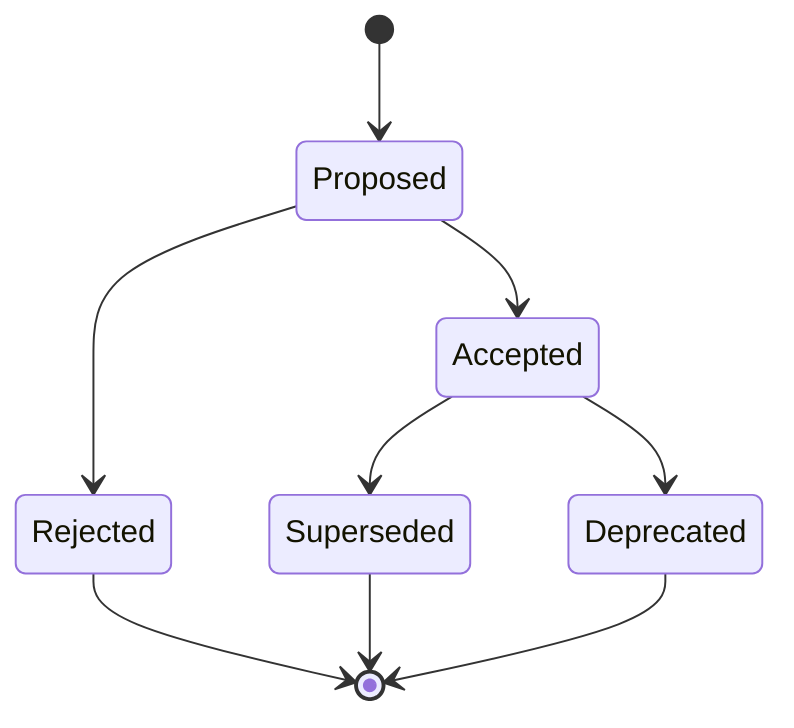
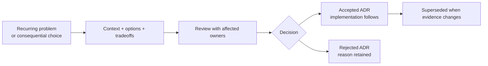

# Architecture Decision Records

This directory contains Architecture Decision Records (ADRs) for CrossTide.
Each ADR documents a significant technical decision, its context, and consequences.

## Lifecycle

_Use an ADR when a choice changes a boundary, contract, dependency, or long-lived operational
tradeoff._

### Decision Inputs And Outputs

## Index

| #    | Title                                      | Status      | Date       |
| ---- | ------------------------------------------ | ----------- | ---------- |
| 0001 | Use Yahoo Finance as primary data provider | ✅ Accepted | 2026-05-04 |
| 0002 | KV caching with market-hours-aware TTL     | ✅ Accepted | 2026-05-04 |
| 0003 | D1 for user data persistence               | ✅ Accepted | 2026-05-04 |
| 0004 | KV-backed rate limiting over per-isolate   | ✅ Accepted | 2026-05-04 |
| 0005 | Signal batching via batch() primitive      | ✅ Accepted | 2026-05-04 |
| 0006 | Store pattern with createStore()           | ✅ Accepted | 2026-05-04 |
| 0007 | Route loaders with AbortController         | ✅ Accepted | 2026-05-04 |
| 0008 | Error boundaries for card isolation        | ✅ Accepted | 2026-05-04 |
| 0009 | Web Components for shared UI primitives    | ✅ Accepted | 2026-05-04 |
| 0010 | Preview environments serve fixture data    | ✅ Accepted | 2026-05-04 |
| 0011 | Structured JSON logging in Worker          | ✅ Accepted | 2026-05-04 |
| 0012 | Split Vitest into Node and DOM projects    | ✅ Accepted | 2026-05-04 |
| 0013 | Divide formatting and linting tooling      | ✅ Accepted | 2026-05-04 |
| 0014 | Keep the domain layer publishable           | ✅ Accepted | 2026-05-04 |
| 0015 | Gate WASM adoption with benchmarks          | ✅ Accepted | 2026-05-04 |
| 0016 | Layered product boundary                    | Accepted | 2026-08-11 |
| 0017 | CrossTide threat model baseline             | Proposed | 2026-08-11 |
| 0018 | AI feature boundary                         | Accepted | 2026-08-12 |
