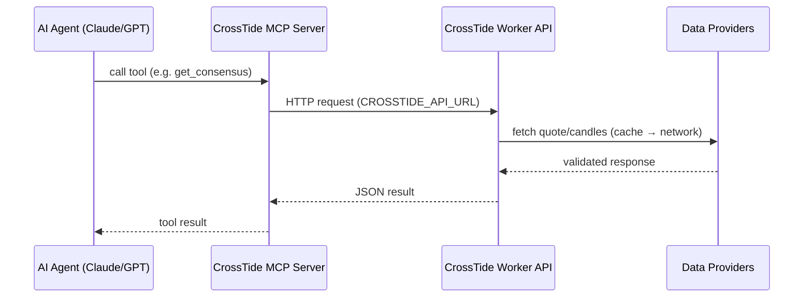

# CrossTide MCP Server

[Model Context Protocol](https://modelcontextprotocol.io) server that exposes CrossTide's financial analysis API to AI agents (Claude, GPT, etc.).

## How it works



## Tools

| Tool | Description |
|------|-------------|
| `get_quote` | Real-time stock quote (price, change, volume) |
| `get_consensus` | 12-method consensus signal (BUY/SELL/HOLD) |
| `get_chart_data` | OHLCV candlestick data |
| `get_indicators` | Technical indicators (SMA, RSI, MACD, etc.) |
| `run_screener` | Screen stocks by technical criteria |
| `get_portfolio_risk` | Portfolio risk metrics (VaR, Sharpe, Sortino) |

## Setup

```bash
cd mcp-server
npm install
npm run build
```

## Usage with Claude Desktop

Add to `claude_desktop_config.json`:

```json
{
  "mcpServers": {
    "crosstide": {
      "command": "node",
      "args": ["path/to/CrossTide/mcp-server/dist/index.js"],
      "env": {
        "CROSSTIDE_API_URL": "https://crosstide-worker.workers.dev"
      }
    }
  }
}
```

## Environment Variables

| Variable | Default | Description |
|----------|---------|-------------|
| `CROSSTIDE_API_URL` | `https://crosstide-worker.workers.dev` | Worker API base URL |
