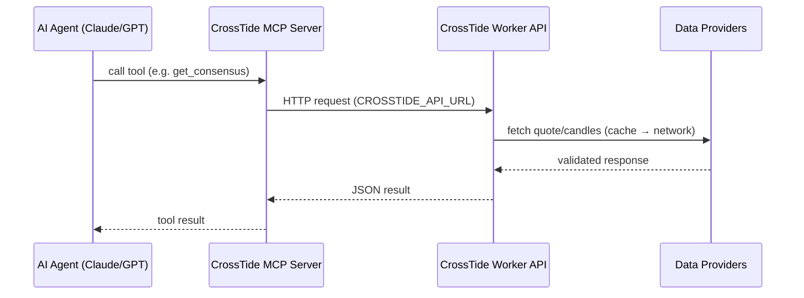

# CrossTide MCP Server

[Model Context Protocol](https://modelcontextprotocol.io) server that exposes CrossTide's financial analysis API to AI agents (Claude, GPT, etc.).

> **Status: Code-ready, local use only.** The server builds and can connect to a local
> Worker; a public Worker endpoint is not configured or verified yet.

## How It Works


```mermaid
sequenceDiagram
  participant Agent as AI Agent (Claude/GPT)
  participant MCP as CrossTide MCP Server
  participant Worker as CrossTide Worker API
  participant Provider as Data Providers

  Agent->>MCP: call tool (e.g. get_consensus)
  MCP->>Worker: HTTP request (CROSSTIDE_API_URL)
  Worker->>Provider: fetch quote/candles (cache → network)
  Provider-->>Worker: validated response
  Worker-->>MCP: JSON result
  MCP-->>Agent: tool result
```

## Tools

| Tool | Description |
|------|-------------|
| `get_quote` | Real-time stock quote (price, change, volume) |
| `get_consensus` | 12-method consensus signal (BUY/SELL/HOLD) |
| `get_chart_data` | OHLCV candlestick data |
| `get_indicators` | Technical indicators (SMA, RSI, MACD, etc.) |
| `run_screener` | Screen stocks by technical criteria |
| `get_portfolio_analytics` | Portfolio allocation, P&L, and concentration metrics |

## Setup

```bash
cd mcp-server
npm install
npm run build
```

Start the local Worker API before calling tools:

```bash
../node_modules/.bin/wrangler dev --config worker/wrangler.toml
```

## Usage With Claude Desktop

Add to `claude_desktop_config.json`:

```json
{
  "mcpServers": {
    "crosstide": {
      "command": "node",
      "args": ["path/to/CrossTide/mcp-server/dist/index.js"],
      "env": {
        "CROSSTIDE_API_URL": "http://localhost:8787"
      }
    }
  }
}
```

## Environment Variables

| Variable | Default | Description |
|----------|---------|-------------|
| `CROSSTIDE_API_URL` | `http://localhost:8787` | Worker API base URL |
| `CROSSTIDE_API_TOKEN` | unset | Optional bearer token sent as `Authorization: Bearer <token>` on every request to `CROSSTIDE_API_URL` (roadmap E04) |

## Authorization And Rate Limiting (roadmap E04)

- **Transport trust boundary:** the server speaks stdio to a single local agent
  process (Claude Desktop, etc.) — there is no multi-tenant request boundary to
  authorize inside the MCP protocol itself. Treat `CROSSTIDE_API_URL` the same
  way you would treat any other credential-adjacent config: point it at a
  Worker you trust, not an arbitrary third party's deployment.
- **Per-tool rate limiting:** `src/rate-limit.ts` enforces a 30-calls-per-minute
  token bucket per tool name as defense-in-depth against a looping or
  misbehaving agent, independent of the Worker's own IP-based rate limiter
  (`worker/rate-limit.ts`) that every underlying HTTP call still passes through.
- **Optional bearer-token auth.** Set `CROSSTIDE_API_TOKEN` and every request
  to `CROSSTIDE_API_URL` carries `Authorization: Bearer <token>`. The MCP
  server only sends this header — the Worker route layer does not itself
  validate a bearer token today, so this is only useful once `CROSSTIDE_API_URL`
  sits behind infrastructure (a reverse proxy, Cloudflare Access, etc.) that
  checks it. If you expose `CROSSTIDE_API_URL` over a network the MCP process
  doesn't fully control, put that infrastructure in front of it rather than
  assuming the token alone authenticates the request.
- **Error format:** every tool failure (validation, rate limit, or upstream
  HTTP error) returns MCP's standard `{ content: [{ type: "text", ... }],
  isError: true }` shape rather than throwing, so a client can distinguish a
  tool-level failure from a transport-level one.
